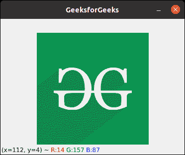
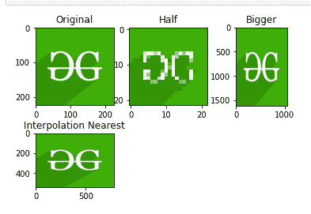
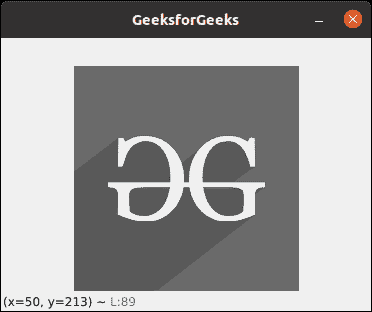
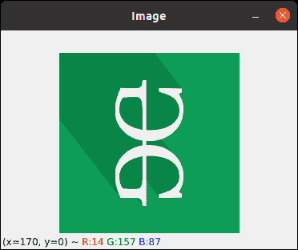
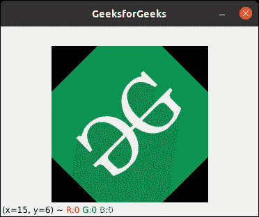
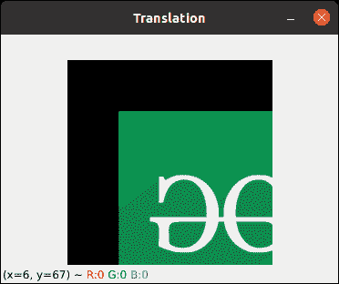
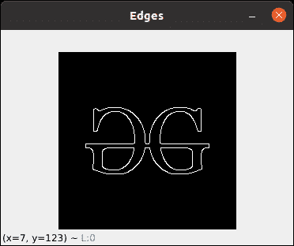

# 开启计算机视觉的基本 OpenCV 功能

> 原文:[https://www . geesforgeks . org/essential-opencv-functions-to-入门-进入计算机视觉/](https://www.geeksforgeeks.org/essential-opencv-functions-to-get-started-into-computer-vision/)

计算机视觉是一个过程，通过这个过程，我们可以理解图像和视频是如何存储的，以及我们如何从它们中操作和检索数据。计算机视觉是人工智能的基础或主要应用。计算机视觉在自动驾驶汽车、机器人以及照片校正应用中发挥着重要作用。

[OpenCV](https://www.geeksforgeeks.org/introduction-to-opencv/) 是用于计算机视觉、机器学习和图像处理的巨大开源库，现在它在实时操作中发挥着重要作用，这在当今的系统中非常重要。通过使用它，人们可以处理图像和视频来识别物体、人脸，甚至是人类的笔迹。当它与各种库(如 NumPy)集成时，python 能够处理 OpenCV 数组结构进行分析。为了识别图像模式及其各种特征，我们使用向量空间并对这些特征执行数学运算。

在本文中，我们将讨论 OpenCV 中的一些常用函数及其应用。

**注意:**本文使用的函数对于 OpenCV 支持的不同语言是通用的。

## 阅读图像

读取图像[使用 cv2.imread()](https://www.geeksforgeeks.org/python-opencv-cv2-imread-method/) 方法。此方法从指定文件加载图像。如果无法读取图像(因为缺少文件、权限不当、格式不受支持或无效)，则此方法返回一个空矩阵。

**使用的图像**


### 示例:Python OpenCV 读取图像

## 蟒蛇 3

```
# Python code to read image
import cv2

# To read image from disk, we use
# cv2.imread function, in below method,
img = cv2.imread("geeks.png", cv2.IMREAD_COLOR)

# Creating GUI window to display an image on screen
# first Parameter is windows title (should be in string format)
# Second Parameter is image array
cv2.imshow("GeeksforGeeks", img)

# To hold the window on screen, we use cv2.waitKey method
# Once it detected the close input, it will release the control
# To the next line
# First Parameter is for holding screen for specified milliseconds
# It should be positive integer. If 0 pass an parameter, then it will
# hold the screen until user close it.
cv2.waitKey(0)

# It is for removing/deleting created GUI window from screen
# and memory
cv2.destroyAllWindows()
```

**输出:**



## 保存图像

[cv2.imwrite()](https://www.geeksforgeeks.org/python-opencv-cv2-imwrite-method/) 方法用于将图像保存到任何存储设备。这将根据当前工作目录中指定的格式保存图像。

### 示例:Python OpenCV 保存图像

## 蟒蛇 3

```
# Python program to explain cv2.imwrite() method

# importing cv2
import cv2

image_path = 'geeks.png'

# Using cv2.imread() method
# to read the image
img = cv2.imread(image_path)

# Filename
filename = 'savedImage.jpg'

# Using cv2.imwrite() method
# Saving the image
cv2.imwrite(filename, img)

# Reading and showing the saved image
img = cv2.imread(filename)
cv2.imshow("GeeksforGeeks", img)

cv2.waitKey(0)
cv2.destroyAllWindows()
```

**输出:**


## 调整图像大小

[图像尺寸调整](https://www.geeksforgeeks.org/image-resizing-using-opencv-python/)是指图像的缩放。它有助于减少图像的像素数，并且具有几个优点，例如，它可以减少神经网络的训练时间，因为图像中的像素数越多，输入节点的数量越多，这又增加了模型的复杂性。它还有助于放大图像。很多时候，我们需要调整图像的大小，即缩小或放大以满足尺寸要求。

OpenCV 为我们提供了几种调整图像大小的插值方法。选择调整大小的插值方法–

*   **cv2。INTER_AREA:** 当我们需要缩小图像时使用。
*   **cv2。INTER_CUBIC:** 这样比较慢但是效率更高。
*   **cv2。INTER_LINEAR:** 主要用于需要缩放时。这是 OpenCV 中默认的插值技术。

### 示例:Python OpenCV 图像大小调整

## 蟒蛇 3

```
import cv2
import numpy as np
import matplotlib.pyplot as plt

image = cv2.imread("geeks.png", 1)
# Loading the image

half = cv2.resize(image, (0, 0), fx = 0.1, fy = 0.1)
bigger = cv2.resize(image, (1050, 1610))

stretch_near = cv2.resize(image, (780, 540),
            interpolation = cv2.INTER_NEAREST)

Titles =["Original", "Half", "Bigger", "Interpolation Nearest"]
images =[image, half, bigger, stretch_near]
count = 4

for i in range(count):
    plt.subplot(2, 3, i + 1)
    plt.title(Titles[i])
    plt.imshow(images[i])

plt.show()
```

**输出:**



## 色彩空间

[色彩空间](https://www.geeksforgeeks.org/color-spaces-in-opencv-python/)是一种表示图像中呈现的色彩通道的方式，它赋予图像特定的色调。有几种不同的颜色空间，每种都有自己的意义。一些流行的颜色空间是 RGB(红色、绿色、蓝色)、CMYK(青色、洋红色、黄色、黑色)、HSV(色调、饱和度、值)等。

[cv2.cvtColor()](https://www.geeksforgeeks.org/python-opencv-cv2-cvtcolor-method/) 方法用于将图像从一个颜色空间转换到另一个颜色空间。OpenCV 中有 150 多种颜色空间转换方法。

### 示例:Python OpenCV 颜色空间

## 蟒蛇 3

```
# Python program to explain cv2.cvtColor() method

# importing cv2
import cv2

# path
path = 'geeks.png'

# Reading an image in default mode
src = cv2.imread(path)

# Window name in which image is displayed
window_name = 'GeeksforGeeks'

# Using cv2.cvtColor() method
# Using cv2.COLOR_BGR2GRAY color space
# conversion code
image = cv2.cvtColor(src, cv2.COLOR_BGR2GRAY )

# Displaying the image
cv2.imshow(window_name, image)

cv2.waitKey(0)
cv2.destroyAllWindows()
```

**输出:**



## 旋转图像

[cv2.rotate()](https://www.geeksforgeeks.org/python-opencv-cv2-rotate-method/) 方法用于以 90 度的倍数旋转 2D 阵列。函数 cv::rotate 以三种不同的方式旋转数组。

### 示例:Python OpenCV 旋转图像

## 蟒蛇 3

```
# Python program to explain cv2.rotate() method

# importing cv2
import cv2

# path
path = 'geeks.png'

# Reading an image in default mode
src = cv2.imread(path)

# Window name in which image is displayed
window_name = 'Image'

# Using cv2.rotate() method
# Using cv2.ROTATE_90_CLOCKWISE rotate
# by 90 degrees clockwise
image = cv2.rotate(src, cv2.cv2.ROTATE_90_CLOCKWISE)

# Displaying the image
cv2.imshow(window_name, image)
cv2.waitKey(0)
```

**输出:**



上述功能限制我们只能将图像旋转 90 度的倍数。我们还可以通过定义列出旋转点、旋转程度和比例因子的旋转矩阵，将[图像旋转到任意角度](https://www.geeksforgeeks.org/image-processing-in-python-scaling-rotating-shifting-and-edge-detection/)。

### 示例:Python OpenCV 将图像旋转任意角度

## 蟒蛇 3

```
import cv2
import numpy as np

FILE_NAME = 'geeks.png'

# Read image from the disk.
img = cv2.imread(FILE_NAME)

# Shape of image in terms of pixels.
(rows, cols) = img.shape[:2]

# getRotationMatrix2D creates a matrix needed 
# for transformation. We want matrix for rotation 
# w.r.t center to 45 degree without scaling.
M = cv2.getRotationMatrix2D((cols / 2, rows / 2), 45, 1)
res = cv2.warpAffine(img, M, (cols, rows))

cv2.imshow("GeeksforGeeks", res)

cv2.waitKey(0)
cv2.destroyAllWindows()
```

**输出:**



## 图像翻译

平移指的是物体的直线移动，即图像从一个位置移动到另一个位置。如果我们知道水平和垂直方向的位移量，比如(tx，ty)，那么我们就可以做一个变换矩阵。现在，我们可以使用 cv2 . wrap 仿射()函数来实现翻译。这个函数需要一个 2×3 的数组。numpy 数组应该是浮点型的。

### 示例:Python OpenCV 图像翻译

## 蟒蛇 3

```
import cv2
import numpy as np

image = cv2.imread('geeks.png')

# Store height and width of the image
height, width = image.shape[:2]

quarter_height, quarter_width = height / 4, width / 4

T = np.float32([[1, 0, quarter_width], [0, 1, quarter_height]])

# We use warpAffine to transform
# the image using the matrix, T
img_translation = cv2.warpAffine(image, T, (width, height))

cv2.imshow('Translation', img_translation)
cv2.waitKey(0)

cv2.destroyAllWindows()
```

**输出:**



## 边缘检测

图像检测的过程包括检测图像中的尖锐边缘。这种边缘检测在图像识别或物体定位/检测的环境中是必不可少的。由于其广泛的适用性，有几种检测边缘的算法。我们将使用一种称为 [Canny 边缘检测](https://www.geeksforgeeks.org/implement-canny-edge-detector-in-python-using-opencv/)的算法。

### 示例:Python OpenCV Canny 边缘检测

## 蟒蛇 3

```
import cv2

FILE_NAME = 'geeks.png'

# Read image from disk.
img = cv2.imread(FILE_NAME)

# Canny edge detection.
edges = cv2.Canny(img, 100, 200)

# Write image back to disk.
cv2.imshow('Edges', edges)
cv2.waitKey(0)
cv2.destroyAllWindows()
```

**输出:**



关于 Python OpenCV 的更多信息，请参考我们的 [Python OpenCV 教程](https://www.geeksforgeeks.org/opencv-python-tutorial/)。