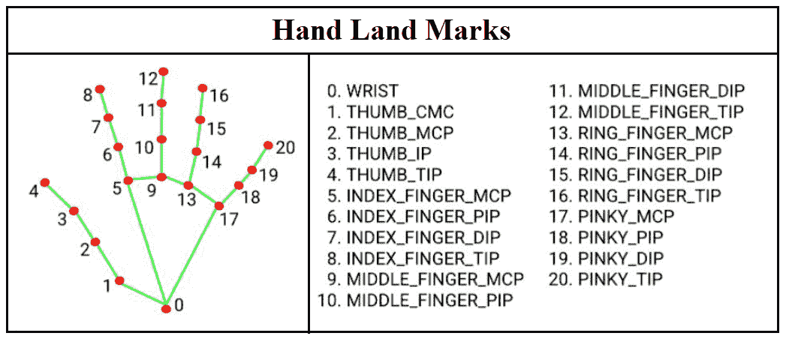
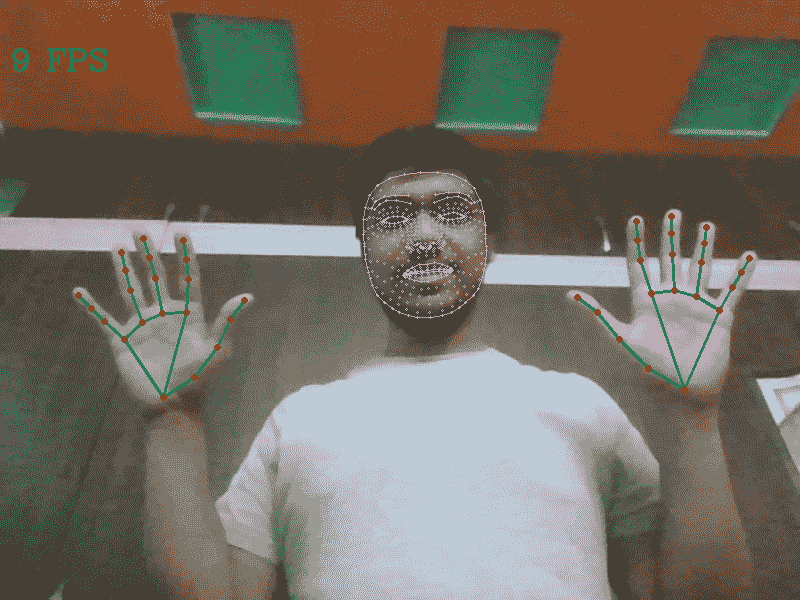

# 使用 Python–Mediapipe、OpenCV

进行面部和手部地标检测

> 原文:[https://www . geesforgeks . org/face-and-hand-landmarks-detection-use-python-mediapipe-opencv/](https://www.geeksforgeeks.org/face-and-hand-landmarks-detection-using-python-mediapipe-opencv/)

在本文中，我们将使用 *mediapipe* python 库来检测面部和手部地标。我们将使用来自 *mediapipe* 解决方案的整体模型来检测所有面部和手部地标。我们还将看到如何访问面部和手部的不同地标，这些地标可用于不同的计算机视觉应用，如手语检测、睡意检测等。

#### **所需库**

*   **Mediapipe** 是谷歌开发的跨平台库，为计算机视觉任务提供令人惊叹的即用型 ML 解决方案。
*   **python 中的 OpenCV** 库是一个广泛用于图像分析、图像处理、检测、识别等的计算机视觉库。

**安装所需的库**

```
pip install opencv-python mediapipe msvc-runtime
```

**下面是面部和手部标志检测的分步方法**

**STEP-1:** 导入所有必需的库，在我们的例子中只需要两个库。

## 蟒蛇 3

```
# Import Libraries
import cv2
import time
import mediapipe as mp
```

**步骤 2:** 初始化整体模型和绘图工具，用于检测和绘制图像上的地标。

## 蟒蛇 3

```
# Grabbing the Holistic Model from Mediapipe and
# Initializing the Model
mp_holistic = mp.solutions.holistic
holistic_model = mp_holistic.Holistic(
    min_detection_confidence=0.5,
    min_tracking_confidence=0.5
)

# Initializing the drawng utils for drawing the facial landmarks on image
mp_drawing = mp.solutions.drawing_utils
```

让我们看看整体模型的参数:

```
Holistic(
  static_image_mode=False, 
  model_complexity=1, 
  smooth_landmarks=True, 
  min_detection_confidence=0.5, 
  min_tracking_confidence=0.5
)
```

*   **static_image_mode:** 用于指定输入图像必须被视为静态图像还是视频流。默认值为假。
*   **模型 _ 复杂度:**用于指定姿态地标模型的复杂度:0、1 或 2。随着模型复杂性的增加，地标的准确性和延迟增加。默认值为 1。
*   **smooth _ landmark:**此参数用于通过过滤不同输入图像上的姿态界标来减少预测中的抖动。默认值为“真”。
*   **min _ detection _ confidence:**用于指定来自人物检测模型的检测需要被视为成功的最小置信度值。可以在[0.0，1.0]中指定一个值。默认值为 0.5。
*   **min_tracking_confidence:** 用于指定从地标跟踪模型进行的检测必须被视为成功的最小置信度值。可以在[0.0，1.0]中指定一个值。默认值为 0.5。

**STEP-3:** 从图像中检测面部和手部标志。整体模型处理图像并产生面部、左手、右手的界标，还检测

1.  使用 OpenCV 从相机中连续捕捉帧。
2.  将 BGR 图像转换为 RGB 图像，并使用初始化的整体模型进行预测。
3.  整体模型做出的预测保存在结果变量中，我们可以分别使用 results.face_landmarks、results.right_hand_landmarks、results.left_hand_landmarks 访问这些地标。
4.  使用绘图工具中的 draw _ landmarks 函数在图像上绘制检测到的地标。
5.  显示结果图像。

## 蟒蛇 3

```
# (0) in VideoCapture is used to connect to your computer's default camera
capture = cv2.VideoCapture(0)

# Initializing current time and precious time for calculating the FPS
previousTime = 0
currentTime = 0

while capture.isOpened():
    # capture frame by frame
    ret, frame = capture.read()

    # resizing the frame for better view
    frame = cv2.resize(frame, (800, 600))

    # Converting the from from BGR to RGB
    image = cv2.cvtColor(frame, cv2.COLOR_BGR2RGB)

    # Making predictions using holistic model
    # To improve performance, optionally mark the image as not writable to
    # pass by reference.
    image.flags.writable = False
    results = holistic_model.process(image)
    image.flags.writable = True

    # Converting back the RGB image to BGR
    image = cv2.cvtColor(image, cv2.COLOR_RGB2BGR)

    # Drawing the Facial Landmarks
    mp_drawing.draw_landmarks(
      image,
      results.face_landmarks,
      mp_holistic.FACE_CONNECTIONS,
      mp_drawing.DrawingSpec(
        color=(255,0,255),
        thickness=1,
        circle_radius=1
      ),
      mp_drawing.DrawingSpec(
        color=(0,255,255),
        thickness=1,
        circle_radius=1
      )
    )

    # Drawing Right hand Land Marks
    mp_drawing.draw_landmarks(
      image,
      results.right_hand_landmarks,
      mp_holistic.HAND_CONNECTIONS
    )

    # Drawing Left hand Land Marks
    mp_drawing.draw_landmarks(
      image,
      results.left_hand_landmarks,
      mp_holistic.HAND_CONNECTIONS
    )

    # Calculating the FPS
    currentTime = time.time()
    fps = 1 / (currentTime-previousTime)
    previousTime = currentTime

    # Displaying FPS on the image
    cv2.putText(image, str(int(fps))+" FPS", (10, 70), cv2.FONT_HERSHEY_COMPLEX, 1, (0,255,0), 2)

    # Display the resulting image
    cv2.imshow("Facial and Hand Landmarks", image)

    # Enter key 'q' to break the loop
    if cv2.waitKey(5) & 0xFF == ord('q'):
        break

# When all the process is done
# Release the capture and destroy all windows
capture.release()
cv2.destroyAllWindows()
```

整体模型产生 468 个面部标志、21 个左手标志和 21 个右手标志。可以通过指定所需地标的索引来访问各个地标。示例:results . left _ hand _ landmark . landmark[0]。您可以使用以下代码获得所有单个地标的索引:

## 蟒蛇 3

```
# Code to access landmarks
for landmark in mp_holistic.HandLandmark:
    print(landmark, landmark.value)

print(mp_holistic.HandLandmark.WRIST.value)
```

```
HandLandmark.WRIST 0
HandLandmark.THUMB_CMC 1
HandLandmark.THUMB_MCP 2
HandLandmark.THUMB_IP 3
HandLandmark.THUMB_TIP 4
HandLandmark.INDEX_FINGER_MCP 5
HandLandmark.INDEX_FINGER_PIP 6
HandLandmark.INDEX_FINGER_DIP 7
HandLandmark.INDEX_FINGER_TIP 8
HandLandmark.MIDDLE_FINGER_MCP 9
HandLandmark.MIDDLE_FINGER_PIP 10
HandLandmark.MIDDLE_FINGER_DIP 11
HandLandmark.MIDDLE_FINGER_TIP 12
HandLandmark.RING_FINGER_MCP 13
HandLandmark.RING_FINGER_PIP 14
HandLandmark.RING_FINGER_DIP 15
HandLandmark.RING_FINGER_TIP 16
HandLandmark.PINKY_MCP 17
HandLandmark.PINKY_PIP 18
HandLandmark.PINKY_DIP 19
HandLandmark.PINKY_TIP 20
0
```



手地标及其索引

**输出:**

