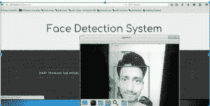
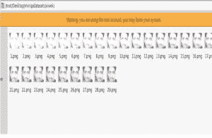

# 使用 Python 和 OpenCV 结合网络摄像头进行人脸检测

> 原文:[https://www . geesforgeks . org/人脸检测-使用 python-and-opencv-带网络摄像头/](https://www.geeksforgeeks.org/face-detection-using-python-and-opencv-with-webcam/)

OpenCV 是一个库，用于使用像 python 这样的编程语言进行图像处理。这个项目利用 OpenCV 库，使用你的网络摄像头作为主摄像头进行实时人脸检测。
**以下是对它的要求:-**

1.  Python 2.7
2.  OpenCV
3.  数字
4.  [哈尔级联正面人脸分类器](https://github.com/vschs007/realtime-face-detection-using-python-and-opencv/blob/master/haarcascade_frontalface_default.xml)

**使用的方法/算法:**

1.  该项目使用局部二值模式直方图算法来检测人脸。它通过阈值化每个像素的邻域来标记图像的像素，并将结果视为二进制数。
2.  LBPH 使用 4 个参数:
    (i)半径:半径用于构建圆形局部二值模式，代表
    中心像素周围的半径。
    (二)邻居:构建圆形局部二进制模式的样本点数。
    (iii)网格 X:水平方向的单元数。
    (四)网格 Y:垂直方向的单元格数。
3.  建立的模型是用给他们的标签训练的，然后，机器得到一个测试数据，机器为它决定正确的标签。

**如何使用:**

1.  在你的电脑上创建一个目录并命名(比如项目)
2.  创建两个名为 create_data.py 和 face_recognize.py 的 python 文件，分别在其中复制第一个源代码和第二个源代码。
3.  将 haarcscade _ frontal face _ default . XML 复制到项目目录中，可以在 opencv 中获取，也可以从
    [这里](https://github.com/vschs007/realtime-face-detection-using-python-and-opencv/blob/master/haarcascade_frontalface_default.xml)获取。
4.  您现在可以运行以下代码了。

## 计算机编程语言

```py
# Creating database
# It captures images and stores them in datasets
# folder under the folder name of sub_data
import cv2, sys, numpy, os
haar_file = 'haarcascade_frontalface_default.xml'

# All the faces data will be
#  present this folder
datasets = 'datasets' 

# These are sub data sets of folder,
# for my faces I've used my name you can
# change the label here
sub_data = 'vivek'    

path = os.path.join(datasets, sub_data)
if not os.path.isdir(path):
    os.mkdir(path)

# defining the size of images
(width, height) = (130, 100)   

#'0' is used for my webcam,
# if you've any other camera
#  attached use '1' like this
face_cascade = cv2.CascadeClassifier(haar_file)
webcam = cv2.VideoCapture(0)

# The program loops until it has 30 images of the face.
count = 1
while count < 30:
    (_, im) = webcam.read()
    gray = cv2.cvtColor(im, cv2.COLOR_BGR2GRAY)
    faces = face_cascade.detectMultiScale(gray, 1.3, 4)
    for (x, y, w, h) in faces:
        cv2.rectangle(im, (x, y), (x + w, y + h), (255, 0, 0), 2)
        face = gray[y:y + h, x:x + w]
        face_resize = cv2.resize(face, (width, height))
        cv2.imwrite('% s/% s.png' % (path, count), face_resize)
    count += 1

    cv2.imshow('OpenCV', im)
    key = cv2.waitKey(10)
    if key == 27:
        break
```

在为面部训练模型后，应运行以下代码:

## 计算机编程语言

```py
# It helps in identifying the faces
import cv2, sys, numpy, os
size = 4
haar_file = 'haarcascade_frontalface_default.xml'
datasets = 'datasets'

# Part 1: Create fisherRecognizer
print('Recognizing Face Please Be in sufficient Lights...')

# Create a list of images and a list of corresponding names
(images, labels, names, id) = ([], [], {}, 0)
for (subdirs, dirs, files) in os.walk(datasets):
    for subdir in dirs:
        names[id] = subdir
        subjectpath = os.path.join(datasets, subdir)
        for filename in os.listdir(subjectpath):
            path = subjectpath + '/' + filename
            label = id
            images.append(cv2.imread(path, 0))
            labels.append(int(label))
        id += 1
(width, height) = (130, 100)

# Create a Numpy array from the two lists above
(images, labels) = [numpy.array(lis) for lis in [images, labels]]

# OpenCV trains a model from the images
# NOTE FOR OpenCV2: remove '.face'
model = cv2.face.LBPHFaceRecognizer_create()
model.train(images, labels)

# Part 2: Use fisherRecognizer on camera stream
face_cascade = cv2.CascadeClassifier(haar_file)
webcam = cv2.VideoCapture(0)
while True:
    (_, im) = webcam.read()
    gray = cv2.cvtColor(im, cv2.COLOR_BGR2GRAY)
    faces = face_cascade.detectMultiScale(gray, 1.3, 5)
    for (x, y, w, h) in faces:
        cv2.rectangle(im, (x, y), (x + w, y + h), (255, 0, 0), 2)
        face = gray[y:y + h, x:x + w]
        face_resize = cv2.resize(face, (width, height))
        # Try to recognize the face
        prediction = model.predict(face_resize)
        cv2.rectangle(im, (x, y), (x + w, y + h), (0, 255, 0), 3)

        if prediction[1]<500:

           cv2.putText(im, '% s - %.0f' %
(names[prediction[0]], prediction[1]), (x-10, y-10),
cv2.FONT_HERSHEY_PLAIN, 1, (0, 255, 0))
        else:
          cv2.putText(im, 'not recognized',
(x-10, y-10), cv2.FONT_HERSHEY_PLAIN, 1, (0, 255, 0))

    cv2.imshow('OpenCV', im)

    key = cv2.waitKey(10)
    if key == 27:
        break
```

**注意:**以上程序不会在联机 IDE 上运行。

**程序截图**

它可能看起来有些不同，因为我已经将上面的程序集成到 flask framework 上
**运行第二个程序会产生类似于下图的结果:**



人脸检测

**数据集存储:**



数据集