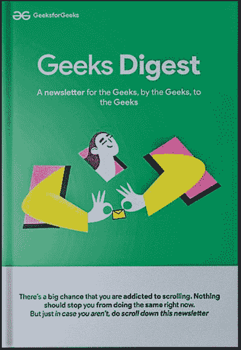
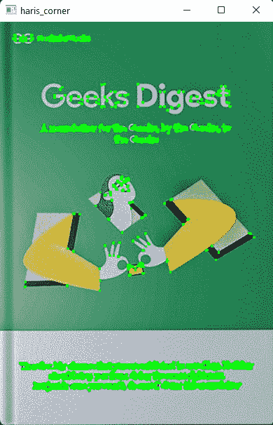
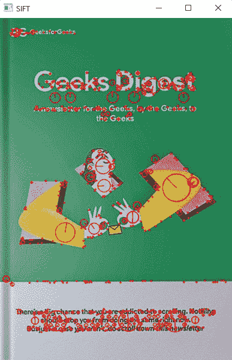
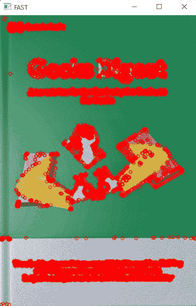
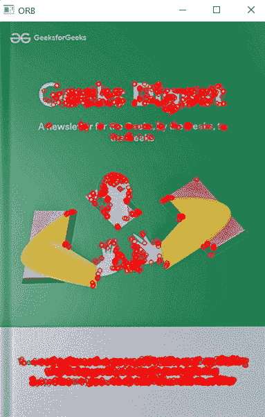

# 利用 OpenCV-Python 进行特征检测和匹配

> 原文:[https://www . geesforgeks . org/feature-detection-and-matching-with-opencv-python/](https://www.geeksforgeeks.org/feature-detection-and-matching-with-opencv-python/)

在本文中，我们将使用 Python 中的 OpenCV 来了解计算机视觉中的特征检测。特征检测是检查图像重要特征的过程，在这种情况下，图像的特征可以是图像中的边缘、角、脊和斑点。


在 OpenCV 中，有许多方法可以检测图像的特征，每种技术都有自己的优点和缺点。

**注意:**我们给这些算法的图像应该是黑白的。这有助于算法更加关注特征。

**使用中的图像:**



## 方法 1:哈里斯角点检测

Haris 角点检测是一种方法，在这种方法中，我们可以通过找到角点在图像上滑动滑块框来检测图像的角点，它将应用阈值，并且角点将在图像中被标记。该算法主要用于检测图像的角点。

> **语法:**
> 
> cv2 . cornerrelis(图像、dest、块大小、kSize、freeParameter、bordertype)
> 
> **参数:**
> 
> *   图像–检测特征的源图像
> *   dest–存储输出图像的变量
> *   块大小–邻域大小
> *   ksize–光圈参数
> *   边框类型:像素显示类型。

**示例:**使用 OpenCV 进行特征检测和匹配

## 蟒蛇 3

```py
# Importing the libraries
import cv2
import numpy as np

# Reading the image and converting the image to B/W
image = cv2.imread('book.png')
gray_image = cv2.cvtColor(image, cv2.COLOR_BGR2GRAY)
gray_image = np.float32(gray_image)

# Applying the function
dst = cv2.cornerHarris(gray_image, blockSize=2, ksize=3, k=0.04)

# dilate to mark the corners
dst = cv2.dilate(dst, None)
image[dst > 0.01 * dst.max()] = [0, 255, 0]

cv2.imshow('haris_corner', image)
cv2.waitKey()
```

**输出:**



## 方法二:施-托马西角点检测

Shi 和 Tomasi 提出了一种不同的角点检测算法，这种算法与 Haris 角点检测算法最相似，唯一不同的是核值，在核值中我们只能找到图像的 n 个最强角点。当我们只需要图像的有限且非常重要的特征时，这可以有很大的帮助。

> **语法:**
> 
> cv2.goodFeaturesToTrack(图像，maxc，质量，maxD)
> 
> **参数:**
> 
> *   图像–我们需要提取特征的源图像。
> *   maxc–我们想要的最大转角数[负值表示所有转角]
> *   质量–质量水平参数(首选值=0.01)
> *   最大距离–最大距离(首选值=10)

**示例:**使用 OpenCV 进行特征检测和匹配

## 蟒蛇 3

```py
# Importing the libraries
import cv2
import numpy as np

# Reading the image and converting into B?W
image = cv2.imread("book.png")
gray_image = cv2.cvtColor(image, cv2.COLOR_BGR2GRAY)

# Applying the function
corners = cv2.goodFeaturesToTrack(
    gray_image, maxCorners=50, qualityLevel=0.02, minDistance=20)
corners = np.float32(corners)

for item in corners:
    x, y = item[0]
    x = int(x)
    y = int(y)
    cv2.circle(image, (x, y), 6, (0, 255, 0), -1)

# Showing the image
cv2.imshow('good_features', image)
cv2.waitKey()
```

**输出:**


## 方法三:尺度不变特征变换

而 Haris 和 shi-Tomasi 是检测图像角点的算法。SIFT 是检测与图像和参考的尺度和旋转无关的目标的重要算法之一。这在我们将现实世界的物体与图像进行比较时很有帮助，尽管它与图像的角度和比例无关。该方法将返回图像中我们需要标记的关键点。

**语法:**

> sift = cv2 . xfeatures 2d . sift _ create()
> 
> kp，des = sift . detectandcompe(gray _ img，None)

这个函数返回关键点，我们稍后使用 drawkeypoints()方法来绘制关键点。

**注:**图像中的圆圈代表关键点，圆圈的大小直接代表关键点的强弱。

**示例:**使用 OpenCV 进行特征检测和匹配

## 蟒蛇 3

```py
# Importing the libraries
import cv2

# Reading the image and converting into B/W
image = cv2.imread('book.jpg')
gray_image = cv2.cvtColor(image, cv2.COLOR_BGR2GRAY)

# Applying the function
sift = cv2.xfeatures2d.SIFT_create()
kp, des = sift.detectAndCompute(gray_image, None)

# Applying the function
kp_image = cv2.drawKeypoints(image, kp, None, color=(
    0, 255, 0), flags=cv2.DRAW_MATCHES_FLAGS_DRAW_RICH_KEYPOINTS)
cv2.imshow('SIFT', kp_image)
cv2.waitKey()
```

**输出:**



## 方法 4:角点检测的快速算法

与 SIFT 相比，SURF 速度很快，但与手机和监控摄像头等实时设备一起使用时，速度就没那么快了。因此，FAST 算法的引入带来了非常快的计算时间。然而 FAST 只给我们关键点，我们可能需要用其他算法来计算描述符，比如 SIFT 和 SURF。使用快速算法，我们可以检测角落和斑点。

> **语法:**
> 
> fast = cv2。FastFeatureDetector_create()
> 
> fast . setnonmaxsuppression(false)
> 
> kp =快速。检测(灰色 _img，无)

**示例:**使用 OpenCV 进行特征检测和匹配

## 蟒蛇 3

```py
# Importing the libraries
import cv2

# Reading the image and converting into B/W
image = cv2.imread('book.png')
gray_image = cv2.cvtColor(image, cv2.COLOR_BGR2GRAY)

# Applying the function
fast = cv2.FastFeatureDetector_create()
fast.setNonmaxSuppression(False)

# Drawing the keypoints
kp = fast.detect(gray_image, None)
kp_image = cv2.drawKeypoints(image, kp, None, color=(0, 255, 0))

cv2.imshow('FAST', kp_image)
cv2.waitKey()
```

**输出:**



## 方法 5: ORB(定向快速旋转简报)

与 SIFT 和 SURF 相比，ORB 是一种非常有效的检测图像特征的方法。与 SIFT 和 SURF 算法相比，ORB 被编程为在图像中找到更少的特征，因为它在比它们更短的时间内检测到非常重要的特征，然而与其他检测算法相比，该算法被认为是非常有效的算法。

**语法:**

> orb = cv2。ORB _ create(nfatures = 2000)
> 
> kp，des = orb . detected compute(gray _ img，None)

**示例:**使用 OpenCV 进行特征检测和匹配

## 蟒蛇 3

```py
# Importing the libraries
import cv2

# Reading the image and converting into B/W
image = cv2.imread('book.png')
gray_image = cv2.cvtColor(image, cv2.COLOR_BGR2GRAY)

# Applying the function
orb = cv2.ORB_create(nfeatures=2000)
kp, des = orb.detectAndCompute(gray_image, None)

# Drawing the keypoints
kp_image = cv2.drawKeypoints(image, kp, None, color=(0, 255, 0), flags=0)

cv2.imshow('ORB', kp_image)
cv2.waitKey()
```

**输出:**

