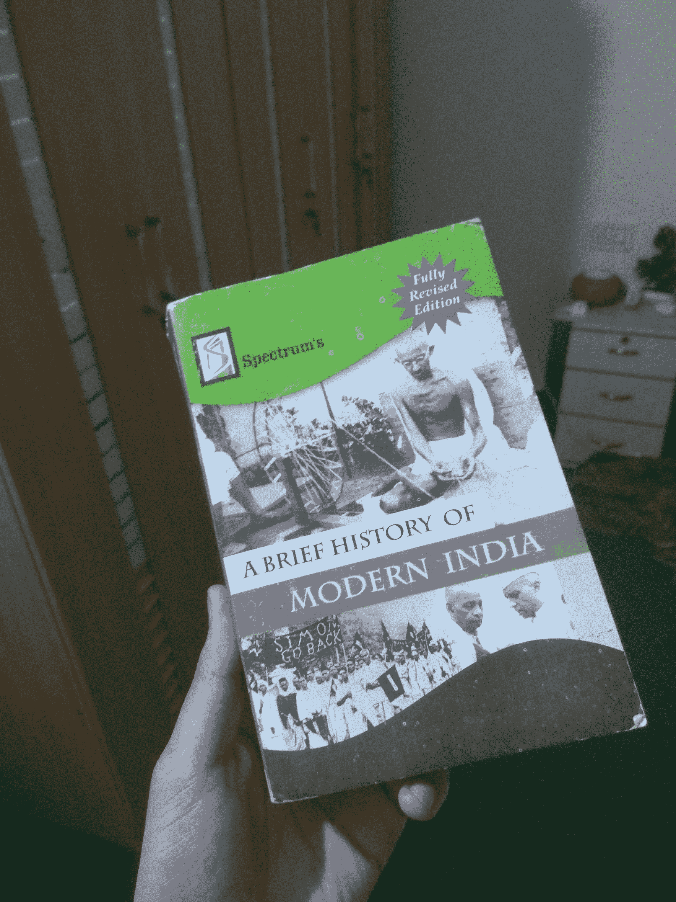
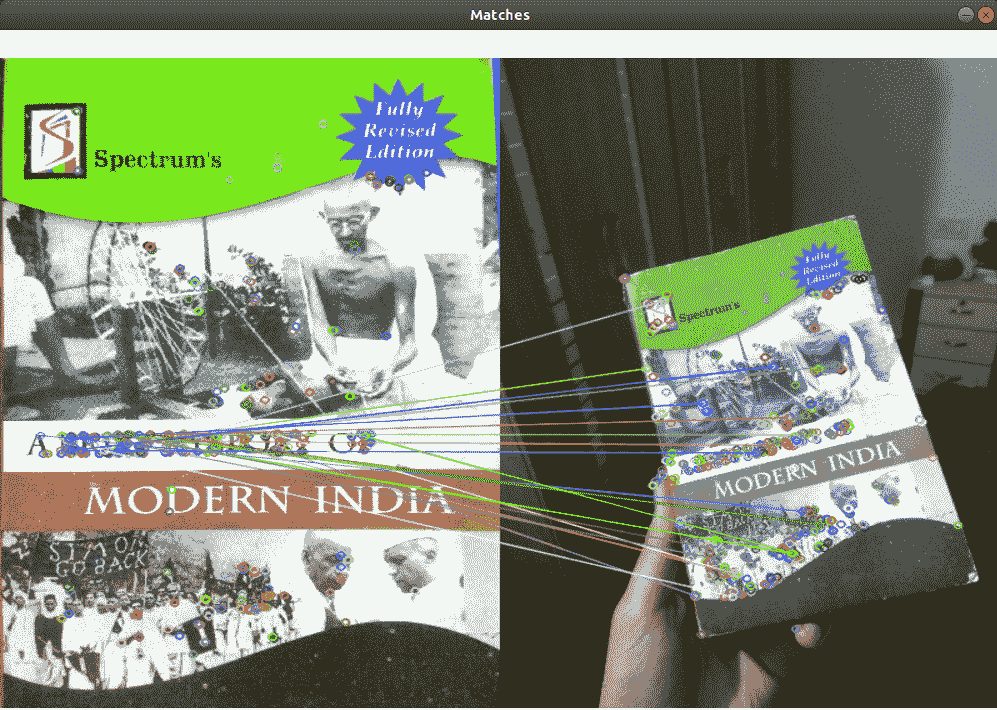

# Python-OpenCV 中使用 ORB 算法的特征匹配

> 原文:[https://www . geesforgeks . org/feature-matching-using-orb-algorithm in-python-opencv/](https://www.geeksforgeeks.org/feature-matching-using-orb-algorithm-in-python-opencv/)

**ORB** 是 FAST 关键点检测器和 BRIEF 描述符的融合，增加了一些特性来提高性能。 **FAST** 是来自加速分割测试的**特征，用于从提供的图像中检测特征。它还使用金字塔来产生多尺度特征。现在，它不计算特征的方向和描述符，所以这就是简要的作用。**

ORB 使用简要描述符，但是由于简要描述符在旋转时表现不佳。所以 ORB 所做的是根据关键点的方向旋转简报。使用面片的方向，找到它的旋转矩阵，旋转简表得到旋转版本。ORB 是用于特征提取的 SIFT 或 SURF 算法的有效替代品，在计算成本、匹配性能以及主要是专利方面。SIFT 和 SURF 是专利，你应该为它的使用付费。但是 ORB 没有专利。

在本教程中，我们将学习如何找到图像中的特征，并将其与连续视频中的其他图像进行匹配。

### 算法

*   获取查询图像并将其转换为灰度。
*   现在初始化 ORB 检测器，检测查询图像和场景中的关键点。
*   计算属于两幅图像的描述符。
*   使用强力匹配器匹配关键点。
*   显示匹配的图像。

下面是实现。

**输入图像:**



## 蟒蛇 3

```py
import numpy as np
import cv2

# Read the query image as query_img
# and train image This query image
# is what you need to find in train image
# Save it in the same directory
# with the name image.jpg 
query_img = cv2.imread('query.jpg')
train_img = cv2.imread('train.jpg')

# Convert it to grayscale
query_img_bw = cv2.cvtColor(query_img,cv2.COLOR_BGR2GRAY)
train_img_bw = cv2.cvtColor(train_img, cv2.COLOR_BGR2GRAY)

# Initialize the ORB detector algorithm
orb = cv2.ORB_create()

# Now detect the keypoints and compute
# the descriptors for the query image
# and train image
queryKeypoints, queryDescriptors = orb.detectAndCompute(query_img_bw,None)
trainKeypoints, trainDescriptors = orb.detectAndCompute(train_img_bw,None)

# Initialize the Matcher for matching
# the keypoints and then match the
# keypoints
matcher = cv2.BFMatcher()
matches = matcher.match(queryDescriptors,trainDescriptors)

# draw the matches to the final image
# containing both the images the drawMatches()
# function takes both images and keypoints
# and outputs the matched query image with
# its train image
final_img = cv2.drawMatches(query_img, queryKeypoints,
train_img, trainKeypoints, matches[:20],None)

final_img = cv2.resize(final_img, (1000,650))

# Show the final image
cv2.imshow("Matches", final_img)
cv2.waitKey(3000)
```

**输出:**

