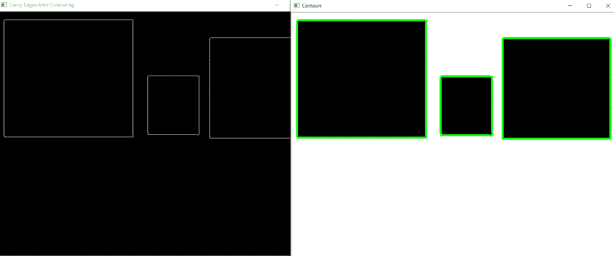

# 使用 OpenCV | Python

查找并绘制等高线

> 原文:[https://www . geesforgeks . org/find-and-draw-等高线-使用-opencv-python/](https://www.geeksforgeeks.org/find-and-draw-contours-using-opencv-python/)

**轮廓**被定义为连接图像边界上具有相同强度的所有点的线。轮廓在形状分析、寻找感兴趣对象的大小和对象检测中很方便。

OpenCV 具有`findContour()`功能，有助于从图像中提取轮廓。它最适合二值图像，所以我们应该首先应用阈值技术，索贝尔边缘等。

**以下是寻找等高线的代码–**

```py
import cv2
import numpy as np

# Let's load a simple image with 3 black squares
image = cv2.imread('C://Users//gfg//shapes.jpg')
cv2.waitKey(0)

# Grayscale
gray = cv2.cvtColor(image, cv2.COLOR_BGR2GRAY)

# Find Canny edges
edged = cv2.Canny(gray, 30, 200)
cv2.waitKey(0)

# Finding Contours
# Use a copy of the image e.g. edged.copy()
# since findContours alters the image
contours, hierarchy = cv2.findContours(edged, 
    cv2.RETR_EXTERNAL, cv2.CHAIN_APPROX_NONE)

cv2.imshow('Canny Edges After Contouring', edged)
cv2.waitKey(0)

print("Number of Contours found = " + str(len(contours)))

# Draw all contours
# -1 signifies drawing all contours
cv2.drawContours(image, contours, -1, (0, 255, 0), 3)

cv2.imshow('Contours', image)
cv2.waitKey(0)
cv2.destroyAllWindows()
```

**输出:**

我们看到`cv2.findContours()`函数中有三个必不可少的参数。第一种是源图像，第二种是轮廓检索模式，第三种是轮廓逼近法，它输出图像、轮廓和层次。*轮廓*是图像中所有轮廓的 Python 列表。每个单独的轮廓是对象边界点的(x，y)坐标的 Numpy 数组。

**轮廓近似法–**
上面，我们看到轮廓是具有相同强度的形状的边界。它存储形状边界的(x，y)坐标。但是它存储了所有的坐标吗？这是由这个轮廓近似方法指定的。
如果我们通过`cv2.CHAIN_APPROX_NONE`，所有的边界点都被存储。但实际上，我们需要所有的点吗？例如，如果我们必须找到一条直线的轮廓。我们只需要那条线的两个端点。这就是`cv2.CHAIN_APPROX_SIMPLE`的作用。它删除所有冗余点并压缩轮廓，从而节省内存。