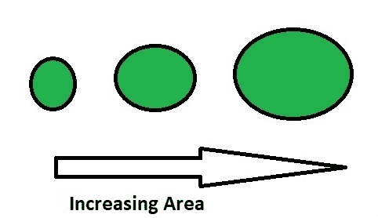
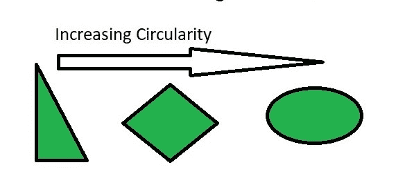
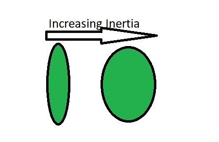
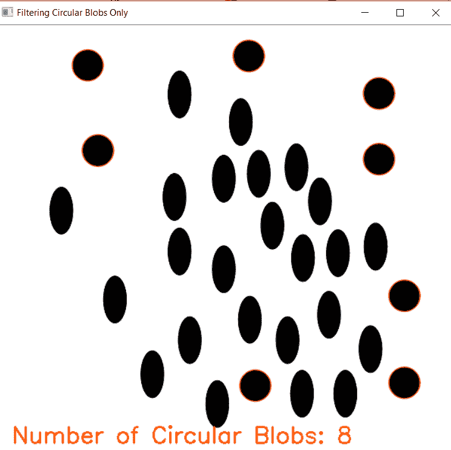

# 使用 OpenCV | Python 在图像中查找圆和椭圆

> 原文:[https://www . geesforgeks . org/find-circles-and-省略号-in-a-image-use-opencv-python/](https://www.geeksforgeeks.org/find-circles-and-ellipses-in-an-image-using-opencv-python/)

为了识别圆，椭圆，或者一般来说，任何连接像素的形状，我们使用 OpenCV 的 **SimpleBlobDetector()** 函数。在非技术术语中，斑点被理解为粘稠的液滴。在这里，我们将把所有的形状称为斑点。我们的任务是检测和识别斑点是否是圆。

OpenCV 提供了一种方便的方法来检测斑点，并根据不同的特征进行过滤。有各种不同的参数控制识别过程和结果。本项目使用的重要参数有:

*   **按区域过滤–**这是为了避免识别图像中可能被错误检测为圆形的任何小点。



*   **按圆形过滤–**这有助于我们识别更像圆形的形状。

```py
Circularity = . 
```

真圆的圆度为 1，正方形的圆度接近 78%。



*   **按凸性过滤–**凹性通常会破坏圆形度。凸度越大，越接近一个封闭的圆。


*   **按惯性过滤–**与圆相似的对象具有更大的惯性，例如，对于圆，该值为 1，对于椭圆，该值介于 0 和 1 之间，对于直线，该值为 0。要按惯性比过滤，请将“按惯性过滤”设置为 1，并适当设置为 0 < =最小比率< = 1 和最大比率(< =1)。



以下是识别圆圈的代码:

## 蟒蛇 3

```py
import cv2
import numpy as np

# Load image
image = cv2.imread('C://gfg//images//blobs.jpg', 0)

# Set our filtering parameters
# Initialize parameter settiing using cv2.SimpleBlobDetector
params = cv2.SimpleBlobDetector_Params()

# Set Area filtering parameters
params.filterByArea = True
params.minArea = 100

# Set Circularity filtering parameters
params.filterByCircularity = True
params.minCircularity = 0.9

# Set Convexity filtering parameters
params.filterByConvexity = True
params.minConvexity = 0.2

# Set inertia filtering parameters
params.filterByInertia = True
params.minInertiaRatio = 0.01

# Create a detector with the parameters
detector = cv2.SimpleBlobDetector_create(params)

# Detect blobs
keypoints = detector.detect(image)

# Draw blobs on our image as red circles
blank = np.zeros((1, 1))
blobs = cv2.drawKeypoints(image, keypoints, blank, (0, 0, 255),
                          cv2.DRAW_MATCHES_FLAGS_DRAW_RICH_KEYPOINTS)

number_of_blobs = len(keypoints)
text = "Number of Circular Blobs: " + str(len(keypoints))
cv2.putText(blobs, text, (20, 550),
            cv2.FONT_HERSHEY_SIMPLEX, 1, (0, 100, 255), 2)

# Show blobs
cv2.imshow("Filtering Circular Blobs Only", blobs)
cv2.waitKey(0)
cv2.destroyAllWindows()
```

**输出:**

