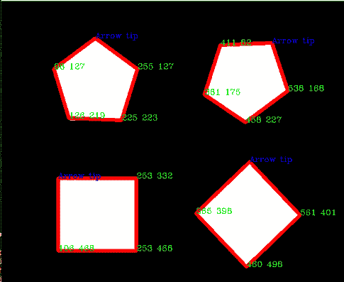

# 使用 OpenCV | Python 找到等高线的坐标

> 原文:[https://www . geesforgeks . org/find-坐标-等高线-使用-opencv-python/](https://www.geeksforgeeks.org/find-co-ordinates-of-contours-using-opencv-python/)

在本文中，我们将学习如何借助 OpenCV 找到等高线的坐标。轮廓被定义为连接图像边界上具有相同强度的所有点的线。轮廓在形状分析、寻找感兴趣对象的大小和对象检测中很方便。

我们将使用 OpenCV `findContour()`功能，帮助从图像中提取轮廓。

**方法:**
轮廓每个顶点的坐标隐藏在轮廓本身中。在这种方法中，我们将使用 numpy 库将轮廓的所有坐标转换为线性阵列。这个线性阵列将包含每个轮廓的 x 和 y 坐标。这里的关键点是，阵列中的第一个坐标总是最顶端顶点的坐标，因此可以帮助检测图像的方向。

在下面的代码中，我们将使用名为“test.jpg”的图像来查找轮廓，并在图像本身上打印顶点的坐标。

```py
# Python code to find the co-ordinates of
# the contours detected in an image.
import numpy as np
import cv2

# Reading image
font = cv2.FONT_HERSHEY_COMPLEX
img2 = cv2.imread('test.jpg', cv2.IMREAD_COLOR)

# Reading same image in another 
# variable and converting to gray scale.
img = cv2.imread('test.jpg', cv2.IMREAD_GRAYSCALE)

# Converting image to a binary image
# ( black and white only image).
_, threshold = cv2.threshold(img, 110, 255, cv2.THRESH_BINARY)

# Detecting contours in image.
contours, _= cv2.findContours(threshold, cv2.RETR_TREE,
                               cv2.CHAIN_APPROX_SIMPLE)

# Going through every contours found in the image.
for cnt in contours :

    approx = cv2.approxPolyDP(cnt, 0.009 * cv2.arcLength(cnt, True), True)

    # draws boundary of contours.
    cv2.drawContours(img2, [approx], 0, (0, 0, 255), 5) 

    # Used to flatted the array containing
    # the co-ordinates of the vertices.
    n = approx.ravel() 
    i = 0

    for j in n :
        if(i % 2 == 0):
            x = n[i]
            y = n[i + 1]

            # String containing the co-ordinates.
            string = str(x) + " " + str(y) 

            if(i == 0):
                # text on topmost co-ordinate.
                cv2.putText(img2, "Arrow tip", (x, y),
                                font, 0.5, (255, 0, 0)) 
            else:
                # text on remaining co-ordinates.
                cv2.putText(img2, string, (x, y), 
                          font, 0.5, (0, 255, 0)) 
        i = i + 1

# Showing the final image.
cv2.imshow('image2', img2) 

# Exiting the window if 'q' is pressed on the keyboard.
if cv2.waitKey(0) & 0xFF == ord('q'): 
    cv2.destroyAllWindows()
```

**输入图像:**


**输出:**
