# Python OpenCV 入门

> 原文:[https://www . geesforgeks . org/入门-python-opencv/](https://www.geeksforgeeks.org/getting-started-with-python-opencv/)

计算机视觉是我们能够理解图像和视频并从中提取信息的技术之一。它是人工智能的一个子集，从数字图像或视频中收集信息。

Python OpenCV 是最流行的计算机视觉库。通过使用它，人们可以处理图像和视频来识别物体、人脸，甚至是人类的笔迹。当它与各种库(如 NumPy)集成时，python 能够处理 OpenCV 数组结构进行分析。

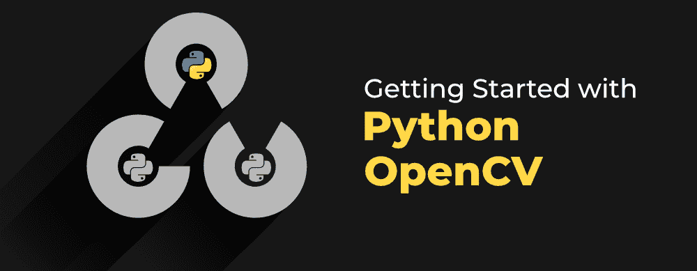

在本文中，我们将借助好的例子详细讨论 Python OpenCV 以及一些常见的操作，如调整大小、裁剪、读取、保存图像等。

## 装置

要安装 OpenCV，必须在系统上预装 Python 和 PIP。如果 Python 不存在，请通过[如何在 Linux 上安装 Python？](https://www.geeksforgeeks.org/how-to-install-python-on-linux/)并按照提供的说明操作。如果画中画不存在，通过[如何在 Linux 上安装画中画？](https://www.geeksforgeeks.org/how-to-install-pip-in-linux/)并按照提供的说明操作。

安装 Python 和 PIP 后，在终端中键入以下命令。

```py
pip3 install opencv-python
```


## 阅读图像

读取图像[使用 cv2.imread()](https://www.geeksforgeeks.org/python-opencv-cv2-imread-method/) 方法。此方法从指定文件加载图像。如果无法读取图像(因为缺少文件、权限不当、格式不受支持或无效)，则此方法返回一个空矩阵。

**使用的图像:**


## 示例:Python OpenCV 读取图像

## 蟒蛇 3

```py
# Python code to read image
import cv2

# To read image from disk, we use
# cv2.imread function, in below method,
img = cv2.imread("geeks.png", cv2.IMREAD_COLOR)

print(img)
```

**输出:**

```py
[[[ 87 157  14]
  [ 87 157  14]
  [ 87 157  14]
  ...
  [ 87 157  14]
  [ 87 157  14]
  [ 87 157  14]]

 [[ 87 157  14]
  [ 87 157  14]
  [ 87 157  14]
  ...
  [ 87 157  14]
  [ 87 157  14]
  [ 87 157  14]]

 [[ 87 157  14]
  [ 87 157  14]
  [ 87 157  14]
  ...
  [ 87 157  14]
  [ 87 157  14]
  [ 87 157  14]]

 ...

 [[ 72 133   9]
  [ 72 133   9]
  [ 72 133   9]
  ...
  [ 87 157  14]
  [ 87 157  14]
  [ 87 157  14]]

 [[ 72 133   9]
  [ 72 133   9]
  [ 72 133   9]
  ...
  [ 87 157  14]
  [ 87 157  14]
  [ 87 157  14]]

 [[ 72 133   9]
  [ 72 133   9]
  [ 72 133   9]
  ...
  [ 87 157  14]
  [ 87 157  14]
  [ 87 157  14]]]
```

## 显示图像

[cv2.imshow()](https://www.geeksforgeeks.org/python-opencv-cv2-imshow-method/) 方法用于在窗口中显示图像。窗口会自动适应图像大小。

### 示例:Python OpenCV 显示图像

## 蟒蛇 3

```py
# Python code to read image
import cv2

# To read image from disk, we use
# cv2.imread function, in below method,
img = cv2.imread("geeks.png", cv2.IMREAD_COLOR)

# Creating GUI window to display an image on screen
# first Parameter is windows title (should be in string format)
# Second Parameter is image array
cv2.imshow("GeeksforGeeks", img)

# To hold the window on screen, we use cv2.waitKey method
# Once it detected the close input, it will release the control
# To the next line
# First Parameter is for holding screen for specified milliseconds
# It should be positive integer. If 0 pass an parameter, then it will
# hold the screen until user close it.
cv2.waitKey(0)

# It is for removing/deleting created GUI window from screen
# and memory
cv2.destroyAllWindows()
```

**输出:**


## 保存图像

[cv2.imwrite()](https://www.geeksforgeeks.org/python-opencv-cv2-imwrite-method/) 方法用于将图像保存到任何存储设备。这将根据当前工作目录中的指定格式保存图像。

### 示例:Python OpenCV 保存图像

## 蟒蛇 3

```py
# Python program to explain cv2.imwrite() method

# importing cv2
import cv2

image_path = 'geeks.png'

# Using cv2.imread() method
# to read the image
img = cv2.imread(image_path)

# Filename
filename = 'savedImage.jpg'

# Using cv2.imwrite() method
# Saving the image
cv2.imwrite(filename, img)

# Reading and showing the saved image
img = cv2.imread(filename)
cv2.imshow("GeeksforGeeks", img)

cv2.waitKey(0)
cv2.destroyAllWindows()
```

**输出:**


## 旋转图像

[cv2.rotate()](https://www.geeksforgeeks.org/python-opencv-cv2-rotate-method/) 方法用于以 90 度的倍数旋转 2D 阵列。函数 cv::rotate 以三种不同的方式旋转数组。

### 示例:Python OpenCV 旋转图像

## 蟒蛇 3

```py
# Python program to explain cv2.rotate() method

# importing cv2
import cv2

# path
path = 'geeks.png'

# Reading an image in default mode
src = cv2.imread(path)

# Window name in which image is displayed
window_name = 'Image'

# Using cv2.rotate() method
# Using cv2.ROTATE_90_CLOCKWISE rotate
# by 90 degrees clockwise
image = cv2.rotate(src, cv2.cv2.ROTATE_90_CLOCKWISE)

# Displaying the image
cv2.imshow(window_name, image)
cv2.waitKey(0)
```

**输出:**


上述功能限制我们只能将图像旋转 90 度的倍数。我们还可以通过定义列出旋转点、旋转程度和比例因子的旋转矩阵，将[图像旋转到任意角度](https://www.geeksforgeeks.org/image-processing-in-python-scaling-rotating-shifting-and-edge-detection/)。

### 示例:Python OpenCV 将图像旋转任意角度

## 蟒蛇 3

```py
import cv2
import numpy as np

FILE_NAME = 'geeks.png'

# Read image from the disk.
img = cv2.imread(FILE_NAME)

# Shape of image in terms of pixels.
(rows, cols) = img.shape[:2]

# getRotationMatrix2D creates a matrix needed
# for transformation. We want matrix for rotation
# w.r.t center to 45 degree without scaling.
M = cv2.getRotationMatrix2D((cols / 2, rows / 2), 45, 1)
res = cv2.warpAffine(img, M, (cols, rows))

cv2.imshow("GeeksforGeeks", res)

cv2.waitKey(0)
cv2.destroyAllWindows()
```

**输出:**


## 调整图像大小

[图像尺寸调整](https://www.geeksforgeeks.org/image-resizing-using-opencv-python/)是指图像的缩放。它有助于减少图像的像素数，并且具有几个优点，例如，它可以减少神经网络的训练时间，因为图像中的像素数越多，输入节点的数量越多，这又增加了模型的复杂性。它还有助于放大图像。很多时候，我们需要调整图像的大小，即缩小或放大以满足尺寸要求。

OpenCV 为我们提供了几种调整图像大小的插值方法。选择调整大小的插值方法–

*   **cv2。INTER_AREA:** 当我们需要缩小图像时使用。
*   **cv2。INTER_CUBIC:** 这样比较慢但是效率更高。
*   **cv2。INTER_LINEAR:** 主要用于需要缩放时。这是 OpenCV 中默认的插值技术。

### 示例:Python OpenCV 图像大小调整

## 蟒蛇 3

```py
import cv2
import numpy as np
import matplotlib.pyplot as plt

image = cv2.imread("geeks.png", 1)
# Loading the image

half = cv2.resize(image, (0, 0), fx = 0.1, fy = 0.1)
bigger = cv2.resize(image, (1050, 1610))

stretch_near = cv2.resize(image, (780, 540),
            interpolation = cv2.INTER_NEAREST)

Titles =["Original", "Half", "Bigger", "Interpolation Nearest"]
images =[image, half, bigger, stretch_near]
count = 4

for i in range(count):
    plt.subplot(2, 3, i + 1)
    plt.title(Titles[i])
    plt.imshow(images[i])

plt.show()
```

**输出:**


## 色彩空间

[色彩空间](https://www.geeksforgeeks.org/color-spaces-in-opencv-python/)是一种表示图像中呈现的色彩通道的方式，它赋予图像特定的色调。有几种不同的颜色空间，每种都有自己的意义。一些流行的颜色空间是 RGB(红色、绿色、蓝色)、CMYK(青色、洋红色、黄色、黑色)、HSV(色调、饱和度、值)等。

[cv2.cvtColor()](https://www.geeksforgeeks.org/python-opencv-cv2-cvtcolor-method/) 方法用于将图像从一个颜色空间转换到另一个颜色空间。OpenCV 中有 150 多种颜色空间转换方法。

### 示例:Python OpenCV 颜色空间

## 蟒蛇 3

```py
# Python program to explain cv2.cvtColor() method

# importing cv2
import cv2

# path
path = 'geeks.png'

# Reading an image in default mode
src = cv2.imread(path)

# Window name in which image is displayed
window_name = 'GeeksforGeeks'

# Using cv2.cvtColor() method
# Using cv2.COLOR_BGR2GRAY color space
# conversion code
image = cv2.cvtColor(src, cv2.COLOR_BGR2GRAY )

# Displaying the image
cv2.imshow(window_name, image)

cv2.waitKey(0)
cv2.destroyAllWindows()
```

**输出:**


## 算术运算

加法、减法和按位运算(与、或、非、异或)等算术运算可以应用于输入图像。这些操作有助于增强输入图像的属性。图像算法对于分析输入图像的特性非常重要。被操作的图像可以进一步用作增强的输入图像，并且更多的操作可以被应用于图像的澄清、阈值化、扩张等。

### 添加图像:

我们可以使用函数 cv2.add()添加两幅图像。这直接将两幅图像中的图像像素相加。但是增加像素并不是一个理想的情况。所以，我们使用 cv2.addweighted()。请记住，两幅图像的大小和深度应该相等。

**输入图像 1:**


**输入图像 2:**

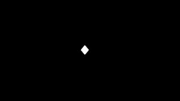

## 蟒蛇 3

```py
# Python program to illustrate
# arithmetic operation of
# addition of two images

# organizing imports
import cv2
import numpy as np

# path to input images are specified and
# images are loaded with imread command
image1 = cv2.imread('star.jpg')
image2 = cv2.imread('dot.jpg')

# cv2.addWeighted is applied over the
# image inputs with applied parameters
weightedSum = cv2.addWeighted(image1, 0.5, image2, 0.4, 0)

# the window showing output image
# with the weighted sum
cv2.imshow('Weighted Image', weightedSum)

# De-allocate any associated memory usage
if cv2.waitKey(0) & 0xff == 27:
    cv2.destroyAllWindows()
```

**输出:**

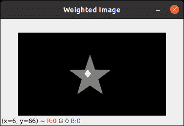

### **图像相减:**

就像除此之外，我们还可以减去两幅图像中的像素值，并借助 cv2 .减法()进行合并。图像的大小和深度应该相等。

## 蟒蛇 3

```py
# Python program to illustrate
# arithmetic operation of
# subtraction of pixels of two images

# organizing imports
import cv2
import numpy as np

# path to input images are specified and
# images are loaded with imread command
image1 = cv2.imread('star.jpg')
image2 = cv2.imread('dot.jpg')

# cv2.subtract is applied over the
# image inputs with applied parameters
sub = cv2.subtract(image1, image2)

# the window showing output image
# with the subtracted image
cv2.imshow('Subtracted Image', sub)

# De-allocate any associated memory usage
if cv2.waitKey(0) & 0xff == 27:
    cv2.destroyAllWindows()
```

**输出:**

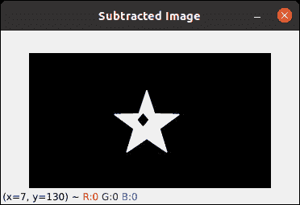

## 二值图像的位运算

[逐位运算](https://www.geeksforgeeks.org/arithmetic-operations-on-images-using-opencv-set-2-bitwise-operations-on-binary-images/)用于图像处理，用于提取图像中的重要部分。使用的位运算有:

*   和
*   运筹学
*   异或
*   不

### 逐位“与”运算

输入数组元素的逐位连接。

**输入图像 1:**


**输入图像 2:**


## 蟒蛇 3

```py
# Python program to illustrate
# arithmetic operation of
# bitwise AND of two images

# organizing imports
import cv2
import numpy as np

# path to input images are specified and
# images are loaded with imread command
img1 = cv2.imread('input1.png')
img2 = cv2.imread('input2.png')

# cv2.bitwise_and is applied over the
# image inputs with applied parameters
dest_and = cv2.bitwise_and(img2, img1, mask = None)

# the window showing output image
# with the Bitwise AND operation
# on the input images
cv2.imshow('Bitwise And', dest_and)

# De-allocate any associated memory usage
if cv2.waitKey(0) & 0xff == 27:
    cv2.destroyAllWindows()
```

**输出:**


### 逐位或运算

输入数组元素的逐位析取。

## 蟒蛇 3

```py
# Python program to illustrate
# arithmetic operation of
# bitwise OR of two images

# organizing imports
import cv2
import numpy as np

# path to input images are specified and
# images are loaded with imread command
img1 = cv2.imread('input1.png')
img2 = cv2.imread('input2.png')

# cv2.bitwise_or is applied over the
# image inputs with applied parameters
dest_or = cv2.bitwise_or(img2, img1, mask = None)

# the window showing output image
# with the Bitwise OR operation
# on the input images
cv2.imshow('Bitwise OR', dest_or)

# De-allocate any associated memory usage
if cv2.waitKey(0) & 0xff == 27:
    cv2.destroyAllWindows()
```

**输出:**


### 逐位异或运算

输入数组元素的逐位异或运算。

## 蟒蛇 3

```py
# Python program to illustrate
# arithmetic operation of
# bitwise XOR of two images

# organizing imports
import cv2
import numpy as np

# path to input images are specified and
# images are loaded with imread command
img1 = cv2.imread('input1.png')
img2 = cv2.imread('input2.png')

# cv2.bitwise_xor is applied over the
# image inputs with applied parameters
dest_xor = cv2.bitwise_xor(img1, img2, mask = None)

# the window showing output image
# with the Bitwise XOR operation
# on the input images
cv2.imshow('Bitwise XOR', dest_xor)

# De-allocate any associated memory usage
if cv2.waitKey(0) & 0xff == 27:
    cv2.destroyAllWindows()
```

**输出:**


### 逐位非运算

输入数组元素的反转。

## 蟒蛇 3

```py
# Python program to illustrate
# arithmetic operation of
# bitwise NOT on input image

# organizing imports
import cv2
import numpy as np

# path to input images are specified and
# images are loaded with imread command
img1 = cv2.imread('input1.png')
img2 = cv2.imread('input2.png')

# cv2.bitwise_not is applied over the
# image input with applied parameters
dest_not1 = cv2.bitwise_not(img1, mask = None)
dest_not2 = cv2.bitwise_not(img2, mask = None)

# the windows showing output image
# with the Bitwise NOT operation
# on the 1st and 2nd input image
cv2.imshow('Bitwise NOT on image 1', dest_not1)
cv2.imshow('Bitwise NOT on image 2', dest_not2)

# De-allocate any associated memory usage
if cv2.waitKey(0) & 0xff == 27:
    cv2.destroyAllWindows()
```

**输出:**

**图像 1 上的按位非**


**图像 2 上的按位非**


## 图像翻译

平移指的是物体的直线移动，即图像从一个位置移动到另一个位置。如果我们知道水平和垂直方向的位移量，比如(tx，ty)，那么我们就可以做一个变换矩阵。现在，我们可以使用 cv2 . wrap 仿射()函数来实现翻译。这个函数需要一个 2×3 的数组。numpy 数组应该是浮点型的。

### 示例:Python OpenCV 图像翻译

## 蟒蛇 3

```py
import cv2
import numpy as np

image = cv2.imread('geeks.png')

# Store height and width of the image
height, width = image.shape[:2]

quarter_height, quarter_width = height / 4, width / 4

T = np.float32([[1, 0, quarter_width], [0, 1, quarter_height]])

# We use warpAffine to transform
# the image using the matrix, T
img_translation = cv2.warpAffine(image, T, (width, height))

cv2.imshow('Translation', img_translation)
cv2.waitKey(0)

cv2.destroyAllWindows()
```

**输出:**


## 边缘检测

图像检测的过程包括检测图像中的尖锐边缘。这种边缘检测在图像识别或物体定位/检测的环境中是必不可少的。由于其广泛的适用性，有几种检测边缘的算法。我们将使用一种称为 [Canny 边缘检测](https://www.geeksforgeeks.org/implement-canny-edge-detector-in-python-using-opencv/)的算法。

### 示例:Python OpenCV Canny 边缘检测

## 蟒蛇 3

```py
import cv2

FILE_NAME = 'geeks.png'

# Read image from disk.
img = cv2.imread(FILE_NAME)

# Canny edge detection.
edges = cv2.Canny(img, 100, 200)

# Write image back to disk.
cv2.imshow('Edges', edges)
cv2.waitKey(0)
cv2.destroyAllWindows()
```

**输出:**


## 简单阈值化

[阈值化](https://www.geeksforgeeks.org/python-thresholding-techniques-using-opencv-set-1-simple-thresholding/)是 OpenCV 中的一种技术，它是像素值相对于所提供的阈值的分配。在阈值处理中，将每个像素值与阈值进行比较。如果像素值小于阈值，则设置为 0，否则设置为最大值(一般为 255)。阈值分割是一种非常流行的分割技术，用于将被认为是前景的对象与其背景分离。阈值是在两侧具有两个区域的值，即低于阈值或高于阈值。

在计算机视觉中，这种阈值技术是在灰度图像上完成的。所以最初，图像必须在灰度颜色空间中转换。

```py
If f (x, y) < T
  then f (x, y) = 0
else
  f (x, y) = 255

where
f (x, y) = Coordinate Pixel Value
T = Threshold Value.
```

在 Python 的 OpenCV 中，函数 cv2.threshold 用于阈值化。

基本的阈值技术是二值阈值。对于每个像素，应用相同的阈值。如果像素值小于阈值，则设置为 0，否则设置为最大值。不同的简单阈值技术有:

*   **cv2。THRESH_BINARY:** 如果像素强度大于设定阈值，则该值设置为 255，否则设置为 0(黑色)。
*   **cv2。THRESH _ BINARY _ INV:**cv2 的反转或相反情况。THRESH_BINARY。
*   **cv。THRESH_TRUNC:** 如果像素强度值大于阈值，则截断为阈值。像素值被设置为与阈值相同。所有其他值保持不变。
*   **cv。THRESH_TOZERO:** 像素强度设置为 0，对于所有像素强度，小于阈值。
*   **cv。THRESH _ TOZERO _ INV:**cv2 的反转或相反情况。THRESH_TOZERO。

### 示例:Python OpenCV 简单阈值化

## 蟒蛇 3

```py
# Python program to illustrate
# simple thresholding type on an image

# organizing imports
import cv2
import numpy as np

# path to input image is specified and
# image is loaded with imread command
image1 = cv2.imread('geeks.png')

# cv2.cvtColor is applied over the
# image input with applied parameters
# to convert the image in grayscale
img = cv2.cvtColor(image1, cv2.COLOR_BGR2GRAY)

# applying different thresholding
# techniques on the input image
# all pixels value above 120 will
# be set to 255
ret, thresh1 = cv2.threshold(img, 120, 255, cv2.THRESH_BINARY)
ret, thresh2 = cv2.threshold(img, 120, 255, cv2.THRESH_BINARY_INV)
ret, thresh3 = cv2.threshold(img, 120, 255, cv2.THRESH_TRUNC)
ret, thresh4 = cv2.threshold(img, 120, 255, cv2.THRESH_TOZERO)
ret, thresh5 = cv2.threshold(img, 120, 255, cv2.THRESH_TOZERO_INV)

# the window showing output images
# with the corresponding thresholding
# techniques applied to the input images
cv2.imshow('Binary Threshold', thresh1)
cv2.imshow('Binary Threshold Inverted', thresh2)
cv2.imshow('Truncated Threshold', thresh3)
cv2.imshow('Set to 0', thresh4)
cv2.imshow('Set to 0 Inverted', thresh5)

# De-allocate any associated memory usage
if cv2.waitKey(0) & 0xff == 27:
    cv2.destroyAllWindows()
```

**输出:**

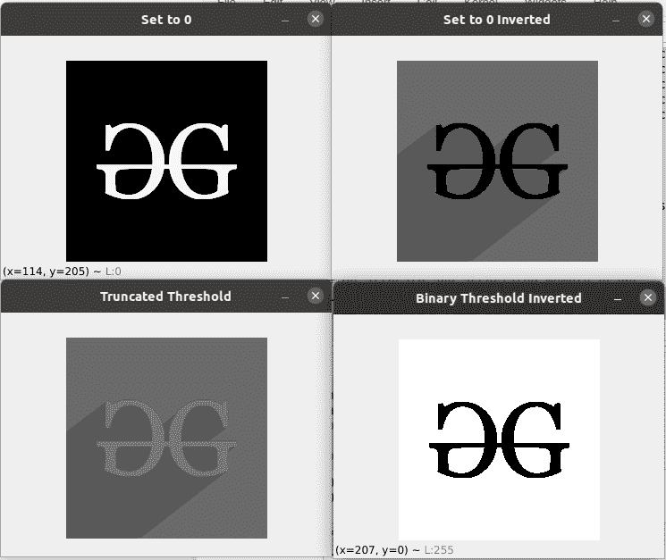

## 自适应阈值化

[自适应阈值化](https://www.geeksforgeeks.org/python-thresholding-techniques-using-opencv-set-2-adaptive-thresholding/)是为较小区域计算阈值的方法。这导致不同区域关于照明变化的阈值不同。我们对此使用 cv2.adaptiveThreshold。

### 示例:Python OpenCV 自适应阈值化

## 蟒蛇 3

```py
# Python program to illustrate
# adaptive thresholding type on an image

# organizing imports
import cv2
import numpy as np

# path to input image is specified and
# image is loaded with imread command
image1 = cv2.imread('geeks.png')

# cv2.cvtColor is applied over the
# image input with applied parameters
# to convert the image in grayscale
img = cv2.cvtColor(image1, cv2.COLOR_BGR2GRAY)

# applying different thresholding
# techniques on the input image
thresh1 = cv2.adaptiveThreshold(img, 255, cv2.ADAPTIVE_THRESH_MEAN_C,
                                cv2.THRESH_BINARY, 199, 5)

thresh2 = cv2.adaptiveThreshold(img, 255, cv2.ADAPTIVE_THRESH_GAUSSIAN_C,
                                cv2.THRESH_BINARY, 199, 5)

# the window showing output images
# with the corresponding thresholding
# techniques applied to the input image
cv2.imshow('Adaptive Mean', thresh1)
cv2.imshow('Adaptive Gaussian', thresh2)

# De-allocate any associated memory usage
if cv2.waitKey(0) & 0xff == 27:
    cv2.destroyAllWindows()
```

**输出:**

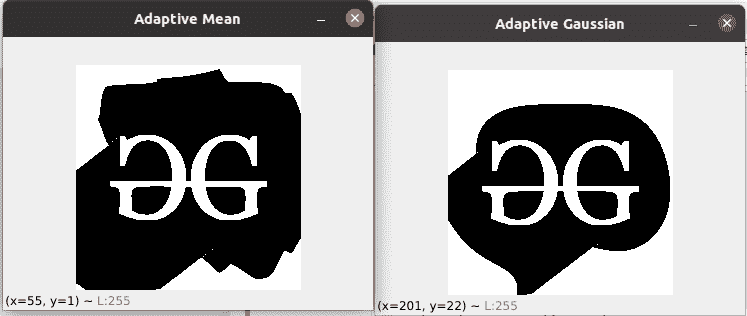

## 最大似然阈值法

在[大津阈值](https://www.geeksforgeeks.org/python-thresholding-techniques-using-opencv-set-3-otsu-thresholding/)中，阈值的值不是选择的，而是自动确定的。考虑双峰图像(两个不同的图像值)。生成的直方图包含两个峰值。因此，一般条件是选择一个位于两个直方图峰值中间的阈值。我们使用传统的 cv2.threshold 函数和 cv2。THRESH_OTSU 作为额外的旗帜。

### 示例:Python OpenCV Otsu 阈值化

## 蟒蛇 3

```py
# Python program to illustrate
# Otsu thresholding type on an image

# organizing imports
import cv2
import numpy as np

# path to input image is specified and
# image is loaded with imread command
image1 = cv2.imread('geeks.png')

# cv2.cvtColor is applied over the
# image input with applied parameters
# to convert the image in grayscale
img = cv2.cvtColor(image1, cv2.COLOR_BGR2GRAY)

# applying Otsu thresholding
# as an extra flag in binary
# thresholding
ret, thresh1 = cv2.threshold(img, 120, 255, cv2.THRESH_BINARY +
                             cv2.THRESH_OTSU)

# the window showing output image
# with the corresponding thresholding
# techniques applied to the input image
cv2.imshow('Otsu Threshold', thresh1)

# De-allocate any associated memory usage
if cv2.waitKey(0) & 0xff == 27:
    cv2.destroyAllWindows()
```

**输出:**

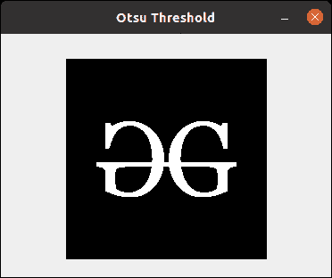

## 图像模糊

[图像模糊](https://www.geeksforgeeks.org/python-image-blurring-using-opencv/)是指使图像变得不清晰或不清晰。这是在各种低通滤波器内核的帮助下完成的。重要的模糊类型:

*   **高斯模糊:**高斯模糊是通过高斯函数模糊图像的结果。这是图形软件中广泛使用的效果，通常用于减少图像噪声和细节。它还被用作应用我们的机器学习或深度学习模型之前的预处理阶段。例如高斯核(3×3)
*   **中值模糊:**中值滤波器是一种非线性数字滤波技术，通常用于去除图像或信号中的噪声。中值滤波在数字图像处理中应用非常广泛，因为在某些条件下，它在去除噪声的同时保留了边缘。它是去除椒盐噪声的最佳算法之一。
*   **双边模糊:**双边滤波器是一种用于图像的非线性、边缘保持和降噪平滑滤波器。它用附近像素的亮度值的加权平均值替换每个像素的亮度。这个权重可以基于高斯分布。因此，在丢弃弱边缘的同时，保留了尖锐的边缘。

### 示例:Python OpenCV 模糊图像

## 蟒蛇 3

```py
# importing libraries
import cv2
import numpy as np

image = cv2.imread('geeks.png')

cv2.imshow('Original Image', image)
cv2.waitKey(0)

# Gaussian Blur
Gaussian = cv2.GaussianBlur(image, (7, 7), 0)
cv2.imshow('Gaussian Blurring', Gaussian)
cv2.waitKey(0)

# Median Blur
median = cv2.medianBlur(image, 5)
cv2.imshow('Median Blurring', median)
cv2.waitKey(0)

# Bilateral Blur
bilateral = cv2.bilateralFilter(image, 9, 75, 75)
cv2.imshow('Bilateral Blurring', bilateral)
cv2.waitKey(0)
cv2.destroyAllWindows()
```

**输出:**

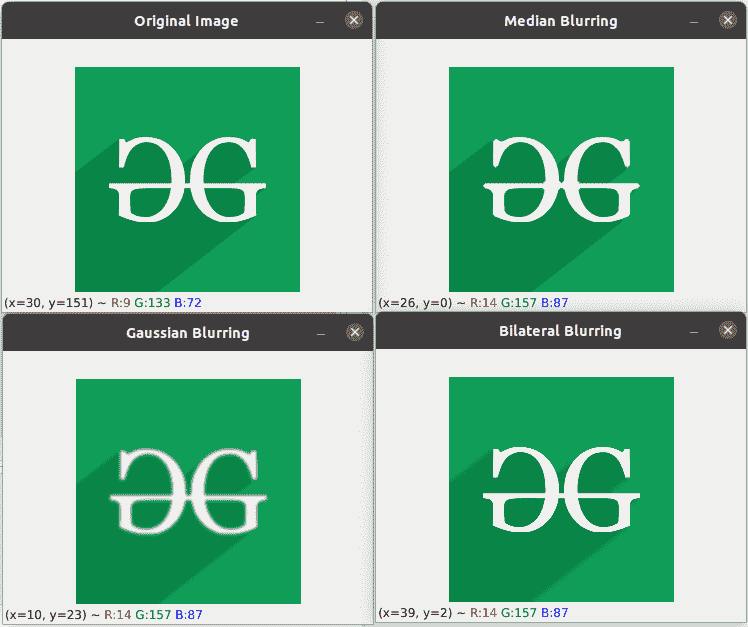

## 双边滤波

一个[双边滤波器](https://www.geeksforgeeks.org/python-bilateral-filtering/)用于平滑图像和减少噪声，同时保留边缘。然而，这些卷积通常会导致重要边缘信息的丢失，因为它们会模糊掉一切，不管是噪声还是边缘。针对这一问题，引入了非线性双边滤波。OpenCV 有一个名为 bilateralFilter()的函数，它有以下参数:

*   d:每个像素邻域的直径。
*   sigmaColor:颜色空间中的值。值越大，彼此距离越远的颜色将开始混合。
*   sigmaColor:坐标空间中的值。它的值越大，混合在一起的像素就越多，因为它们的颜色在 sigmaColor 范围内。

### 示例:Python OpenCV 双边图像

## 蟒蛇 3

```py
import cv2

# Read the image
img = cv2.imread('geeks.png')

# Apply bilateral filter with d = 30,
# sigmaColor = sigmaSpace = 100
bilateral = cv2.bilateralFilter(img, 15, 100, 100)

# Save the output
cv2.imshow('Bilateral', bilateral)
cv2.waitKey(0)
cv2.destroyAllWindows()
```

**输出:**

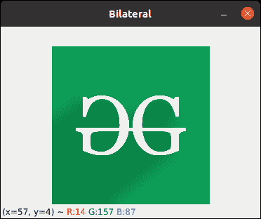

## 轮廓图像

[轮廓](https://www.geeksforgeeks.org/find-and-draw-contours-using-opencv-python/)被定义为连接图像边界上具有相同强度的所有点的线。轮廓在形状分析、寻找感兴趣对象的大小和对象检测中很方便。OpenCV 具有 findContour()功能，有助于从图像中提取轮廓。它最适合二值图像，所以我们应该首先应用阈值技术，索贝尔边缘等。

### 示例:Python OpenCV 图像轮廓

## 蟒蛇 3

```py
import cv2
import numpy as np

# Let's load a simple image with 3 black squares
image = cv2.imread('geeks.png')
cv2.waitKey(0)

# Grayscale
gray = cv2.cvtColor(image, cv2.COLOR_BGR2GRAY)

# Find Canny edges
edged = cv2.Canny(gray, 30, 200)
cv2.waitKey(0)

# Finding Contours
# Use a copy of the image e.g. edged.copy()
# since findContours alters the image
contours, hierarchy = cv2.findContours(edged,
    cv2.RETR_EXTERNAL, cv2.CHAIN_APPROX_NONE)

cv2.imshow('Canny Edges After Contouring', edged)
cv2.waitKey(0)

print("Number of Contours found = " + str(len(contours)))

# Draw all contours
# -1 signifies drawing all contours
cv2.drawContours(image, contours, -1, (0, 255, 0), 3)

cv2.imshow('Contours', image)
cv2.waitKey(0)
cv2.destroyAllWindows()
```

**输出:**

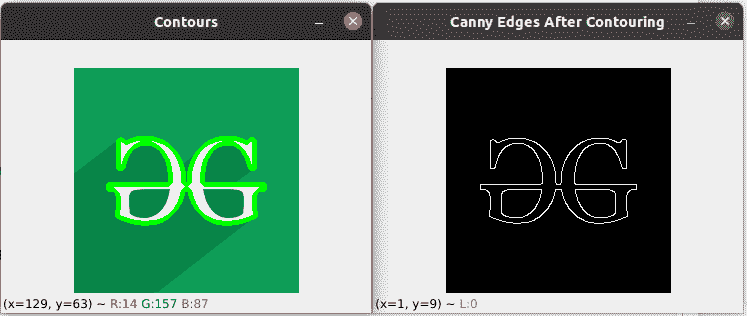

## 侵蚀和扩张

最基本的形态学操作有两个:[侵蚀和膨胀](https://www.geeksforgeeks.org/erosion-dilation-images-using-opencv-python/)

**侵蚀基础:**

*   侵蚀掉前景对象的边界
*   用于减少图像的特征。

**侵蚀工作:**

*   核(奇数大小(3，5，7)的矩阵)与图像卷积。
*   只有当内核下的所有像素都为 1 时，原始图像中的像素(1 或 0)才会被视为 1，否则，它会被侵蚀(变为零)。
*   因此，根据内核的大小，边界附近的所有像素都将被丢弃。
*   因此，前景对象的厚度或大小减小，或者只是图像中的白色区域减小。

**膨胀基础:**

*   增加对象面积
*   用来突出特征

**膨胀工作:**

*   核(奇数大小(3，5，7)的矩阵)与图像卷积
*   如果内核下至少有一个像素为“1”，则原始图像中的像素元素为“1”。
*   它会增加图像中的白色区域，或者增加前景对象的大小

### 示例:Python OpenCV 侵蚀和膨胀

## 蟒蛇 3

```py
# Python program to demonstrate erosion and
# dilation of images.
import cv2
import numpy as np

# Reading the input image
img = cv2.imread('geeks.png', 0)

# Taking a matrix of size 5 as the kernel
kernel = np.ones((5,5), np.uint8)

# The first parameter is the original image,
# kernel is the matrix with which image is
# convolved and third parameter is the number
# of iterations, which will determine how much
# you want to erode/dilate a given image.
img_erosion = cv2.erode(img, kernel, iterations=1)
img_dilation = cv2.dilate(img, kernel, iterations=1)

cv2.imshow('Input', img)
cv2.imshow('Erosion', img_erosion)
cv2.imshow('Dilation', img_dilation)

cv2.waitKey(0)
cv2.destroyAllWindows()
```

**输出**T2】

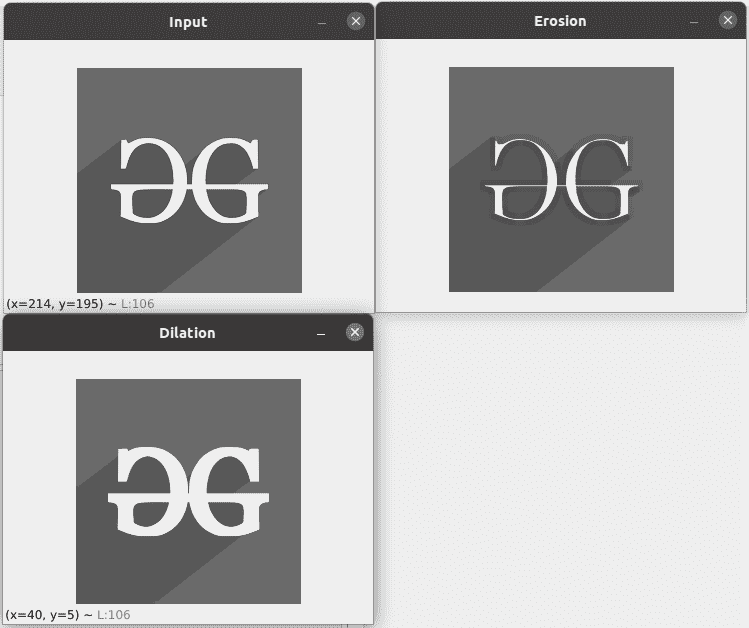

## 特征匹配

[ORB](https://www.geeksforgeeks.org/feature-matching-using-orb-algorithm-in-python-opencv/) 融合了 FAST 关键点检测器和 BRIEF 描述符，并增加了一些功能以提高性能。FAST 是加速细分测试中的功能，用于检测所提供图像中的功能。它还使用金字塔来产生多尺度特征。现在，它不计算特征的方向和描述符，所以这就是简要的作用。

ORB 使用了简要描述符，但是简要描述符在循环中表现不佳。所以 ORB 所做的是根据关键点的方向旋转简报。使用面片的方向，找到它的旋转矩阵，旋转简表得到旋转版本。ORB 是用于特征提取的 SIFT 或 SURF 算法的有效替代品，在计算成本、匹配性能以及主要是专利方面。SIFT 和 SURF 是专利，你应该为它们的使用付费。但是 ORB 没有专利。

## 蟒蛇 3

```py
import numpy as np
import cv2

# Read the query image as query_img
# and train image This query image
# is what you need to find in train image
# Save it in the same directory
# with the name image.jpg
query_img = cv2.imread('geeks.png')
train_img = cv2.imread('geeks.png')

# Convert it to grayscale
query_img_bw = cv2.cvtColor(query_img,cv2.COLOR_BGR2GRAY)
train_img_bw = cv2.cvtColor(train_img, cv2.COLOR_BGR2GRAY)

# Initialize the ORB detector algorithm
orb = cv2.ORB_create()

# Now detect the keypoints and compute
# the descriptors for the query image
# and train image
queryKeypoints, queryDescriptors = orb.detectAndCompute(query_img_bw,None)
trainKeypoints, trainDescriptors = orb.detectAndCompute(train_img_bw,None)

# Initialize the Matcher for matching
# the keypoints and then match the
# keypoints
matcher = cv2.BFMatcher()
matches = matcher.match(queryDescriptors,trainDescriptors)

# draw the matches to the final image
# containing both the images the drawMatches()
# function takes both images and keypoints
# and outputs the matched query image with
# its train image
final_img = cv2.drawMatches(query_img, queryKeypoints,
train_img, trainKeypoints, matches[:20],None)

final_img = cv2.resize(final_img, (1000,650))

# Show the final image
cv2.imshow("Matches", final_img)
cv2.waitKey(0)
cv2.destroyAllWindows()
```

**输出:**

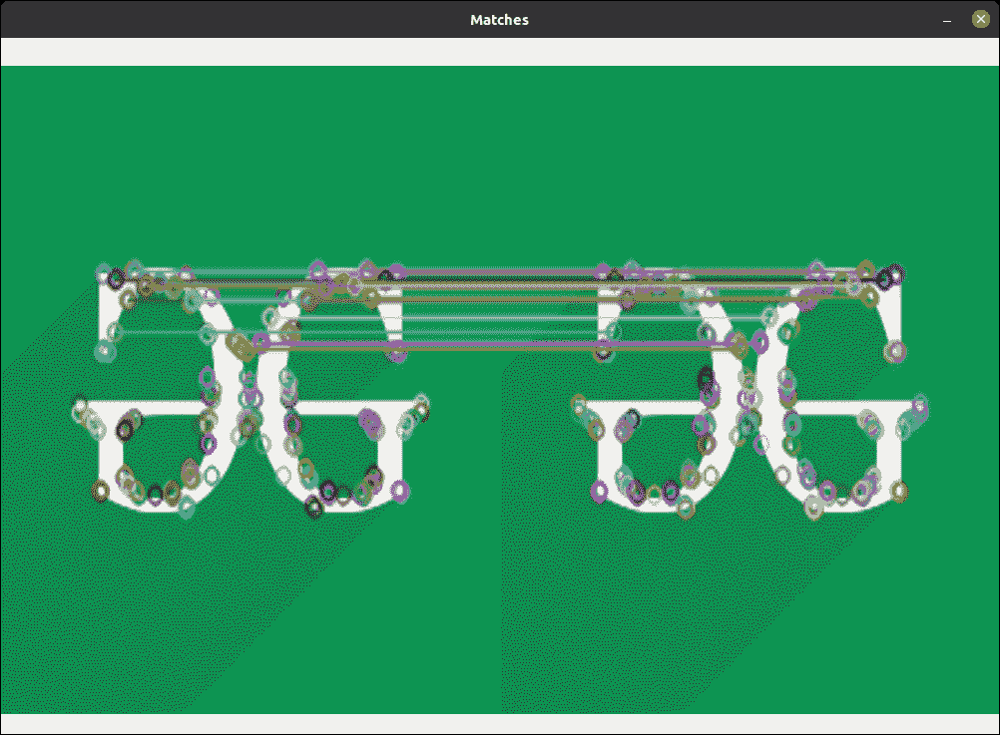

## 在图像上绘图

让我们看看一些绘图功能[使用 OpenCV 在图像](https://www.geeksforgeeks.org/draw-geometric-shapes-images-using-opencv/)上绘制几何形状。一些绘图功能包括:

*   [cv2.line() :](https://www.geeksforgeeks.org/python-opencv-cv2-line-method/) 用于在图像上画线。
*   [cv2.rectangle() :](https://www.geeksforgeeks.org/python-opencv-cv2-rectangle-method/) 用于在图像上绘制矩形。
*   [cv2.circle() :](https://www.geeksforgeeks.org/python-opencv-cv2-circle-method/) 用于在图像上画圆。
*   [cv2.putText() :](https://www.geeksforgeeks.org/python-opencv-cv2-puttext-method/) 用于在图像上写文字。

为了演示上述功能的使用，我们需要一个尺寸为 400 X 400 的图像，用纯色填充(本例中为黑色)。为了做到这一点，我们可以利用 numpy.zeroes 函数来创建所需的图像。

## 示例:Python OpenCV 在图像上绘制

## 蟒蛇 3

```py
# Python3 program to draw rectangle
# shape on solid image
import numpy as np
import cv2

# Creating a black image with 3
# channels RGB and unsigned int datatype
img = np.zeros((400, 400, 3), dtype = "uint8")

# Creating rectangle
cv2.rectangle(img, (30, 30), (300, 200), (0, 255, 0), 5)

cv2.imshow('dark', img)

# Allows us to see image
# until closed forcefully
cv2.waitKey(0)
cv2.destroyAllWindows()
```

**输出:**

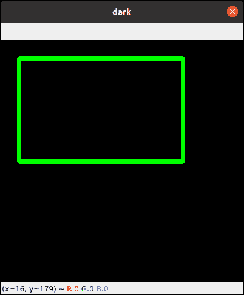

## 人脸识别

在本文中，我们将使用名为[的哈尔级联](https://www.geeksforgeeks.org/python-haar-cascades-for-object-detection/)来进行[人脸识别](https://www.geeksforgeeks.org/face-detection-using-python-and-opencv-with-webcam/)。哈尔级联是一种基于机器学习的方法，其中使用大量的正图像和负图像来训练分类器。

*   **正面图像:**这些图像包含我们希望分类器识别的图像。
*   **负像:**其他一切的像，不包含我们要检测的物体。

**使用的文件:**

*   [发壳 _ front face _ default . XML](https://raw.githubusercontent.com/opencv/opencv/master/data/haarcascades/haarcascade_frontalface_default.xml)
*   [毛发瀑布 _eye.xml](https://raw.githubusercontent.com/opencv/opencv/master/data/haarcascades/haarcascade_eye.xml)

### 示例:Python OpenCV 人脸识别

## 蟒蛇 3

```py
# OpenCV program to detect face in real time
# import libraries of python OpenCV
# where its functionality resides
import cv2

# Trained XML classifiers describes some features of some
# object we want to detect a cascade function is trained
# from a lot of positive(faces) and negative(non-faces)
# images.
face_cascade = cv2.CascadeClassifier('haarcascade_frontalface_default.xml')

# Trained XML file for detecting eyes
eye_cascade = cv2.CascadeClassifier('haarcascade_eye.xml')

# capture frames from a camera
cap = cv2.VideoCapture(0)

# loop runs if capturing has been initialized.
while 1:

    # reads frames from a camera
    ret, img = cap.read()

    # convert to gray scale of each frames
    gray = cv2.cvtColor(img, cv2.COLOR_BGR2GRAY)

    # Detects faces of different sizes in the input image
    faces = face_cascade.detectMultiScale(gray, 1.3, 5)

    for (x,y,w,h) in faces:
        # To draw a rectangle in a face
        cv2.rectangle(img,(x,y),(x+w,y+h),(255,255,0),2)
        roi_gray = gray[y:y+h, x:x+w]
        roi_color = img[y:y+h, x:x+w]

        # Detects eyes of different sizes in the input image
        eyes = eye_cascade.detectMultiScale(roi_gray)

        # To draw a rectangle in eyes
        for (ex,ey,ew,eh) in eyes:
            cv2.rectangle(roi_color,(ex,ey),(ex+ew,ey+eh),(0,127,255),2)

    # Display an image in a window
    cv2.imshow('img',img)

    # Wait for Esc key to stop
    k = cv2.waitKey(30) & 0xff
    if k == 27:
        break

# Close the window
cap.release()

# De-allocate any associated memory usage
cv2.destroyAllWindows()
```

**输出**T2】

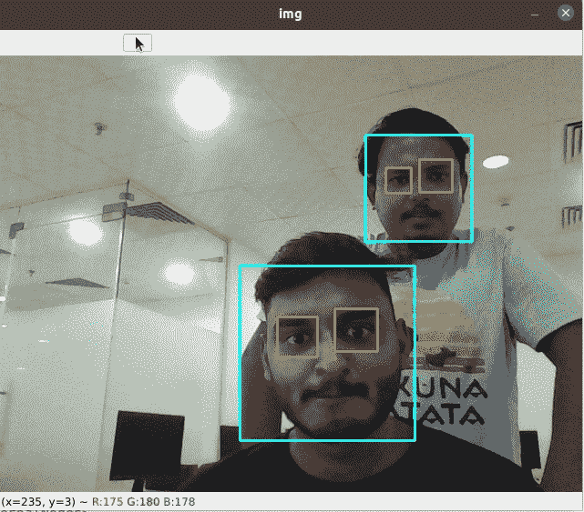