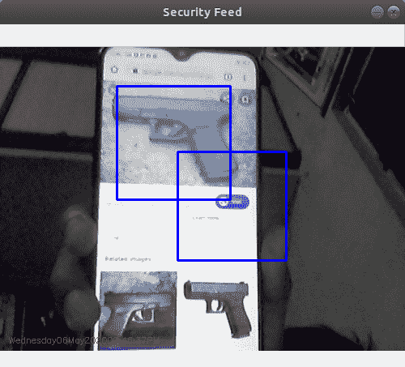

# 使用 Python-OpenCV 进行枪械检测

> 原文:[https://www . geesforgeks . org/gun-detection-use-python-opencv/](https://www.geeksforgeeks.org/gun-detection-using-python-opencv/)

**先决条件:** [Python OpenCV](https://www.geeksforgeeks.org/opencv-python-tutorial/)

使用对象检测的枪支检测是一个有用的工具。它构成了许多奇妙工业应用的支柱。 [OpenCV(开源计算机视觉库)](https://www.geeksforgeeks.org/opencv-python-tutorial/)是一个高度优化的库，专注于实时应用。

**途径:**

1) **创建枪支的哈卡卡德文件:**参考[创建自己的哈卡卡德](https://pythonprogramming.net/haar-cascade-object-detection-python-opencv-tutorial/)

从这里，您将了解如何创建自己的 Haarcascade 文件。对于单个正面图像，您可以使用 opencv_createsamples 命令，使用您的负面图像实际创建一堆正面示例。你的正面形象会叠加在这些底片上，它会有角度和各种各样的东西。它实际上可以很好地工作，尤其是如果你真的只是在寻找一个特定的对象。但是，如果您希望识别所有枪支，您将希望拥有成千上万个独特的枪支图像，而不是使用 opencv_createsamples 为您生成样本。我们将保持简单，只使用一张正片，然后用我们的底片制作一堆样本。

**注意:**对于创建的枪哈尔级联–[点击这里。](https://drive.google.com/open?id=1Ndr_HFhxHB8mJ_uysdasXgfAKSQ2is4q)

**2)使用 OpenCV** 检测枪支

```
import numpy as np
import cv2
import imutils
import datetime

gun_cascade = cv2.CascadeClassifier('cascade.xml')
camera = cv2.VideoCapture(0)

firstFrame = None
gun_exist = False

while True:

    ret, frame = camera.read()

    frame = imutils.resize(frame, width = 500)
    gray = cv2.cvtColor(frame, cv2.COLOR_BGR2GRAY)

    gun = gun_cascade.detectMultiScale(gray,
                                       1.3, 5,
                                       minSize = (100, 100))

    if len(gun) > 0:
        gun_exist = True

    for (x, y, w, h) in gun:

        frame = cv2.rectangle(frame,
                              (x, y),
                              (x + w, y + h),
                              (255, 0, 0), 2)
        roi_gray = gray[y:y + h, x:x + w]
        roi_color = frame[y:y + h, x:x + w]    

    if firstFrame is None:
        firstFrame = gray
        continue

    # print(datetime.date(2019))
    # draw the text and timestamp on the frame
    cv2.putText(frame, datetime.datetime.now().strftime("% A % d % B % Y % I:% M:% S % p"),
                (10, frame.shape[0] - 10),
                cv2.FONT_HERSHEY_SIMPLEX,
                0.35, (0, 0, 255), 1)

    cv2.imshow("Security Feed", frame)
    key = cv2.waitKey(1) & 0xFF

    if key == ord('q'):
        break

        if gun_exist:
    print("guns detected")
else:
    print("guns NOT detected")

camera.release()
cv2.destroyAllWindows()
```

**输出:**



OpenCV 附带了一个训练器和一个探测器。如果你想为汽车、飞机等任何物体训练自己的分类器。你可以使用 OpenCV 创建一个。

在这里，我们处理枪的检测。首先，我们需要加载所需的 XML 分类器。然后以灰度模式加载我们的输入图像(或视频)。现在我们在图像中找到了枪。如果找到枪，则返回检测到的枪的位置为`Rect(x, y, w, h)`。一旦我们得到这些位置，我们就可以为枪创建一个感兴趣区域。