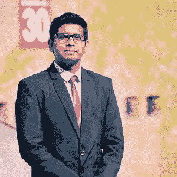
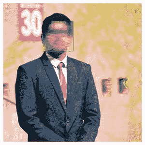

# 如何使用 Python 中的 OpenCV 模糊图像中的人脸？

> 原文:[https://www . geeksforgeeks . org/如何使用 python 中的-opencv 在图像中模糊人脸/](https://www.geeksforgeeks.org/how-to-blur-faces-in-images-using-opencv-in-python/)

**先决条件:** [OpenCV](https://www.geeksforgeeks.org/opencv-python-tutorial/)

**OpenCV** 是一个巨大的开源库，用于计算机视觉、机器学习和图像处理。它可以处理图像和视频来识别物体、人脸，甚至是人类的笔迹。当它与各种库集成时，如[【Numpy】](https://www.geeksforgeeks.org/python-numpy/)这是一个高度优化的数值运算库，那么你的武器库中的武器数量就会增加，即在 Numpy 中可以做的任何运算都可以与 OpenCV 结合。

本文讨论了如何使用 OpenCV 模糊图像中的人脸。

**要求:**

除了 OpenCV 模块，要获得这个功能我们还需要 **哈尔级联正面人脸分类器**需要下载。它以 XML 文件的形式提供，用于检测图像中的人脸

**接近**

*   导入模块
*   使用 OpenCV 读取图像
*   绘制它
*   检测面部
*   在检测到的人脸上画一个矩形
*   模糊矩形
*   显示输出

下面是实现。

**输入图像:**



原始:my_img.jpg

## 蟒蛇 3

```
# Importing libraries
import numpy as np
import cv2
import matplotlib.pyplot as plt

# A function for plotting the images

def plotImages(img):
    plt.imshow(img, cmap="gray")
    plt.axis('off')
    plt.style.use('seaborn')
    plt.show()

# Reading an image using OpenCV
# OpenCV reads images by default in BGR format
image = cv2.imread('my_img.jpg')

# Converting BGR image into a RGB image
image = cv2.cvtColor(image, cv2.COLOR_BGR2RGB)

# plotting the original image
plotImages(image)

face_detect = cv2.CascadeClassifier('haarcascade_frontalface_alt.xml')
face_data = face_detect.detectMultiScale(image, 1.3, 5)

# Draw rectangle around the faces which is our region of interest (ROI)
for (x, y, w, h) in face_data:
    cv2.rectangle(image, (x, y), (x + w, y + h), (0, 255, 0), 2)
    roi = image[y:y+h, x:x+w]
    # applying a gaussian blur over this new rectangle area
    roi = cv2.GaussianBlur(roi, (23, 23), 30)
    # impose this blurred image on original image to get final image
    image[y:y+roi.shape[0], x:x+roi.shape[1]] = roi

# Display the output
plotImages(image)
```

**输出:**



模糊图象