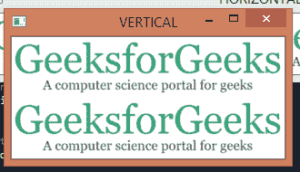

# 如何使用 OpenCV Python 在一个窗口中显示多幅图像？

> 原文:[https://www . geeksforgeeks . org/如何使用-opencv-python/](https://www.geeksforgeeks.org/how-to-display-multiple-images-in-one-window-using-opencv-python/) 在一个窗口中显示多个图像

**先决条件:**T2【Opencv】T3

在本文中，我们将展示如何使用 Python 中的 OpenCV 在一个窗口中显示多个图像。

### **接近**

*   导入模块
*   使用 **cv2.imread()** 加载多个图像
*   使用**连接()和**连接图像，轴值根据方向要求提供
*   使用 **cv2.imshow()** 显示所有图像
*   使用 **cv2.waitKey()** 等待键盘按钮按下
*   退出窗口并使用 **cv2.destroyAllWindows()** 销毁所有窗口

### **使用的功能**

*   [**【cv2 . imread()】**](https://www.geeksforgeeks.org/python-opencv-cv2-imread-method/)**:**从给定的特定位置读取图像文件
*   **连接((image1，image2)，轴):**沿着给定的提到的轴(水平或垂直)连接多个图像，轴的值被给定为 1 用于水平组合它们，0 用于垂直组合它们。
*   [](https://www.geeksforgeeks.org/python-opencv-cv2-imshow-method/#:~:text=imshow()%20method%20is%20used,fits%20to%20the%20image%20size.&text=window_name%3A%20A%20string%20representing%20the,that%20is%20to%20be%20displayed.)****:**在窗口中显示图像**
*   **[**cv2 . waitkey()**](https://www.geeksforgeeks.org/reading-image-opencv-using-python/)T4:是一个键盘绑定功能。它的参数是以毫秒为单位的时间。对于任何键盘事件，该函数等待指定的毫秒数。**
*   ****cv2.destroyAllWindows():** 如果您打开了多个窗口，并且不需要打开这些窗口，您可以使用 cv2.destroyAllWindows()关闭所有这些窗口。**

****程序:****

## **蟒蛇 3**

```
import cv2
import numpy as np

# Read First Image
img1 = cv2.imread('GFG.png')

# Read Second Image
img2 = cv2.imread('GFG.png')

# concatanate image Horizontally
Hori = np.concatenate((img1, img2), axis=1)

# concatanate image Vertically
Verti = np.concatenate((img1, img2), axis=0)

cv2.imshow('HORIZONTAL', Hori)
cv2.imshow('VERTICAL', Verti)

cv2.waitKey(0)
cv2.destroyAllWindows()
```

****输入:****

**GFG.png**

****

****输出:****

** **