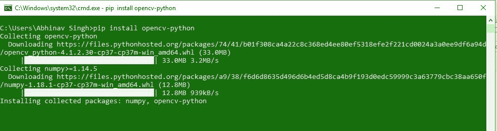
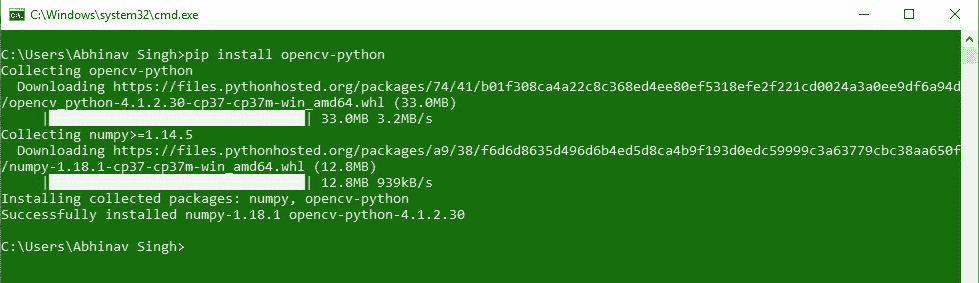

# 如何在 Windows 上安装 Python 的 OpenCV？

> 原文:[https://www . geeksforgeeks . org/how-install-open cv-for-python-in-window/](https://www.geeksforgeeks.org/how-to-install-opencv-for-python-in-windows/)

**先决条件:** [Python 语言简介](https://www.geeksforgeeks.org/python-language-introduction/)

OpenCV 是用于计算机视觉、机器学习和图像处理的巨大开源库，现在它在实时操作中发挥着重要作用，这在当今的系统中非常重要。通过使用它，人们可以处理图像和视频来识别物体、人脸，甚至是人类的笔迹。当它与各种库(如 Numpuy)集成时，python 能够处理 OpenCV 数组结构进行分析。为了识别图像模式及其各种特征，我们使用向量空间并对这些特征执行数学运算。

要安装 OpenCV，必须在系统上预装 Python 和 PIP。要检查您的系统是否已经包含 Python，请按照以下说明操作:

打开**命令行**(在运行对话框中搜索**cmd**(<link rel="stylesheet" href="https://maxcdn.bootstrapcdn.com/font-awesome/4.6.1/css/font-awesome.min.css">***+R**)。
现在运行以下命令:*

```py
*python --version* 
```

*如果已经安装了 Python，它将生成一条消息，其中包含可用的 Python 版本。
*

*如果 Python 不存在，请通过[如何在 Windows 上安装 Python？](https://www.geeksforgeeks.org/how-to-install-python-on-windows/)并按照提供的说明操作。

**PIP** 是一个包管理系统，用于安装和管理用 Python 编写的软件包/库。这些文件存储在一个被称为 Python 包索引(PyPI)的大型“在线存储库中”。
要检查 PIP 是否已经安装在您的系统上，只需转到命令行并执行以下命令:*

```py
*pip -V*
```

**

*如果画中画不存在，通过[如何在 Windows 上安装画中画？](https://www.geeksforgeeks.org/how-to-install-pip-on-windows/)并按照提供的说明操作。*

### *下载和安装 OpenCV:*

*OpenCV 可以使用 pip(包管理器)直接下载安装。要安装 OpenCV，只需转到命令行并键入以下命令:*

```py
*pip install opencv-python*
```

***从安装开始:***

*   ***在终端中输入命令并继续:**
    *
*   ***采集信息、下载数据:**
    *
*   ***安装软件包:**
    *
*   ***安装完毕:**
    *

*要检查 OpenCV 是否正确安装，只需运行以下命令来执行版本检查:*

```py
*python
>>>import cv2
>>>print(cv2.__version__)* 
```

**