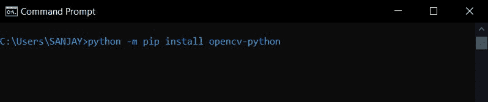
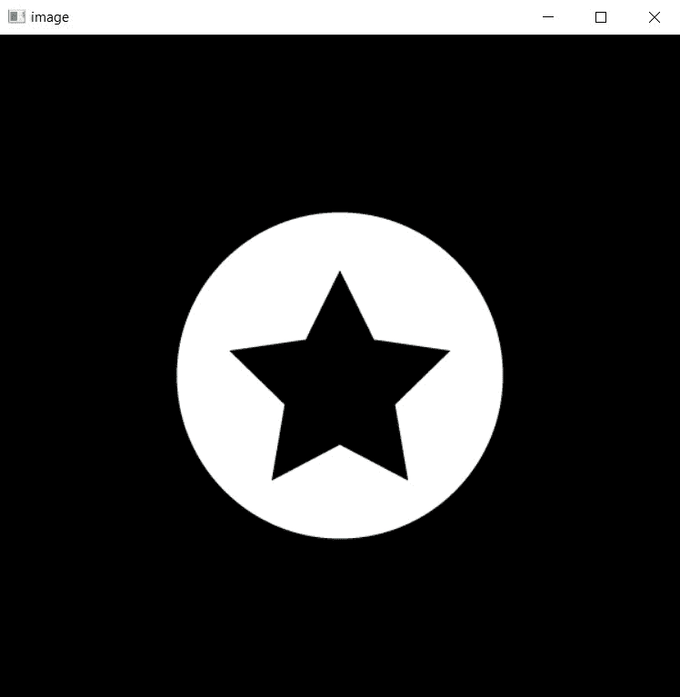

# 如何用 Python-OpenCV 减去两幅图像？

> 原文:[https://www . geesforgeks . org/如何使用-python-opencv/](https://www.geeksforgeeks.org/how-to-subtract-two-images-using-python-opencv/) 减去两个图像

在本文中，我们将看到如何在 Python 中使用 OpenCV 减去两幅图像。

现在，在进入主题之前，我们将讨论一些[算术运算的用例。](https://www.geeksforgeeks.org/arithmetic-operations-on-images-using-opencv-set-1-addition-and-subtraction/)加减等算术运算可以帮助我们让图像变亮或变暗。具体来说，如果你想找出两个相似图像之间的差异，或者比较这一点，两个图像的减法有很多目的。OpenCV 通过像素级检查或操作图像，因为这个事实，我们可以得到图像在像素级的差异。

## 语法:

```
Syntax:  cv2.subtract(image1, image2)
```

**注意:**在减去任何一张图像之前，要注意两张图像的大小和深度必须相同。否则，它将抛出一个错误。

## 装置

要安装 OpenCV，请在终端中键入以下命令。

```
python3 -m pip install opencv--python
or
pip install opencv-python
```



通过安装 OpenCV，它将自动在您的系统上安装 NumPy。所以你可以走了。现在让我们看看如何使用 OpenCV 和 python 减去两幅图像。

## 逐步实施

### 步骤 1:导入库

## 蟒蛇 3

```
# importing opencv
import cv2
```

### **第二步:读取图像**

接下来，我们需要先读取图像，才能在程序中使用图像。

## 蟒蛇 3

```
# reading the images
circle = cv2.imread('circle.png')
star = cv2.imread('star.png')
```

### 第三步:减去图像

现在，我们可以通过名为 **cv2 的内置 cv2 方法减去图像，减去**

> **语法:** cv2 .减法(image1，image2)

## 蟒蛇 3

```
# subtract the images
subracted = cv2.subtract(star, circle)
```

### 步骤 4:显示输出

为了显示图像，我们需要做 3 件事首先通过 [**cv2.imshow()**](https://www.geeksforgeeks.org/python-opencv-cv2-imshow-method/) 显示图像

> **语法:** cv2.imshow(“窗口名称”，图片)

接下来的两行代码保证给我们一个选项来关闭显示的图像。

> **cv2.waitKey(0)** - >会等待无限时间让你按键盘上的任意一个键
> 
> **cv2 . destroyallwindows()**->将关闭所有窗口

## 蟒蛇 3

```
# TO show the output
cv2.imshow('image', subracted)

# To close the window
cv2.waitKey(0)
cv2.destroyAllWindows()
```

下面是 python 中减去两个图像的代码，

**输入图像:**

 

## 蟒蛇 3

```
# importing opencv
import cv2

# reading the images
circle = cv2.imread('circle.png')
star = cv2.imread('star.png')

# subtract the images
subracted = cv2.subtract(star, circle)

# TO show the output
cv2.imshow('image', subracted)

# To close the window
cv2.waitKey(0)
cv2.destroyAllWindows()
```

**输出:**



## **应用程序**

*   **将图像转换为 PNG**–使用 OpenCV 的图像减法用于移除背景图像并将其转换为 PNG。
*   **了解两幅图像之间的差异**–如果我们有两幅相似但有一些差异的图像。我们想知道差异，我们可以通过图像减法来找出差异。
*   **图像亮度和对比度**–增加或减少一些像素会调整图像的亮度和对比度。
*   **调整图像中的照明梯度**–如果包含文本的图像照明不良。我们很难读懂它。图像减法使阅读那篇论文的文字变得容易。
*   **Instagram 和 Snapchat 滤镜**–是的，我们用来拍摄不同自拍和照片的滤镜使用了图像减法。