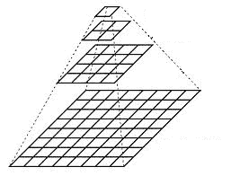
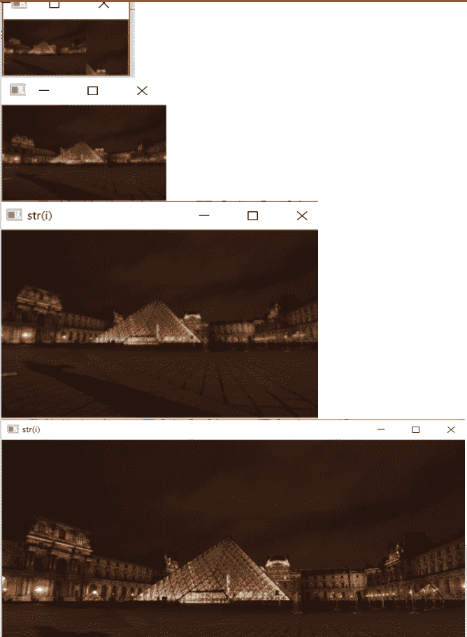

# 使用 OpenCV | Python 的图像金字塔

> 原文:[https://www . geesforgeks . org/image-金字塔-use-opencv-python/](https://www.geeksforgeeks.org/image-pyramid-using-opencv-python/)

**图像金字塔**是图像处理最漂亮的概念之一。通常，我们使用默认分辨率的图像，但很多时候我们需要更改分辨率(降低分辨率)或调整原始图像的大小，在这种情况下，图像金字塔会派上用场。

`**pyrUp()**`功能将尺寸增加到原来的两倍，`**pyrDown()**`功能将尺寸减少到原来的一半。如果我们将原始图像保留为基础图像，并继续对其应用 **`pyrDown`** 功能，并将图像保持在垂直堆栈中，它将看起来像一个金字塔。通过`**pyrUp**`功能放大原始图像也是如此。


一旦我们缩小，如果我们重新缩放到原始尺寸，我们会丢失一些信息，新图像的分辨率会比原始图像低得多。

**以下是图像聚合的示例–**

```py
import cv2
import matplotlib.pyplot as plt

img = cv2.imread("images/input.jpg")

layer = img.copy()

for i in range(4):
    plt.subplot(2, 2, i + 1)

    # using pyrDown() function
    layer = cv2.pyrDown(layer)

    plt.imshow(layer)
    cv2.imshow("str(i)", layer)
    cv2.waitKey(0)

cv2.destroyAllWindows()
```

**输出:**


**图像金字塔的优势:**

*   降低分辨率
*   获得各种尺寸的图像
*   图像混合
*   边缘检测