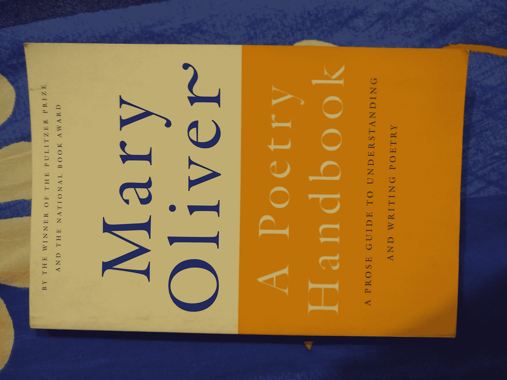
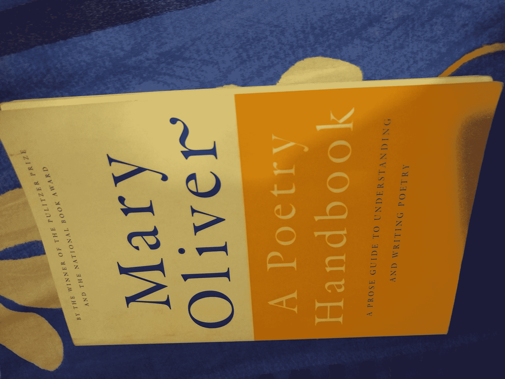
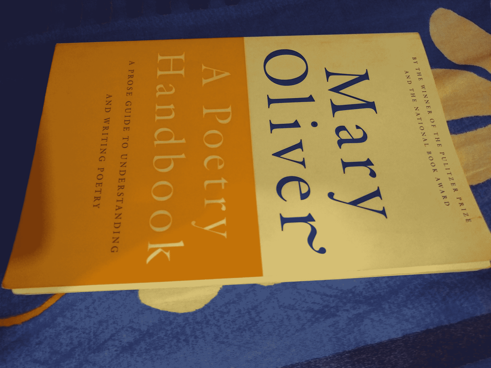
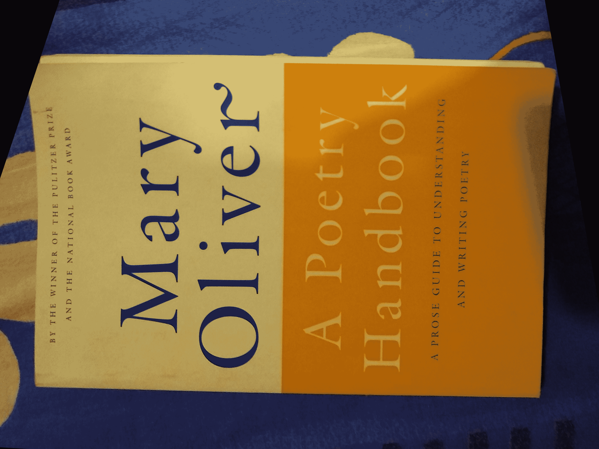

# Python |使用 OpenCV 的图像配准

> 原文:[https://www . geesforgeks . org/image-registration-use-opencv-python/](https://www.geeksforgeeks.org/image-registration-using-opencv-python/)

**图像配准**是一种数字图像处理技术，可以帮助我们对齐同一场景的不同图像。例如，人们可以从不同的角度点击一本书的图片。下面是几个例子，显示了相机角度的多样性。
现在，我们可能希望将特定图像“对齐”到与参考图像相同的角度。在上面的图像中，人们可以认为第一幅图像是“理想的”封面照片，而第二幅和第三幅图像不能很好地用于书籍封面照片的目的。图像配准算法帮助我们将第二幅和第三幅图片与第一幅对齐到同一平面。







**图像配准是如何工作的？**
对齐可以看作是一个简单的坐标变换。该算法的工作原理如下:

*   将两幅图像转换为灰度。
*   将待对齐图像的特征与参考图像进行匹配，并存储相应关键点的坐标。关键点只是用于计算变换的选定的几个点(通常是突出的点)，描述符是图像梯度的直方图，用于表征关键点的外观。在这篇文章中，我们在 OpenCV 库中使用 ORB(面向快速和旋转的简报)实现，它为我们提供了关键点及其相关的描述符。
*   匹配两幅图像之间的关键点。在这篇文章中，我们使用了 BFMatcher，这是一个蛮力匹配器。BFMatcher.match()检索最佳匹配，而 BFMatcher.knnMatch()检索前 K 个匹配，其中 K 由用户指定。
*   挑选最上面的火柴，去掉有噪音的火柴。
*   找到同形变换。
*   将此变换应用于原始未对齐图像以获得输出图像。

**图像配准的应用–**
图像配准的一些有用应用包括:

*   将各种场景(可能有也可能没有相同的相机对准)拼接在一起，形成连续的全景拍摄。
*   将文档的相机图像与标准对齐方式对齐，以创建真实的扫描文档。
*   对齐医学图像以便更好地观察和分析。

下面是图像配准的代码。我们已经参照第三幅图像对齐了第二幅图像。

## 计算机编程语言

```py
import cv2
import numpy as np

# Open the image files.
img1_color = cv2.imread("align.jpg")  # Image to be aligned.
img2_color = cv2.imread("ref.jpg")    # Reference image.

# Convert to grayscale.
img1 = cv2.cvtColor(img1_color, cv2.COLOR_BGR2GRAY)
img2 = cv2.cvtColor(img2_color, cv2.COLOR_BGR2GRAY)
height, width = img2.shape

# Create ORB detector with 5000 features.
orb_detector = cv2.ORB_create(5000)

# Find keypoints and descriptors.
# The first arg is the image, second arg is the mask
#  (which is not required in this case).
kp1, d1 = orb_detector.detectAndCompute(img1, None)
kp2, d2 = orb_detector.detectAndCompute(img2, None)

# Match features between the two images.
# We create a Brute Force matcher with
# Hamming distance as measurement mode.
matcher = cv2.BFMatcher(cv2.NORM_HAMMING, crossCheck = True)

# Match the two sets of descriptors.
matches = matcher.match(d1, d2)

# Sort matches on the basis of their Hamming distance.
matches.sort(key = lambda x: x.distance)

# Take the top 90 % matches forward.
matches = matches[:int(len(matches)*0.9)]
no_of_matches = len(matches)

# Define empty matrices of shape no_of_matches * 2.
p1 = np.zeros((no_of_matches, 2))
p2 = np.zeros((no_of_matches, 2))

for i in range(len(matches)):
  p1[i, :] = kp1[matches[i].queryIdx].pt
  p2[i, :] = kp2[matches[i].trainIdx].pt

# Find the homography matrix.
homography, mask = cv2.findHomography(p1, p2, cv2.RANSAC)

# Use this matrix to transform the
# colored image wrt the reference image.
transformed_img = cv2.warpPerspective(img1_color,
                    homography, (width, height))

# Save the output.
cv2.imwrite('output.jpg', transformed_img)
```

**输出:**

