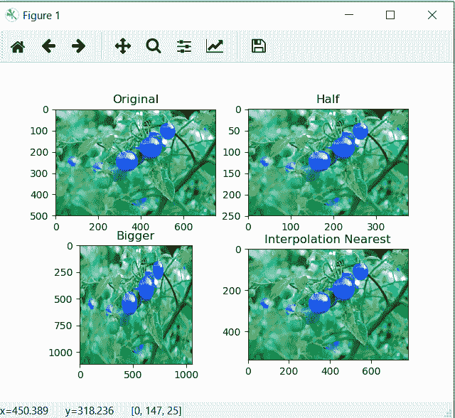

# 使用 OpenCV | Python 调整图像大小

> 原文:[https://www . geesforgeks . org/image-调整大小-使用-opencv-python/](https://www.geeksforgeeks.org/image-resizing-using-opencv-python/)

图像大小调整是指图像的缩放。缩放在许多图像处理和机器学习应用中非常方便。它有助于减少图像的像素数，并且具有几个优点，例如，它可以减少神经网络的训练时间，因为图像中的像素数越多，输入节点的数量越多，这又增加了模型的复杂性。
它还有助于放大图像。很多时候，我们需要调整图像的大小，即缩小或放大以满足尺寸要求。OpenCV 为我们提供了几种调整图像大小的插值方法。

**选择调整大小的插值方法–**

*   cv2。INTER_AREA:当我们需要缩小图像时使用。
*   cv2。INTER_CUBIC:这很慢，但效率更高。
*   cv2。INTER_LINEAR:这主要用于需要缩放时。这是 OpenCV 中默认的插值技术。

**下面是调整大小的代码。**

## 蟒蛇 3

```
import cv2
import numpy as np
import matplotlib.pyplot as plt

image = cv2.imread("C://gfg//tomatoes.jpg", 1)
# Loading the image

half = cv2.resize(image, (0, 0), fx = 0.1, fy = 0.1)
bigger = cv2.resize(image, (1050, 1610))

stretch_near = cv2.resize(image, (780, 540),
               interpolation = cv2.INTER_NEAREST)

Titles =["Original", "Half", "Bigger", "Interpolation Nearest"]
images =[image, half, bigger, stretch_near]
count = 4

for i in range(count):
    plt.subplot(2, 2, i + 1)
    plt.title(Titles[i])
    plt.imshow(images[i])

plt.show()
```

**输出:**



**注意:**使用 cv2.resize()函数时要记住的一点是，为确定新图像的大小而传递的元组(在本例中为(1050，1610))遵循顺序(宽度，高度)，而不是预期的(高度，宽度)。