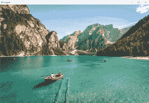
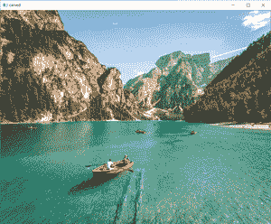

# 使用 Python 中的 OpenCV 使用接缝雕刻调整图像大小

> 原文:[https://www . geesforgeks . org/image-调整大小-使用-接缝-雕刻-使用-python 中的 opencv/](https://www.geeksforgeeks.org/image-resizing-using-seam-carving-using-opencv-in-python/)

**接缝雕刻**是一种有效的图像处理技术，借助于该技术，可以在不去除图像中重要元素的情况下调整图像的大小。基本方法是从左到右或从上到下寻找所有能量低的连续像素。选择区域后，它将从原始图像中移除，只留下图像的相关部分。能量图是从原始图像中导出的，它代表了图像的适当细节。借助能量图，我们可以识别从右向左或从上到下扩展的接缝。

## Seam 雕刻与传统的尺寸调整方法有何不同？

接缝雕刻不同于尺寸调整，因为在接缝雕刻中，所有有价值的方面和元素仍然存在于图像中，但是调整图像尺寸只是复制到较新的尺寸，这可能是丢失重要细节的原因。

以下是接缝雕刻技术的实现:

## 蟒蛇 3

```py
# import the necessary libraries
from skimage import transform
from skimage import filters
import cv2

# read the input image
img = cv2.imread('Seam.jpg')

# convert image from BGR
# to GRAY scale
gray = cv2.cvtColor(img, cv2.COLOR_BGR2GRAY)

# filter out the gradient representation 
# image to further process for 
# seam carving algorithm
# filters.sobel() is used to 
# find edges in an image
filtered = filters.sobel(gray.astype("float"))

for i in range(20, 180, 20):

    # apply seam carve to the image, 
    # iterating over the image for
    # multiple frames
    # transform.seam_carve() can transform 
    # the  seam of image vertically as
    # well as horizontally
    carved_image = transform.seam_carve(img,
                                        filtered, 
                                        'vertical',
                                        i)

# show the original image
cv2.imshow("original", img)

# show the carved image
cv2.imshow("carved", carved_image)

# print shape of both images
print("Shape of original image ",
      img.shape)
print("Shape of Carved image ",
      carved_image.shape)

# wait 
cv2.waitKey(0)
```

**输出**

```py
Shape of original Image(667, 1000, 3)
Shape of Carved image (667, 840, 3)

```



原象



雕刻图像

**注意:**此代码使用 scikit-image 版本 0.15.0。