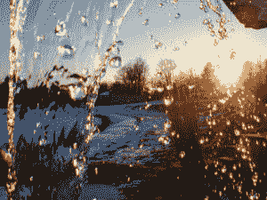
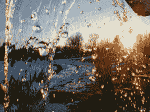
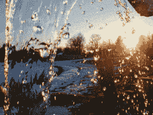

# Python 中使用 OpenCV 的图像隐写

> 原文:[https://www . geesforgeks . org/image-steganography-use-opencv-in-python/](https://www.geeksforgeeks.org/image-steganography-using-opencv-in-python/)

[图像隐写术](https://www.geeksforgeeks.org/image-steganography-in-cryptography/)是将秘密数据隐藏在某个图像中的过程。在这篇文章中，我们将把一幅图像隐藏在另一幅图像中，并将其转换成另一幅图像，然后从上一幅图像中提取出两幅图像。

基于图像的隐写术背后的思想非常简单。图像由数字数据(像素)组成，它描述了图片内部的内容，通常是所有像素的颜色。因为我们知道每个图像都是由像素组成的，每个像素包含 3 个值(红、绿、蓝)。

例如，假设我们必须在 img1 中隐藏 img2，其中 img1 和 img2 都是像素值的`numpy nd`数组。img2 的大小必须小于 img1 的大小。我们使用彩色图像，因此两者都将有 3 个值(红，绿，蓝)。每个像素值从 0 到 255 不等，因此每个像素值为 1 字节或 8 位。假设`img[i][j][l]`是位置`(i, j)`和通道 l 的像素值，其中 I 从 0 变化到宽度，j 从 0 变化到高度，l 从 0 变化到 2。

**注意:**新图片的质量比旧图片稍微差一点。

#### 编码

让`img1[i][j][l]`和`img2[i][j][l]`为每个图像的某个像素值。假设 v1 是`img1[i][j][l]`的 8 位二进制表示，v2 是`img2[i][j][l]`的 8 位二进制表示。因此，`v3=v1[:4]+v2[:4]`，其中，v3 是 v1 和 v2 的前 4 位。然后我们将`img1[i][j][l]`分配给 v3。

这里 img1 是编码后产生的最终图像。

#### 解码

设`img[i][j][l]`为图像的像素值。设 v1 为`img[i][j][l]`的 8 位二进制表示。让`v2=v1[:4]+4`随机位和`v3=v1[4:]+4`随机位。然后我们将`img1[i][j][l]`分配给 v2，将`img2[i][j][l]`分配给 v3。

这里 img1 和 img2 是解码后产生的最终图像。

**实施**

让我们考虑如下使用的图像:

**图像 1**



**图像 2**


我们想在 image1 中隐藏 image2。下面是实现。

```py
# Python program to demonstrate
# image steganography using OpenCV

import cv2
import numpy as np
import random

# Encryption function
def encrypt():

    # img1 and img2 are the
    # two input images
    img1 = cv2.imread('pic1.jpg')
    img2 = cv2.imread('pic2.jpg')

    for i in range(img2.shape[0]):
        for j in range(img2.shape[1]):
            for l in range(3):

                # v1 and v2 are 8-bit pixel values
                # of img1 and img2 respectively
                v1 = format(img1[i][j][l], '08b')
                v2 = format(img2[i][j][l], '08b')

                # Taking 4 MSBs of each image
                v3 = v1[:4] + v2[:4] 

                img1[i][j][l]= int(v3, 2)

    cv2.imwrite('pic3in2.png', img1)

# Decryption function
def decrypt():

    # Encrypted image
    img = cv2.imread('pic3in2.png') 
    width = img.shape[0]
    height = img.shape[1]

    # img1 and img2 are two blank images
    img1 = np.zeros((width, height, 3), np.uint8)
    img2 = np.zeros((width, height, 3), np.uint8)

    for i in range(width):
        for j in range(height):
            for l in range(3):
                v1 = format(img[i][j][l], '08b')
                v2 = v1[:4] + chr(random.randint(0, 1)+48) * 4
                v3 = v1[4:] + chr(random.randint(0, 1)+48) * 4

                # Appending data to img1 and img2
                img1[i][j][l]= int(v2, 2)
                img2[i][j][l]= int(v3, 2)

    # These are two images produced from
    # the encrypted image
    cv2.imwrite('pic2_re.png', img1)
    cv2.imwrite('pic3_re.png', img2)

# Driver's code
encrypt()
decrypt()
```

**输出:**

**加密后:**



**解密后:**

**图像 1**



**图像 2**

