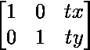
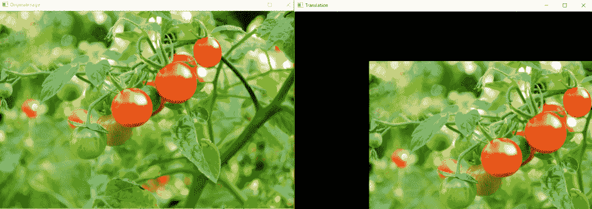

# 使用 OpenCV | Python 进行图像翻译

> 原文:[https://www . geesforgeks . org/image-translation-using-opencv-python/](https://www.geeksforgeeks.org/image-translation-using-opencv-python/)

**平移**是指物体(即图像)从一个位置到另一个位置的直线移动。如果我们知道水平和垂直方向上的偏移量，比如(tx，ty)，那么我们可以制作一个变换矩阵，例如
，其中 tx 表示沿 x 轴的偏移量，ty 表示沿 y 轴的偏移量，即我们需要在该方向上移动的像素数。
现在，我们可以使用 **`cv2.wrapAffine()`** 功能来实现这些翻译。这个函数需要一个 2×3 的数组。numpy 数组应该是浮点型的。

**下面是图像翻译的 Python 代码:**

```
import cv2
import numpy as np

image = cv2.imread('C:\\gfg\\tomatoes.jpg')

# Store height and width of the image
height, width = image.shape[:2]

quarter_height, quarter_width = height / 4, width / 4

T = np.float32([[1, 0, quarter_width], [0, 1, quarter_height]])

# We use warpAffine to transform
# the image using the matrix, T
img_translation = cv2.warpAffine(image, T, (width, height))

cv2.imshow("Originalimage", image)
cv2.imshow('Translation', img_translation)
cv2.waitKey()

cv2.destroyAllWindows()
```

**输出:**


**图像翻译的优势/应用有:**

*   隐藏图像的一部分
*   裁剪图像
*   移动图像
*   使用循环中的图像转换制作图像动画。