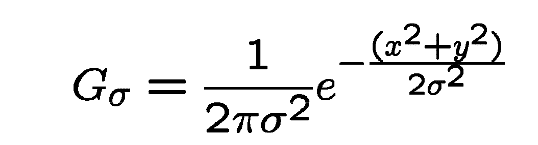
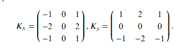
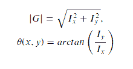
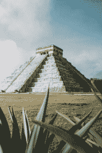
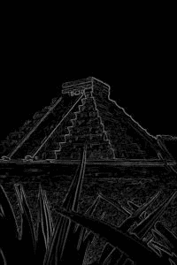

# 使用 OpenCV

在 Python 中实现 Canny 边缘检测器

> 原文:[https://www . geeksforgeeks . org/implement-canny-edge-detector-in-python-using-opencv/](https://www.geeksforgeeks.org/implement-canny-edge-detector-in-python-using-opencv/)

在本文中，我们将学习 1986 年由约翰·f·康尼开发的流行的 Canny 边缘检测算法的工作原理。通常，在 Matlab 和 OpenCV 中，我们使用 canny 边缘检测来完成很多边缘检测中流行的任务，如车道检测、草图绘制、边界去除，现在我们将从头开始学习该算法的内部工作和实现。

## 理论理解

该算法涉及的基本步骤是:

*   使用高斯滤波器降噪

*   沿水平轴和垂直轴的坡度计算

*   虚假边缘的非最大抑制

*   分离强边缘和弱边缘的双阈值处理

*   迟滞边缘跟踪

现在让我们详细了解这些概念:

#### 1.使用高斯滤波器降低噪声

这一步在 Canny 边缘检测中至关重要。它使用高斯滤波器从图像中去除噪声，这是因为由于边缘检测器的突然强度变化，该噪声可以被假设为边缘。高斯核中的元素之和为 1，因此，在将核作为卷积应用于图像之前，应对其进行归一化。在本教程中，我们将使用大小为 5 X 5 且 sigma = 1.4 的内核，它将模糊图像并去除图像中的噪声。高斯滤波器核的方程是



#### 2.梯度计算

当图像被平滑时，导数 Ix 和 Iy 在 x 轴和 y 轴上计算。它可以通过使用索贝尔-费尔德曼核与图像卷积来实现，如下所示:



索贝尔核

在应用这些核之后，我们可以使用梯度大小和角度来进一步处理这个步骤。大小和角度可计算为



梯度大小和角度

#### 3.非最大抑制

该步骤旨在减少沿边缘的重复合并像素，使其不均匀。对于每个像素，在正负梯度方向上找到两个邻居，假设每个邻居占据π/4 的角度，0 是向右的方向。如果当前像素的大小大于相邻像素的大小，则没有任何变化，否则，当前像素的大小被设置为零。

#### 4.双阈值

梯度大小与两个指定的阈值进行比较，第一个阈值低于第二个阈值。小于低阈值的梯度被抑制，高于高阈值的梯度被标记为强梯度，并且相应的像素被包括在最终的边缘图中。所有剩余的梯度被标记为弱梯度，并且对应于这些梯度的像素在下一步中被考虑。

#### 5.使用滞后的边缘跟踪

由于由真边缘引起的弱边缘像素将被连接到强边缘像素，所以具有弱梯度的像素 W 被标记为边缘，并且当且仅当它与具有强梯度的一些像素 S 涉及相同的连接分量时，才被包括在最终的边缘图中。换句话说，应该有一个连接 W 和 S 的相邻弱像素链(相邻像素是所考虑像素周围的 8 个像素)。我们将构建并实现一个算法，只考虑一次每个像素，就可以找到梯度图的所有连通分量。之后，您可以决定哪些像素将包含在最终的边缘图中。
下面是实现。

## 蟒蛇 3

```py
import numpy as np
import os
import cv2
import matplotlib.pyplot as plt

# defining the canny detector function

# here weak_th and strong_th are thresholds for
# double thresholding step
def Canny_detector(img, weak_th = None, strong_th = None):

    # conversion of image to grayscale
    img = cv2.cvtColor(img, cv2.COLOR_BGR2GRAY)

    # Noise reduction step
    img = cv2.GaussianBlur(img, (5, 5), 1.4)

    # Calculating the gradients
    gx = cv2.Sobel(np.float32(img), cv2.CV_64F, 1, 0, 3)
    gy = cv2.Sobel(np.float32(img), cv2.CV_64F, 0, 1, 3)

    # Conversion of Cartesian coordinates to polar
    mag, ang = cv2.cartToPolar(gx, gy, angleInDegrees = True)

    # setting the minimum and maximum thresholds
    # for double thresholding
    mag_max = np.max(mag)
    if not weak_th:weak_th = mag_max * 0.1
    if not strong_th:strong_th = mag_max * 0.5

    # getting the dimensions of the input image 
    height, width = img.shape

    # Looping through every pixel of the grayscale
    # image
    for i_x in range(width):
        for i_y in range(height):

            grad_ang = ang[i_y, i_x]
            grad_ang = abs(grad_ang-180) if abs(grad_ang)>180 else abs(grad_ang)

            # selecting the neighbours of the target pixel
            # according to the gradient direction
            # In the x axis direction
            if grad_ang<= 22.5:
                neighb_1_x, neighb_1_y = i_x-1, i_y
                neighb_2_x, neighb_2_y = i_x + 1, i_y

            # top right (diagonal-1) direction
            elif grad_ang>22.5 and grad_ang<=(22.5 + 45):
                neighb_1_x, neighb_1_y = i_x-1, i_y-1
                neighb_2_x, neighb_2_y = i_x + 1, i_y + 1

            # In y-axis direction
            elif grad_ang>(22.5 + 45) and grad_ang<=(22.5 + 90):
                neighb_1_x, neighb_1_y = i_x, i_y-1
                neighb_2_x, neighb_2_y = i_x, i_y + 1

            # top left (diagonal-2) direction
            elif grad_ang>(22.5 + 90) and grad_ang<=(22.5 + 135):
                neighb_1_x, neighb_1_y = i_x-1, i_y + 1
                neighb_2_x, neighb_2_y = i_x + 1, i_y-1

            # Now it restarts the cycle
            elif grad_ang>(22.5 + 135) and grad_ang<=(22.5 + 180):
                neighb_1_x, neighb_1_y = i_x-1, i_y
                neighb_2_x, neighb_2_y = i_x + 1, i_y

            # Non-maximum suppression step
            if width>neighb_1_x>= 0 and height>neighb_1_y>= 0:
                if mag[i_y, i_x]<mag[neighb_1_y, neighb_1_x]:
                    mag[i_y, i_x]= 0
                    continue

            if width>neighb_2_x>= 0 and height>neighb_2_y>= 0:
                if mag[i_y, i_x]<mag[neighb_2_y, neighb_2_x]:
                    mag[i_y, i_x]= 0

    weak_ids = np.zeros_like(img)
    strong_ids = np.zeros_like(img)             
    ids = np.zeros_like(img)

    # double thresholding step
    for i_x in range(width):
        for i_y in range(height):

            grad_mag = mag[i_y, i_x]

            if grad_mag<weak_th:
                mag[i_y, i_x]= 0
            elif strong_th>grad_mag>= weak_th:
                ids[i_y, i_x]= 1
            else:
                ids[i_y, i_x]= 2

    # finally returning the magnitude of
    # gradients of edges
    return mag

frame = cv2.imread('food.jpeg')

# calling the designed function for
# finding edges
canny_img = Canny_detector(frame)

# Displaying the input and output image 
plt.figure()
f, plots = plt.subplots(2, 1)
plots[0].imshow(frame)
plots[1].imshow(canny_img)
```



输入图像



输出图像