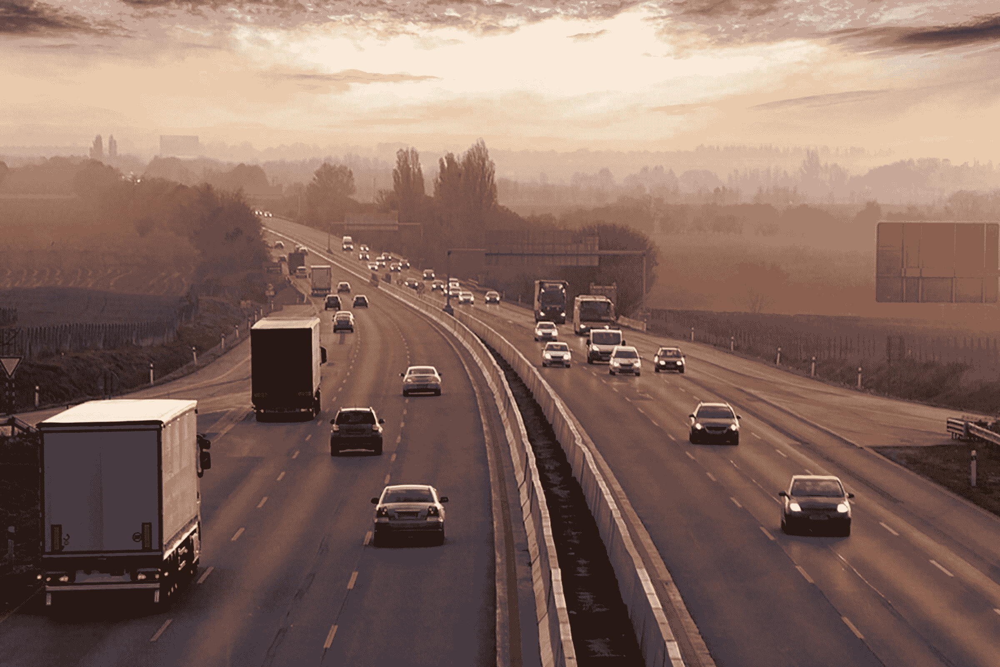
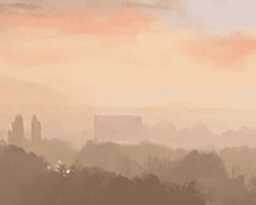
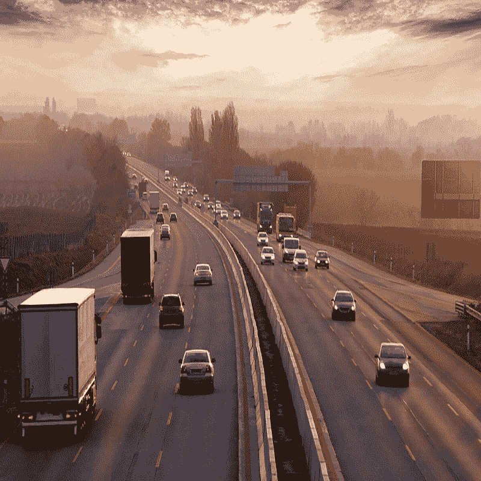
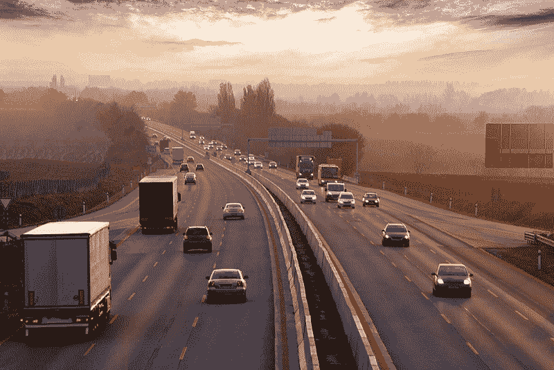
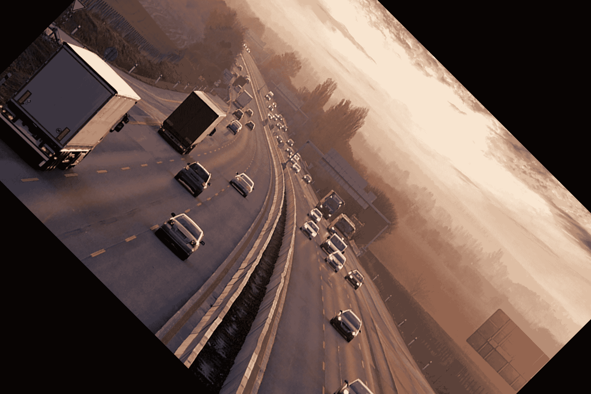
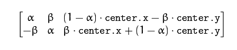
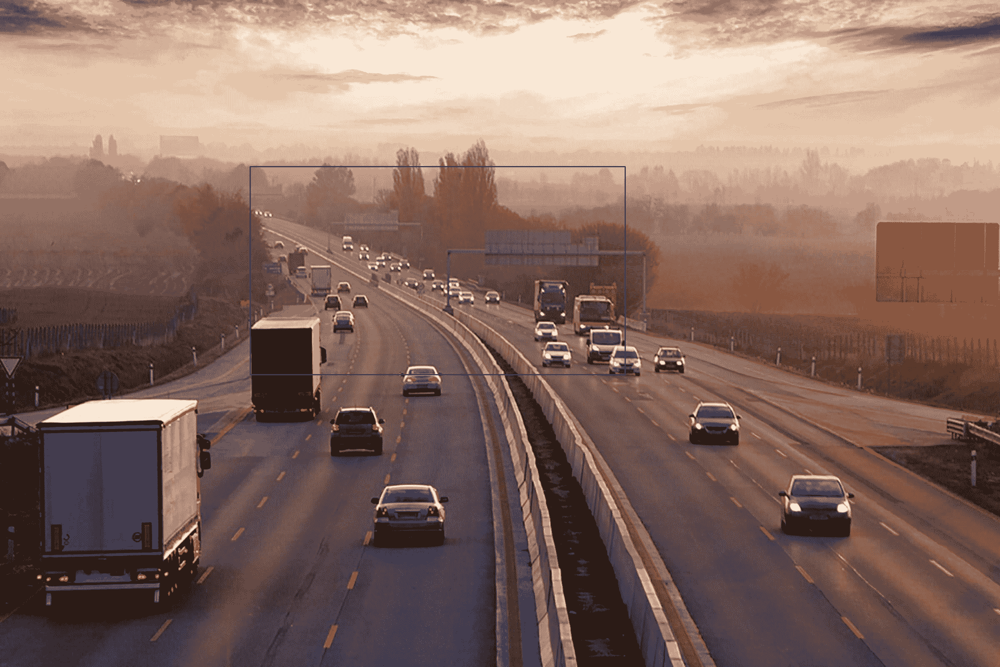
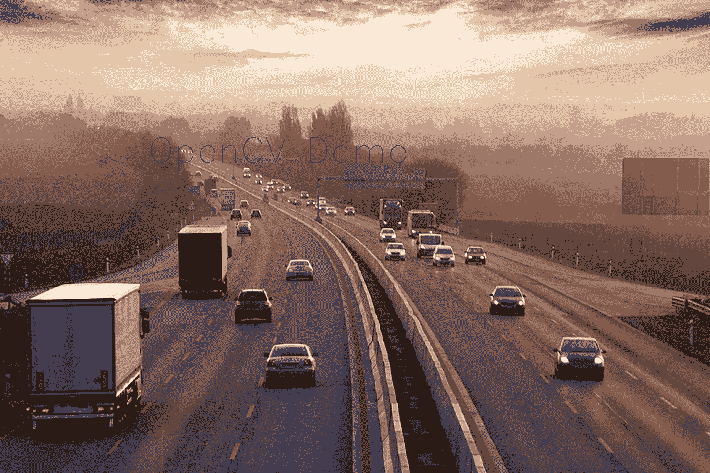

# OpenCV 简介

> 原文:[https://www.geeksforgeeks.org/introduction-to-opencv/](https://www.geeksforgeeks.org/introduction-to-opencv/)

OpenCV 是最受欢迎的计算机视觉库之一。如果你想开始你在计算机视觉领域的旅程，那么彻底理解 OpenCV 的概念是至关重要的。
在本文中，我将尝试以直观的方式介绍 OpenCV 最基本、最重要的概念。
**本文将涵盖以下主题:**

1.  读取图像
2.  提取像素的 RGB 值
3.  提取感兴趣区域
4.  调整图像大小
5.  旋转图像
6.  绘制矩形
7.  显示文本

这是我们将在本文中处理的原始图像。



让我们从使用 OpenCV 读取图像的简单任务开始。

**读取图像**

```
# Importing the OpenCV library
import cv2
# Reading the image using imread() function
image = cv2.imread('image.png')

# Extracting the height and width of an image
h, w = image.shape[:2]
# Displaying the height and width
print("Height = {},  Width = {}".format(h, w))
```

现在我们将集中于提取单个像素的 RGB 值。
注意–OpenCV 按照 BGR 顺序排列频道。因此第 0 个值将对应蓝色像素，而不是红色像素。

**提取像素的 RGB 值**

```
# Extracting RGB values. 
# Here we have randomly chosen a pixel
# by passing in 100, 100 for height and width.
(B, G, R) = image[100, 100]

# Displaying the pixel values
print("R = {}, G = {}, B = {}".format(R, G, B))

# We can also pass the channel to extract 
# the value for a specific channel
B = image[100, 100, 0]
print("B = {}".format(B))
```

**提取感兴趣区域**

```
# We will calculate the region of interest 
# by slicing the pixels of the image
roi = image[100 : 500, 200 : 700]
```



**调整图像大小**

```
# resize() function takes 2 parameters, 
# the image and the dimensions
resize = cv2.resize(image, (800, 800))
```



这种方法的问题是不能保持图像的纵横比。所以我们需要做一些额外的工作，以保持适当的长宽比。

```
# Calculating the ratio
ratio = 800 / w

# Creating a tuple containing width and height
dim = (800, int(h * ratio))

# Resizing the image
resize_aspect = cv2.resize(image, dim)
```



**旋转图像**

```
# Calculating the center of the image
center = (w // 2, h // 2)

# Generating a rotation matrix
matrix = cv2.getRotationMatrix2D(center, -45, 1.0) 

# Performing the affine transformation
rotated = cv2.warpAffine(image, matrix, (w, h))
```



旋转图像需要很多步骤。所以，让我详细解释一下。

这里使用的两个主要功能是–

*   getremotion matrix 2d()
*   石蜡()

**getrotationmatrix 2d()**
需要 3 个参数–

*   **中心–**图像的中心坐标
*   **角度–**图像旋转的角度(度)
*   **Scale –** The scaling factor

    它返回一个 2*3 矩阵，由α和β的值组成
    α=标度* cos(角度)
    β=标度*正弦(角度)

    

    **石蜡()**

    warpAffine 函数使用旋转矩阵变换源图像:

    ```
    dst(x, y) = src(M11X + M12Y + M13, M21X + M22Y + M23)

    ```

    这里 M 是旋转矩阵，如上所述。
    它计算图像的新 x，y 坐标并对其进行变换。

    **绘制矩形**
    这是一个原地操作。

    ```
    # We are copying the original image, 
    # as it is an in-place operation.
    output = image.copy()

    # Using the rectangle() function to create a rectangle.
    rectangle = cv2.rectangle(output, (1500, 900), 
                              (600, 400), (255, 0, 0), 2)
    ```

    

    它包含 5 个参数–

    *   图像
    *   左上角坐标
    *   右下角坐标
    *   颜色(BGR 格式)
    *   线宽

    **显示文字**
    也是原地操作

    ```
    # Copying the original image
    output = image.copy()

    # Adding the text using putText() function
    text = cv2.putText(output, 'OpenCV Demo', (500, 550), 
                       cv2.FONT_HERSHEY_SIMPLEX, 4, (255, 0, 0), 2)
    ```

    

    它包含 7 个参数–

    1.  图像
    2.  要显示的文本
    3.  左下角坐标，文本应该从这里开始
    4.  字体
    5.  字体大小
    6.  颜色(BGR 格式)
    7.  线宽