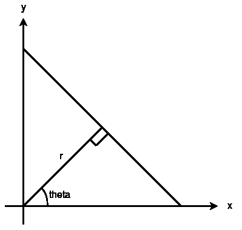
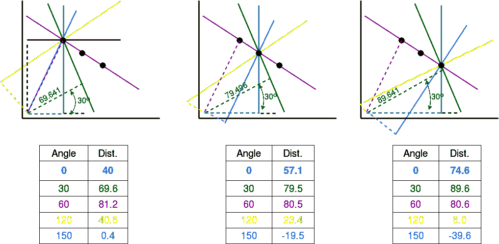
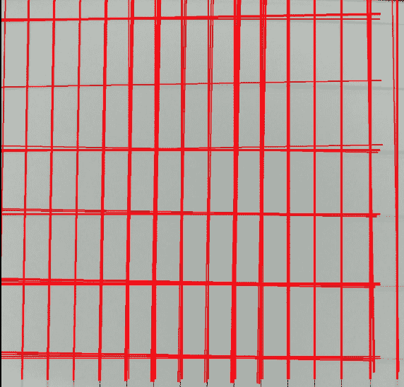

# 用 OpenCV | Houghline 方法进行 python 中的直线检测

> 原文:[https://www . geesforgeks . org/line-detection-python-opencv-Hough line-method/](https://www.geeksforgeeks.org/line-detection-python-opencv-houghline-method/)

霍夫变换是一种在图像处理中用于检测任何形状的方法，如果该形状可以用数学形式表示的话。它可以检测形状，即使它被打破或扭曲了一点点。

我们将看到霍夫变换如何使用霍夫变换方法进行直线检测。为了应用霍夫线方法，首先需要特定图像的边缘检测。关于边缘检测技术，请参阅文章[边缘检测](http://contribute.geeksforgeeks.org/python-program-to-detect-the-edges-of-an-image-using-opencv-sobel-edge-detection-method/)

**霍夫线法基础**

直线可以用 y = mx + c 表示，也可以用参数形式表示，如 r = xcosθ + ysinθ，其中 r 是从原点到直线的垂直距离，θ是这条垂直线和水平轴形成的角度，以逆时针方向测量(该方向因您表示坐标系的方式而异。这种表示在 OpenCV 中使用)。
[](https://media.geeksforgeeks.org/wp-content/uploads/line-detection-1.png) 
所以任何一条线都可以用这两个术语来表示，(r，θ)。

**霍夫线法工作:**

*   首先，它创建一个 2D 数组或累加器(保存两个参数的值)，并且最初设置为零。
*   让行表示 r，列表示(θ)θ。
*   数组的大小取决于您需要的精度。假设您希望角度精度为 1 度，则需要 180 列(直线的最大角度为 180 度)。
*   对于 r，最大可能距离是图像的对角线长度。所以取一个像素的精度，行数可以是图像的对角线长度。

**例:**
考虑一个 100×100 的图像，中间有一条水平线。取线的第一点。你知道它的(x，y)值。现在在线方程中，输入值θ(theta) = 0，1，2，…，180，检查你得到的 r。对于每一个(r，0)对，在累加器的相应(r，0)单元中增加一个值。所以现在在累加器中，单元格(50，90) = 1 以及其他一些单元格。
现在走线上的第二点。做和上面一样的事情。递增对应于(r，0)的单元格中的值。这一次，单元格(50，90) = 2。我们实际上是在对(r，0)值进行投票。你对线上的每一点都继续这个过程。在每一点上，单元(50，90)将被递增或向上表决，而其他单元可能被向上表决，也可能不被向上表决。这样，在最后，单元格(50，90)将拥有最大票数。所以如果你在累加器中搜索最大票数，你会得到一个值(50，90)，它说，在这张图片中有一条线，距离原点 50 度，角度 90 度。
[](https://media.geeksforgeeks.org/wp-content/uploads/line-detection-2.png)

上面解释的一切都封装在 OpenCV 函数 cv2 中。HoughLines()。它只是返回一个(r，0)值的数组。r 以像素为单位，0 以弧度为单位。

```
# Python program to illustrate HoughLine
# method for line detection
import cv2
import numpy as np

# Reading the required image in 
# which operations are to be done. 
# Make sure that the image is in the same 
# directory in which this python program is
img = cv2.imread('image.jpg')

# Convert the img to grayscale
gray = cv2.cvtColor(img,cv2.COLOR_BGR2GRAY)

# Apply edge detection method on the image
edges = cv2.Canny(gray,50,150,apertureSize = 3)

# This returns an array of r and theta values
lines = cv2.HoughLines(edges,1,np.pi/180, 200)

# The below for loop runs till r and theta values 
# are in the range of the 2d array
for r,theta in lines[0]:

    # Stores the value of cos(theta) in a
    a = np.cos(theta)

    # Stores the value of sin(theta) in b
    b = np.sin(theta)

    # x0 stores the value rcos(theta)
    x0 = a*r

    # y0 stores the value rsin(theta)
    y0 = b*r

    # x1 stores the rounded off value of (rcos(theta)-1000sin(theta))
    x1 = int(x0 + 1000*(-b))

    # y1 stores the rounded off value of (rsin(theta)+1000cos(theta))
    y1 = int(y0 + 1000*(a))

    # x2 stores the rounded off value of (rcos(theta)+1000sin(theta))
    x2 = int(x0 - 1000*(-b))

    # y2 stores the rounded off value of (rsin(theta)-1000cos(theta))
    y2 = int(y0 - 1000*(a))

    # cv2.line draws a line in img from the point(x1,y1) to (x2,y2).
    # (0,0,255) denotes the colour of the line to be 
    #drawn. In this case, it is red. 
    cv2.line(img,(x1,y1), (x2,y2), (0,0,255),2)

# All the changes made in the input image are finally
# written on a new image houghlines.jpg
cv2.imwrite('linesDetected.jpg', img)
```

**函数的细化(cv2。霍夫线(边，1，np.pi/180，200)):**

1.  第一个参数，输入图像应该是一个二值图像，所以在找到应用霍夫变换之前应用阈值边缘检测。
2.  第二和第三个参数分别是 r 和θ(θ)精度。
3.  第四个论点是门槛，这意味着它应该获得的最低投票数被认为是一条线。
4.  记住，票数取决于线上的点数。所以它代表应该检测的最小线长度。
    

**总结流程**

*   在图像分析上下文中，图像中边缘段(即，X，Y)的点的坐标是已知的，因此在参数线方程中用作常数，而 R(ρ)和θ(θ)是我们寻求的未知变量。
*   如果我们绘制由每个(θ)定义的可能(r)值，笛卡尔图像空间中的点映射到极坐标霍夫参数空间中的曲线(即正弦曲线)。这种点到曲线的变换就是直线的霍夫变换。
*   该变换是通过将霍夫参数空间量化成有限区间或累加器单元来实现的。随着算法的运行，每个(X，Y)被转换成离散化的(r，0)曲线，沿着该曲线的累加器(2D 阵列)单元被递增。
*   累加器阵列中产生的峰值代表图像中存在相应直线的有力证据。

**霍夫变换的应用:**

1.  它用于隔离图像中特定形状的特征。
2.  容忍特征边界描述中的间隙，并且相对不受图像噪声的影响。
3.  广泛用于条形码扫描、验证和识别

本文由 **Pratima Upadhyay** 供稿。如果你喜欢 GeeksforGeeks 并想投稿，你也可以使用[contribute.geeksforgeeks.org](http://www.contribute.geeksforgeeks.org)写一篇文章或者把你的文章邮寄到 contribute@geeksforgeeks.org。看到你的文章出现在极客博客主页上，帮助其他极客。

如果你发现任何不正确的地方，或者你想分享更多关于上面讨论的话题的信息，请写评论。