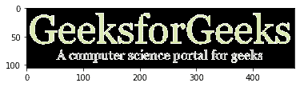

# 使用 Python 和 OpenCV 对图像进行对数变换

> 原文:[https://www . geesforgeks . org/log-transformation-of-a-image-use-python-and-opencv/](https://www.geeksforgeeks.org/log-transformation-of-an-image-using-python-and-opencv/)

一个数的对数值是一个数，它的幂等于一个基数，这个基数给出的数与输入的数相同。简单来说，对数就是一个数的指数值的倒数。

```
log(exp(x)) = x
```

#### 一个数的对数是如何计算的？

让我们看一个例子，


通过在两边应用对数，

```
log(2^3) = log(8)
3 * log(2) = log(8)
3 = log(8) / log(2)
Log(8) = 3 (base is 2)
```

我们知道，幂为 0 的数的值等于 1。所以，

```
log1 = 0 
```

和

```
log0 = infinity
```

我们可以使用 Python 找到一个数字的日志值，如下所示:

```
import numpy as np

# input a number as integer
a = int(input())

print("Natural log value of the input number is", 
      np.log(a))

# If you want base of log to be set to 2
print("Log value of the number with base 2 is", 
      np.log2(a))

# If you want base of log to be set to 10
print("Log value of the number with base 10 is",
      np.log10(a))
```

**示例:**

```
Input : 8
Output : 
Natural log value of the input number is 2.0794415416798357
Log value of the number with base 2 is 3.0
Log value of the number with base 10 is 0.9030899869919435

Input : 255
Output : 
Natural log value of the input number is 5.541263545158426
Log value of the number with base 2 is 7.994353436858858
Log value of the number with base 10 is 2.406540180433955

```

**注意:**在这里访问[可以看到 Python 中的 log 函数。](https://www.geeksforgeeks.org/log-functions-python/)

## 对数变换

图像的对数变换是灰度图像变换之一。图像的对数变换意味着用其对数值替换图像中存在的所有像素值。对数变换用于图像增强，因为与较高的像素值相比，它扩展了图像的暗像素。

在图像中应用对数变换的公式是，

```
S = c * log (1 + r)

where,
R = input pixel value,
C = scaling constant and
S = output pixel value
```

选择“c”的值，以便我们获得对应于所用位大小的最大输出值。因此，计算“c”的公式如下:

```
c = 255 / (log (1 + max_input_pixel_value))
```

当我们在图像中应用对数变换并且任何像素值为“0”时，它的对数值将变为无穷大。这就是为什么我们在对数变换时给每个像素值加上‘1’，这样如果任何像素值为‘0’，它就会变成‘1’，它的对数值就会变成‘0’。

让我们使用 Python 在图像中应用日志转换。

**输入文件–**


```
import cv2
import numpy as np
import matplotlib.pyplot as plt

# Read an image
image = cv2.imread('GFG.png')

# Apply log transformation method
c = 255 / np.log(1 + np.max(image))
log_image = c * (np.log(image + 1))

# Specify the data type so that
# float value will be converted to int
log_image = np.array(log_image, dtype = np.uint8)

# Display both images
plt.imshow(image)
plt.show()
plt.imshow(log_image)
plt.show()
```

**输出:**


的对数变换通过增强图像给出实际信息。如果我们在具有较高像素值的图像中应用这种方法，那么它将更多地增强图像，并且图像的实际信息将丢失。所以，这种方法不可能到处都适用。它可以应用于低像素值大于高像素值的图像。