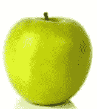
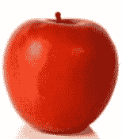
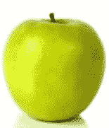

# 使用 Python-OpenCV 测量图像之间的相似度

> 原文:[https://www . geesforgeks . org/measure-图像间相似度-使用-python-opencv/](https://www.geeksforgeeks.org/measure-similarity-between-images-using-python-opencv/)

**先决条件:** [Python OpenCV](https://www.geeksforgeeks.org/opencv-python-tutorial/#getting)
假设我们有两个数据图像和一个测试图像。让我们找出哪个数据图像更类似于 python 中使用 Python 和 OpenCV 库的测试图像。
我们先加载图像，找出图像的直方图。
**导入库**

```
import cv2
```

**导入图像数据**

```
image = cv2.imread('test.jpg')
```

**转换为灰色图像**

```
gray_image = cv2.cvtColor(image, cv2.COLOR_BGR2GRAY)
```

**寻找直方图**

```
histogram = cv2.calcHist([gray_image], [0], 
                              None, [256], [0, 256])
```

**例:**
**所用图像:**
**data1.jpg**



**data2.jpg**T2】



**test.jpg**T2】



## 蟒蛇 3

```
import cv2

# test image
image = cv2.imread('cat.jpg')
gray_image = cv2.cvtColor(image, cv2.COLOR_BGR2GRAY)
histogram = cv2.calcHist([gray_image], [0],
                         None, [256], [0, 256])

# data1 image
image = cv2.imread('cat.jpeg')
gray_image1 = cv2.cvtColor(image, cv2.COLOR_BGR2GRAY)
histogram1 = cv2.calcHist([gray_image1], [0],
                          None, [256], [0, 256])

# data2 image
image = cv2.imread('food.jpeg')
gray_image2 = cv2.cvtColor(image, cv2.COLOR_BGR2GRAY)
histogram2 = cv2.calcHist([gray_image2], [0],
                          None, [256], [0, 256])

c1, c2 = 0, 0

# Euclidean Distance between data1 and test
i = 0
while i<len(histogram) and i<len(histogram1):
    c1+=(histogram[i]-histogram1[i])**2
    i+= 1
c1 = c1**(1 / 2)

# Euclidean Distance between data2 and test
i = 0
while i<len(histogram) and i<len(histogram2):
    c2+=(histogram[i]-histogram2[i])**2
    i+= 1
c2 = c2**(1 / 2)

if(c1<c2):
    print("data1.jpg is more similar to test.jpg as compare to data2.jpg")
else:
    print("data2.jpg is more similar to test.jpg as compare to data1.jpg")
```

**输出:**

```
data1.jpg is more similar to test.jpg as compare to data2.jpg
```