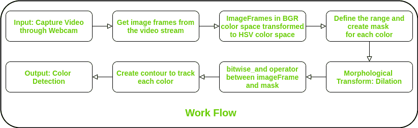

# 使用 Python-OpenCV 实时进行多种颜色检测

> 原文:[https://www . geesforgeks . org/multi-color-detection-in-time-use-python-opencv/](https://www.geeksforgeeks.org/multiple-color-detection-in-real-time-using-python-opencv/)

对于一个能够可视化环境的机器人来说，随着物体的检测，实时检测其颜色也是非常重要的。

### 为什么这很重要？:一些真实世界的应用

*   在自动驾驶汽车中，检测交通信号。
*   多颜色检测用于一些工业机器人，在分离不同颜色的物体时执行拾取和放置任务。

这是一个使用 Python 编程语言实时检测多种颜色(这里只考虑了**和 ***蓝色*** 颜色)的实现。
**使用的 Python 库:****

*   **num py**
*   **[OpenCV-Python](https://www.geeksforgeeks.org/opencv-python-tutorial/)**

### **工作流程描述:**

*****Step 1:*** Input: Capture video through webcam.
***Step 2:*** Read the video stream in image frames.
***Step 3:*** Convert the imageFrame in BGR(RGB color space represented as three matrices of red, green and blue with integer values from 0 to 255) to HSV(hue-saturation-value) color space. *Hue* describes a color in terms of *saturation*, represents the amount of gray color in that color and *value* describes the brightness or intensity of the color. This can be represented as three matrices in the range of 0-179, 0-255 and 0-255 respectively.
***Step 4:*** Define the range of each color and create the corresponding mask.
***Step 5:*** Morphological Transform: Dilation, to remove noises from the images.
***Step 6:*** bitwise_and between the image frame and mask is performed to specificaly detect that particular color and discrad others.
***Step 7:*** Create contour for the individual colors to display the detected colored region distinguishly.
***Step 8:*** Output: Detection of the colors in real-time.**

****

**下面是实现。**

```
**# Python code for Multiple Color Detection

import numpy as np
import cv2

# Capturing video through webcam
webcam = cv2.VideoCapture(0)

# Start a while loop
while(1):

    # Reading the video from the
    # webcam in image frames
    _, imageFrame = webcam.read()

    # Convert the imageFrame in 
    # BGR(RGB color space) to 
    # HSV(hue-saturation-value)
    # color space
    hsvFrame = cv2.cvtColor(imageFrame, cv2.COLOR_BGR2HSV)

    # Set range for red color and 
    # define mask
    red_lower = np.array([136, 87, 111], np.uint8)
    red_upper = np.array([180, 255, 255], np.uint8)
    red_mask = cv2.inRange(hsvFrame, red_lower, red_upper)

    # Set range for green color and 
    # define mask
    green_lower = np.array([25, 52, 72], np.uint8)
    green_upper = np.array([102, 255, 255], np.uint8)
    green_mask = cv2.inRange(hsvFrame, green_lower, green_upper)

    # Set range for blue color and
    # define mask
    blue_lower = np.array([94, 80, 2], np.uint8)
    blue_upper = np.array([120, 255, 255], np.uint8)
    blue_mask = cv2.inRange(hsvFrame, blue_lower, blue_upper)

    # Morphological Transform, Dilation
    # for each color and bitwise_and operator
    # between imageFrame and mask determines
    # to detect only that particular color
    kernal = np.ones((5, 5), "uint8")

    # For red color
    red_mask = cv2.dilate(red_mask, kernal)
    res_red = cv2.bitwise_and(imageFrame, imageFrame, 
                              mask = red_mask)

    # For green color
    green_mask = cv2.dilate(green_mask, kernal)
    res_green = cv2.bitwise_and(imageFrame, imageFrame,
                                mask = green_mask)

    # For blue color
    blue_mask = cv2.dilate(blue_mask, kernal)
    res_blue = cv2.bitwise_and(imageFrame, imageFrame,
                               mask = blue_mask)

    # Creating contour to track red color
    contours, hierarchy = cv2.findContours(red_mask,
                                           cv2.RETR_TREE,
                                           cv2.CHAIN_APPROX_SIMPLE)

    for pic, contour in enumerate(contours):
        area = cv2.contourArea(contour)
        if(area > 300):
            x, y, w, h = cv2.boundingRect(contour)
            imageFrame = cv2.rectangle(imageFrame, (x, y), 
                                       (x + w, y + h), 
                                       (0, 0, 255), 2)

            cv2.putText(imageFrame, "Red Colour", (x, y),
                        cv2.FONT_HERSHEY_SIMPLEX, 1.0,
                        (0, 0, 255))    

    # Creating contour to track green color
    contours, hierarchy = cv2.findContours(green_mask,
                                           cv2.RETR_TREE,
                                           cv2.CHAIN_APPROX_SIMPLE)

    for pic, contour in enumerate(contours):
        area = cv2.contourArea(contour)
        if(area > 300):
            x, y, w, h = cv2.boundingRect(contour)
            imageFrame = cv2.rectangle(imageFrame, (x, y), 
                                       (x + w, y + h),
                                       (0, 255, 0), 2)

            cv2.putText(imageFrame, "Green Colour", (x, y),
                        cv2.FONT_HERSHEY_SIMPLEX, 
                        1.0, (0, 255, 0))

    # Creating contour to track blue color
    contours, hierarchy = cv2.findContours(blue_mask,
                                           cv2.RETR_TREE,
                                           cv2.CHAIN_APPROX_SIMPLE)
    for pic, contour in enumerate(contours):
        area = cv2.contourArea(contour)
        if(area > 300):
            x, y, w, h = cv2.boundingRect(contour)
            imageFrame = cv2.rectangle(imageFrame, (x, y),
                                       (x + w, y + h),
                                       (255, 0, 0), 2)

            cv2.putText(imageFrame, "Blue Colour", (x, y),
                        cv2.FONT_HERSHEY_SIMPLEX,
                        1.0, (255, 0, 0))

    # Program Termination
    cv2.imshow("Multiple Color Detection in Real-TIme", imageFrame)
    if cv2.waitKey(10) & 0xFF == ord('q'):
        cap.release()
        cv2.destroyAllWindows()
        break**
```

****输出:**** 

**<video class="wp-video-shortcode" id="video-402008-1" width="640" height="528" preload="metadata" controls=""><source type="video/mp4" src="https://media.geeksforgeeks.org/wp-content/uploads/20200413120743/MCD_demoVideo.mp4?_=1">[https://media.geeksforgeeks.org/wp-content/uploads/20200413120743/MCD_demoVideo.mp4](https://media.geeksforgeeks.org/wp-content/uploads/20200413120743/MCD_demoVideo.mp4)</video>**