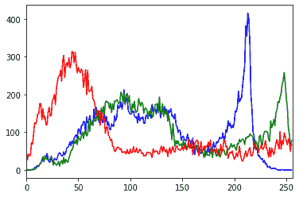
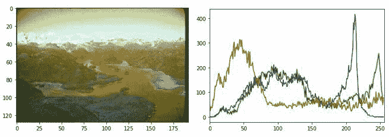
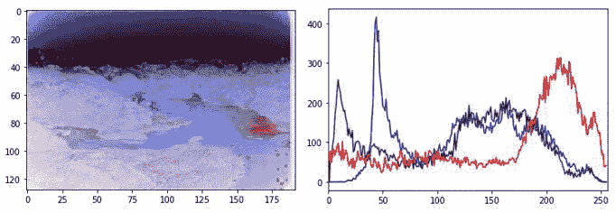

# 使用 Python 和 OpenCV 对图像进行负变换

> 原文:[https://www . geeksforgeeks . org/使用 python 和-opencv 对图像进行负转换/](https://www.geeksforgeeks.org/negative-transformation-of-an-image-using-python-and-opencv/)

图像也称为一组像素。当我们将图像存储在计算机中或以数字方式存储时，相应的像素值就会被存储。因此，当我们使用 Python 中的 OpenCV 将图像读入一个变量时，该变量存储图像的像素值。当我们试图对图像进行负变换时，最亮的区域被变换成最暗的区域，最暗的区域被变换成最亮的区域。

众所周知，彩色图像存储 3 个不同的通道。它们是红色、绿色和蓝色的。这就是为什么彩色图像也被称为 RGB 图像。所以，如果我们需要一个图像的负变换，那么我们需要反转这 3 个通道。

让我们通过在直方图中绘制来查看彩色图像的 3 个通道。

**输入图像–**


```
# We need cv2 module for image 
# reading and matplotlib module
# for plotting
import cv2
import matplotlib.pyplot as plt

img_bgr = cv2.imread('scenary.jpg', 1)

color = ('b', 'g', 'r')

for i, col in enumerate(color):
    histr = cv2.calcHist([img_bgr], [i], None, [256], [0, 256])
    plt.plot(histr, color = col)
    plt.xlim([0, 256])

plt.show()
```

**输出:**



这里，3 个通道(红色、绿色、蓝色)重叠在一起，形成一个直方图。如果你以前研究过像素和 RGB，你可能知道每种颜色包含 256 个值。如果一种颜色的 RGB 值为(255，255，255)，则该颜色显示为白色；如果一种颜色的 RGB 值为(0，0，0)，则该颜色显示为黑色。像这样，上面 3 个通道也包含 256 个像素。

因此，X 轴显示总共 256 个值(0–255)，Y 轴显示每个通道的总频率。如直方图所示，蓝色通道的频率最高，您可以通过查看它轻松标记图像中存在的蓝色量。

## 图像的负变换

让我们创建一个图像的负变换。使用 OpenCV 模块将图像转换为负片有两种不同的方法。第一种方法是逐步解释负变换，第二种方法是单行解释图像的负变换。

**第一种方法:负变换的步骤**

1.  阅读图片
2.  获取图像的高度和宽度
3.  每个像素包含 3 个通道。所以，取一个像素值，用 3 个不同的变量收集 3 个通道。
4.  将 255 的 3 个像素值取反，并将其再次存储在以前使用的像素中。
5.  对图像中存在的所有像素值执行此操作。

**第一种方法的 Python 代码:–**

```
import cv2
import matplotlib.pyplot as plt

# Read an image
img_bgr = cv2.imread('scenary.jpg', 1)
plt.imshow(img_bgr)
plt.show()

# Histogram plotting of the image
color = ('b', 'g', 'r')

for i, col in enumerate(color):

    histr = cv2.calcHist([img_bgr], 
                         [i], None,
                         [256], 
                         [0, 256])

    plt.plot(histr, color = col)

    # Limit X - axis to 256
    plt.xlim([0, 256])

plt.show()

# get height and width of the image
height, width, _ = img_bgr.shape

for i in range(0, height - 1):
    for j in range(0, width - 1):

        # Get the pixel value
        pixel = img_bgr[i, j]

        # Negate each channel by 
        # subtracting it from 255

        # 1st index contains red pixel
        pixel[0] = 255 - pixel[0]

        # 2nd index contains green pixel
        pixel[1] = 255 - pixel[1]

        # 3rd index contains blue pixel
        pixel[2] = 255 - pixel[2]

        # Store new values in the pixel
        img_bgr[i, j] = pixel

# Display the negative transformed image
plt.imshow(img_bgr)
plt.show()

# Histogram plotting of the
# negative transformed image
color = ('b', 'g', 'r')

for i, col in enumerate(color):

    histr = cv2.calcHist([img_bgr], 
                         [i], None,
                         [256],
                         [0, 256])

    plt.plot(histr, color = col)
    plt.xlim([0, 256])

plt.show()
```

**输出:**


(原始图像及其直方图)


(负像及其直方图)

**第二种方法:负变换步骤**

1.  读取图像并将其存储在变量中。
2.  从 1 中减去变量，并将该值存储在另一个变量中。
3.  都搞定了。你成功地完成了负转换。

**第二种方法的 Python 代码:–**

```
import cv2
import matplotlib.pyplot as plt

# Read an image
img_bgr = cv2.imread('scenary.jpg', 1)

plt.imshow(img_bgr)
plt.show()

# Histogram plotting of original image
color = ('b', 'g', 'r')

for i, col in enumerate(color):

    histr = cv2.calcHist([img_bgr],
                         [i], None,
                         [256],
                         [0, 256])

    plt.plot(histr, color = col)

    # Limit X - axis to 256
    plt.xlim([0, 256])

plt.show()

# Negate the original image
img_neg = 1 - img_bgr

plt.imshow(img_neg)
plt.show()

# Histogram plotting of
# negative transformed image
color = ('b', 'g', 'r')

for i, col in enumerate(color):

    histr = cv2.calcHist([img_neg],
                         [i], None, 
                         [256],
                         [0, 256])

    plt.plot(histr, color = col)
    plt.xlim([0, 256])

plt.show()
```

**输出:**


(原始图像及其直方图)


(负像及其直方图)