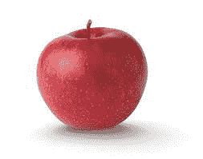
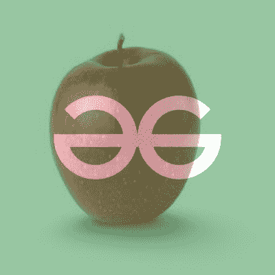
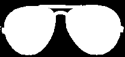

# Opencv–图像的 Alpha 混合和遮罩

> 原文:[https://www . geesforgeks . org/opencv-alpha-图像混合和掩蔽/](https://www.geeksforgeeks.org/opencv-alpha-blending-and-masking-of-images/)

**Alpha 混合**是在背景图像上叠加前景图像的过程。

我们将这两幅图像融合在一起:

<center>


gfg.png



apple.jpeg

</center>

**步骤:**

*   首先，我们将导入 OpenCV。
*   我们阅读我们想要混合的两幅图像。
*   显示图像。
*   我们有一个 while 循环，当选择为 1 时运行。
*   输入一个字母值。
*   使用 **cv2.addWeighted()** 添加加权图像。
*   我们将图像显示并保存为 *alpha_{image}。png* 。
*   要继续并尝试更多 alpha 值，请按 1。否则按 0 退出。

## 蟒蛇 3

```py
import cv2

img1 = cv2.imread('gfg.png')
img2 = cv2.imread('apple.jpeg')

img2 = cv2.resize(img2, img1.shape[1::-1])

cv2.imshow("img 1",img1)

cv2.waitKey(0)

cv2.imshow("img 2",img2)

cv2.waitKey(0)

choice = 1

while (choice) :

    alpha = float(input("Enter alpha value"))

    dst = cv2.addWeighted(img1, alpha , img2, 1-alpha, 0)

    cv2.imwrite('alpha_mask_.png', dst)

    img3 = cv2.imread('alpha_mask_.png')

    cv2.imshow("alpha blending 1",img3)

    cv2.waitKey(0)

    choice = int(input("Enter 1 to continue and 0 to exit"))
```

**输出:**

<center>


α= 0.8



α= 0.5

</center>

**阿尔法掩蔽:**

> 我们可以从一个有透明背景的图像中创建一个黑白蒙版。

<center>
</center>

## 蟒蛇 3

```py
import cv2
im = cv2.imread("spectacles.png", cv2.IMREAD_UNCHANGED)
_, mask = cv2.threshold(im[:, :, 3], 0, 255, cv2.THRESH_BINARY)
cv2.imwrite('mask.jpg', mask)
```

**输出:**

<center>
</center>