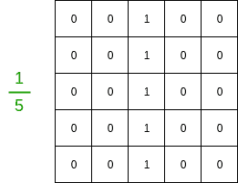
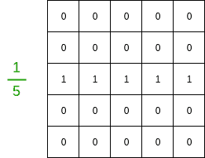
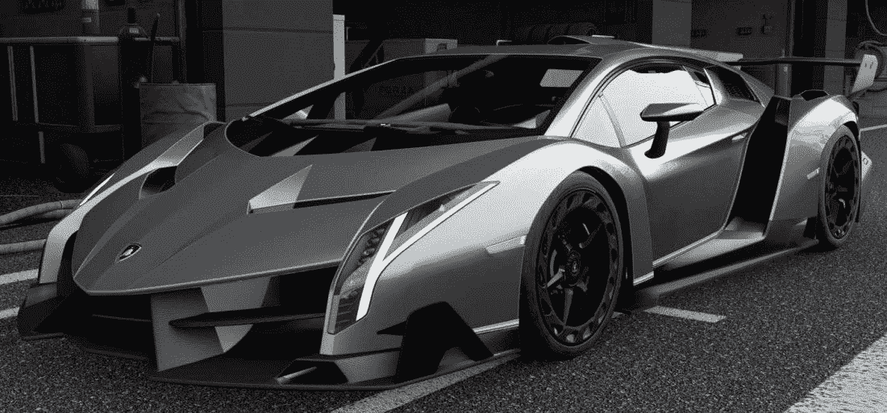
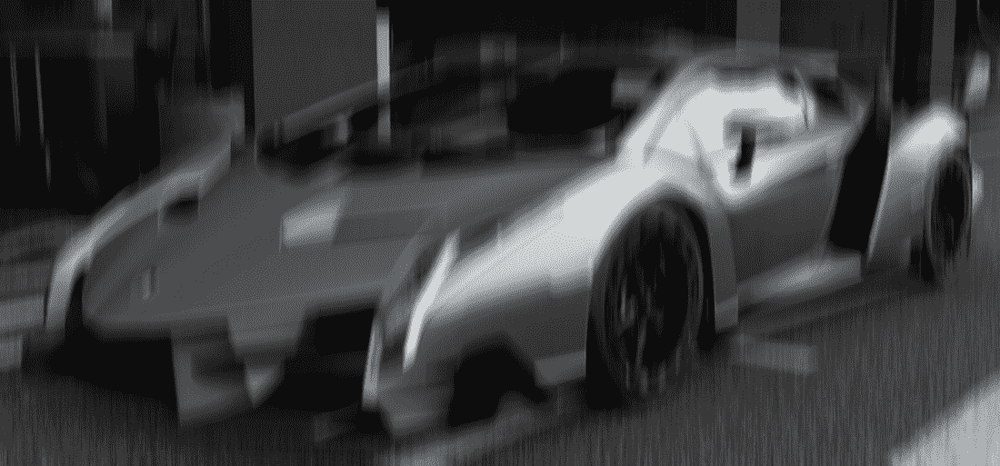
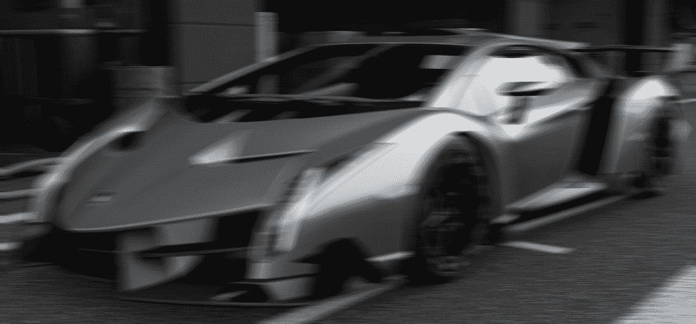

# Python 中的 OpenCV |运动模糊

> 原文:[https://www.geeksforgeeks.org/opencv-motion-blur-in-python/](https://www.geeksforgeeks.org/opencv-motion-blur-in-python/)

这篇[文章](https://www.geeksforgeeks.org/opencv-python-program-to-blur-an-image/)解释了如何使用 OpenCV 给图像添加模糊。运动模糊是一种特定类型的模糊，用于为图像提供定向模糊效果。

**运动模糊滤镜**
将运动模糊应用于图像可以归结为在图像上卷积滤镜。下面给出了示例 5*5 过滤器。

**纵:**


**横:**


滤镜的大小越大，运动模糊效果就越大。此外，穿过滤波器网格的 1 的方向是期望运动的方向。要在特定矢量方向(例如对角方向)自定义运动模糊，只需沿矢量放置 1 即可创建滤镜。

**代码**
考虑以下汽车的图像。



 **代码:用于在图像上应用运动模糊效果的 Python 代码。**

```
# loading library
import cv2
import numpy as np

img = cv2.imread('car.jpg')

# Specify the kernel size.
# The greater the size, the more the motion.
kernel_size = 30

# Create the vertical kernel.
kernel_v = np.zeros((kernel_size, kernel_size))

# Create a copy of the same for creating the horizontal kernel.
kernel_h = np.copy(kernel_v)

# Fill the middle row with ones.
kernel_v[:, int((kernel_size - 1)/2)] = np.ones(kernel_size)
kernel_h[int((kernel_size - 1)/2), :] = np.ones(kernel_size)

# Normalize.
kernel_v /= kernel_size
kernel_h /= kernel_size

# Apply the vertical kernel.
vertical_mb = cv2.filter2D(img, -1, kernel_v)

# Apply the horizontal kernel.
horizonal_mb = cv2.filter2D(img, -1, kernel_h)

# Save the outputs.
cv2.imwrite('car_vertical.jpg', vertical_mb)
cv2.imwrite('car_horizontal.jpg', horizonal_mb)
```

**输出**

**垂直模糊:**


**水平模糊:**
