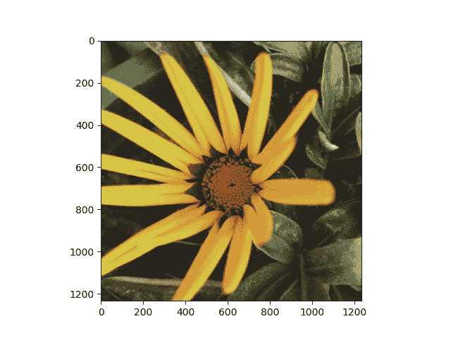
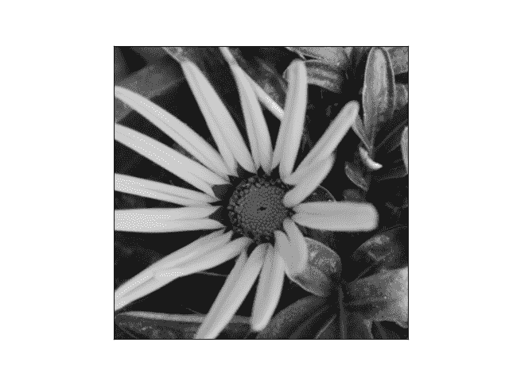
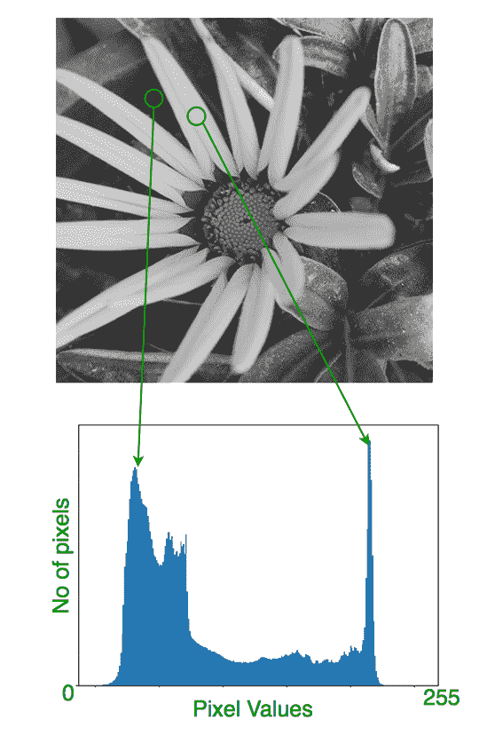
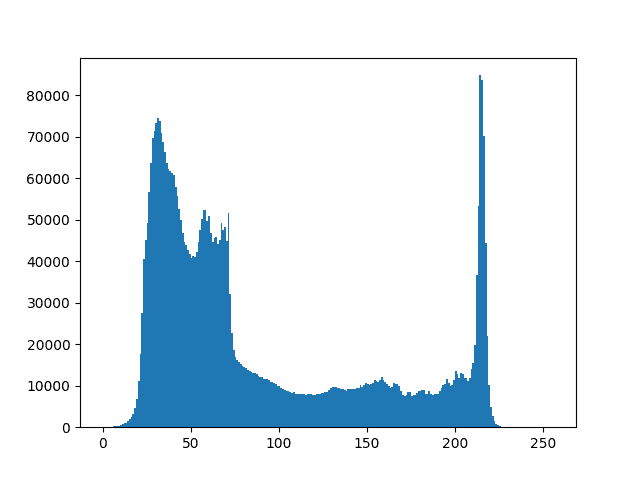
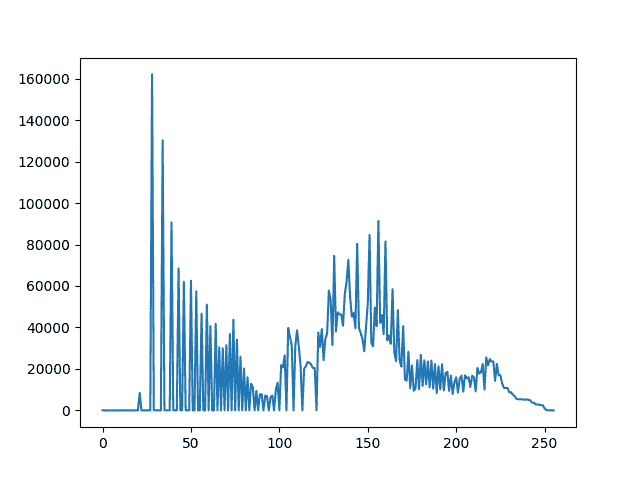
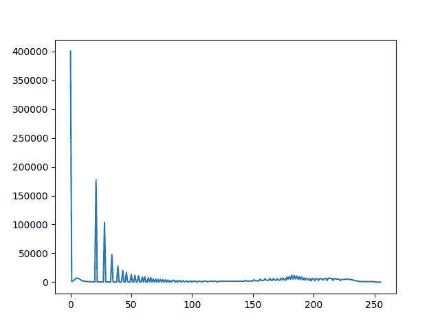
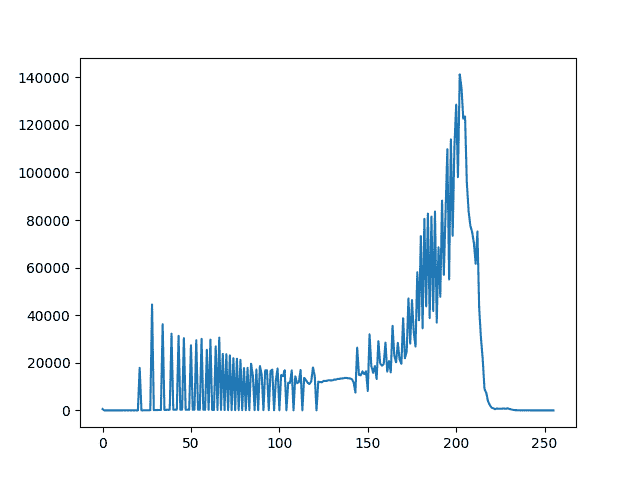
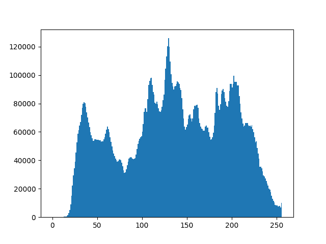

# 使用直方图

分析图像的 OpenCV Python 程序

> 原文:[https://www . geesforgeks . org/opencv-python-program-analyze-image-use-直方图/](https://www.geeksforgeeks.org/opencv-python-program-analyze-image-using-histogram/)

本文讨论了利用 Matplotlib 和 OpenCV 进行图像分析。我们先来了解一下如何实验各种风格的图像数据，以及如何用直方图表示。
先决条件:

*   [OpenCV](http://docs.opencv.org/2.4/doc/tutorials/imgproc/table_of_content_imgproc/table_of_content_imgproc.html)
*   [matplotlib](http://matplotlib.org/users/pyplot_tutorial.html)

**导入图像数据**

```
import matplotlib.pyplot as plt #importing matplotlib
```

图像应该在一个 PNG 文件中使用，因为 matplotlib 只支持 PNG 图像。在这里，这是一个 24 位的 RGB PNG 图像(R，G，B 各 8 位)，在这个例子中使用。每个内部列表代表一个像素。这里，对于一个 RGB 图像，有 3 个值。对于 RGB 图像，matplotlib 支持 float32 和 uint8 数据类型。

```
img = plt.imread('flower.png') #reads image data
```

[](https://media.geeksforgeeks.org/wp-content/uploads/OpenCV-Python-Program-to-analyze-an-image-using-Histogram.png) 
在 Matplotlib 中，这是使用 **imshow()** 功能执行的。这里我们已经抓住了剧情对象。

**关于直方图**

直方图被认为是与具有像素值(范围从 0 到 255)的灰度图像
中的像素频率相关的图形或曲线图。灰度图像是其中每个像素的值是单个样本的图像，也就是说，它仅携带像素值从 0 到 255 变化的强度信息。这种类型的图像，也称为黑白图像，完全由灰色阴影组成，从最弱强度的黑色到最强强度的白色，像素可以被视为图像中的每个点。
灰度图像的外观:
[](https://media.geeksforgeeks.org/wp-content/uploads/OpenCV-Python-Program-to-analyze-an-image-using-Histogram-2.png) 
它量化了所考虑的每个强度值的像素数。在浏览直方图之前，让我们从这个给定的例子中大致了解一下。
[](https://media.geeksforgeeks.org/wp-content/uploads/OpenCV-Python-Program-to-analyze-an-image-using-Histogram-3.png) 
在这里，我们获得了关于该图像的对比度、亮度、强度分布等的直觉。正如我们可以看到的图像及其直方图是为灰度图像绘制的，而不是彩色图像。
直方图左侧区域显示图像中较暗像素的数量，右侧区域显示较亮像素的数量。

**使用 numpy 数组创建直方图**

为了创建图像数据的直方图，我们使用 hist()函数。

```
plt.hist(n_img.ravel(), bins=256, range=(0.0, 1.0), fc='k', ec='k') #calculating histogram
```

[](https://media.geeksforgeeks.org/wp-content/uploads/OpenCV-Python-Program-to-analyze-an-image-using-Histogram-4.png) 
在我们的直方图中，看起来像是灰度图像的黑白像素在整个图像上有强度分布。

从直方图中，我们可以得出暗区多于亮区的结论。

现在，我们将处理由像素值变化的像素的强度分布组成的图像。首先，我们需要使用 OpenCV 内置函数计算直方图。

**直方图计算**

这里，我们使用 cv2 . calchist()(OpenCV 中的内置函数)来查找直方图。

```
cv2.calcHist(images, channels, mask, histSize, ranges[, hist[, accumulate]])
```

**图像:**是 uint8 或 float32 类型的源图像，表示为“[img]”。
**通道:**是我们计算直方图的通道指标。对于灰度图像，其值为【0】和
彩色图像，可以通过【0】、【1】或【2】分别计算蓝色、绿色或红色通道的直方图。
**遮罩:**遮罩图像。为了找到完整图像的直方图，它被给出为“无”。
**histSize :** 这代表我们的 BIN 计数。对于满量程，我们通过[256]。
**ranges** :这是我们的 RANGE。正常情况下是[0，256]。

例如:

```
# load an image in grayscale mode
img = cv2.imread('ex.jpg',0)

# calculate frequency of pixels in range 0-255
histg = cv2.calcHist([img],[0],None,[256],[0,256]) 
```

然后，我们需要绘制直方图来显示图像的特征。

**绘制直方图**

使用 Matplotlib 进行分析:

```
# importing required libraries of opencv
import cv2

# importing library for plotting
from matplotlib import pyplot as plt

# reads an input image
img = cv2.imread('ex.jpg',0)

# find frequency of pixels in range 0-255
histr = cv2.calcHist([img],[0],None,[256],[0,256])

# show the plotting graph of an image
plt.plot(histr)
plt.show()
```

输入:
[](https://media.geeksforgeeks.org/wp-content/uploads/OpenCV-Python-Program-to-analyze-an-image-using-Histogram-5.png)
[](https://media.geeksforgeeks.org/wp-content/uploads/OpenCV-Python-Program-to-analyze-an-image-using-Histogram-6.png)
[](https://media.geeksforgeeks.org/wp-content/uploads/OpenCV-Python-Program-to-analyze-an-image-using-Histogram-7.png)
输出:
[](https://media.geeksforgeeks.org/wp-content/uploads/OpenCV-Python-Program-to-analyze-an-image-using-Histogram-8.png)
[](https://media.geeksforgeeks.org/wp-content/uploads/OpenCV-Python-Program-to-analyze-an-image-using-Histogram-9.png)
[](https://media.geeksforgeeks.org/wp-content/uploads/OpenCV-Python-Program-to-analyze-an-image-using-Histogram-10.png)
插图显示图像的每个像素数位于 0 到 255 的范围内。在第二个例子中，它直接找到直方图并绘制出来。我们不需要使用 calcHist()。请参见下面的代码:

```
import cv2
from matplotlib import pyplot as plt
img = cv2.imread('ex.jpg',0)

# alternative way to find histogram of an image
plt.hist(img.ravel(),256,[0,256])
plt.show()
```

输出:
[](https://media.geeksforgeeks.org/wp-content/uploads/OpenCV-Python-Program-to-analyze-an-image-using-Histogram-11.png)

因此，我们得出结论，图像可以被表示为直方图，以设想图像上的强度分布的概念，并进一步设想它的宁静。

**参考文献:**

*   http://docs.opencv.org/2.4/doc/tutorials/imgproc/table_of_content_imgproc/table_of_content_imgproc.html#table-of-content-imgproc
*   http://www.cambridgeincolour.com/tutorials/histograms1.htm

本文由**阿夫扎尔·安萨里**供稿。如果你喜欢 GeeksforGeeks 并想投稿，你也可以使用[contribute.geeksforgeeks.org](http://contribute.geeksforgeeks.org)写一篇文章或者把你的文章邮寄到 contribute@geeksforgeeks.org。看到你的文章出现在极客博客主页上，帮助其他极客。

如果你发现任何不正确的地方，或者你想分享更多关于上面讨论的话题的信息，请写评论。