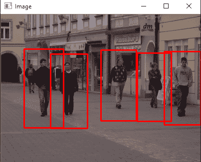
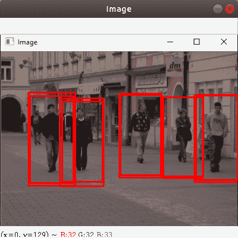

# 使用 OpenCV-Python 进行行人检测

> 原文:[https://www . geesforgeks . org/行人检测-使用-opencv-python/](https://www.geeksforgeeks.org/pedestrian-detection-using-opencv-python/)

[OpenCV](https://www.geeksforgeeks.org/opencv-python-tutorial/) 是一个开源库，针对实时计算机视觉。该库由英特尔开发，跨平台——可支持 Python、C++、Java 等。计算机视觉是计算机科学的一个前沿领域，旨在使计算机能够理解图像中所看到的内容。OpenCV 是用于人脸识别、运动检测、物体检测等计算机视觉任务的最广泛的库之一。

在本教程中，我们将使用 OpenCV 为图像和视频构建一个基本的**行人检测器**。行人检测是一个非常重要的研究领域，因为它可以增强自动驾驶汽车中行人保护系统的功能。

我们可以从人体图像中提取头部、双臂、两条腿等特征，并通过它们来训练机器学习模型。经过训练，该模型可用于检测和跟踪图像和视频流中的人。然而，OpenCV 有一个内置的方法来检测行人。它有一个预训练的 **HOG(方向梯度直方图)+线性 SVM 模型**来检测图像和视频流中的行人。

**定向梯度直方图**

该算法直接检查每个像素的周围像素。目标是检查当前像素与周围像素相比有多暗。该算法绘制箭头，显示图像变暗的方向。它对图像中的每个像素重复这个过程。最后，每个像素将被一个箭头代替，这些箭头被称为**渐变**。这些梯度显示了光从亮到暗的流动。通过使用这些梯度算法执行进一步的分析。要了解更多关于 HOG 的信息，请阅读 Navneet Dalal 和 Bill Triggs 关于[人体检测 HOG 的研究论文。](http://lear.inrialpes.fr/people/triggs/pubs/Dalal-cvpr05.pdf)。

#### 要求

```
opencv-python 3.4.2

imutils 0.5.3

```

要安装上述模块，请在终端中键入以下命令。

```
pip install moudle_name
```

**例 1:**

让程序检测图像中的行人:

**所用图像:**


```
import cv2
import imutils

# Initializing the HOG person
# detector
hog = cv2.HOGDescriptor()
hog.setSVMDetector(cv2.HOGDescriptor_getDefaultPeopleDetector())

# Reading the Image
image = cv2.imread('img.png')

# Resizing the Image
image = imutils.resize(image,
                       width=min(400, image.shape[1]))

# Detecting all the regions in the 
# Image that has a pedestrians inside it
(regions, _) = hog.detectMultiScale(image, 
                                    winStride=(4, 4),
                                    padding=(4, 4),
                                    scale=1.05)

# Drawing the regions in the Image
for (x, y, w, h) in regions:
    cv2.rectangle(image, (x, y), 
                  (x + w, y + h), 
                  (0, 0, 255), 2)

# Showing the output Image
cv2.imshow("Image", image)
cv2.waitKey(0)

cv2.destroyAllWindows()
```

**输出:**



**示例 2:** 让我们制作一个程序来检测视频中的行人:

```
import cv2
import imutils

# Initializing the HOG person
# detector
hog = cv2.HOGDescriptor()
hog.setSVMDetector(cv2.HOGDescriptor_getDefaultPeopleDetector())

cap = cv2.VideoCapture('vid.mp4')

while cap.isOpened():
    # Reading the video stream
    ret, image = cap.read()
    if ret:
        image = imutils.resize(image, 
                               width=min(400, image.shape[1]))

        # Detecting all the regions 
        # in the Image that has a 
        # pedestrians inside it
        (regions, _) = hog.detectMultiScale(image,
                                            winStride=(4, 4),
                                            padding=(4, 4),
                                            scale=1.05)

        # Drawing the regions in the 
        # Image
        for (x, y, w, h) in regions:
            cv2.rectangle(image, (x, y),
                          (x + w, y + h), 
                          (0, 0, 255), 2)

        # Showing the output Image
        cv2.imshow("Image", image)
        if cv2.waitKey(25) & 0xFF == ord('q'):
            break
    else:
        break

cap.release()
cv2.destroyAllWindows()
```

**输出:**

<video class="wp-video-shortcode" id="video-387592-1" width="665" height="374" preload="metadata" controls=""><source type="video/webm" src="https://media.geeksforgeeks.org/wp-content/uploads/20200323164247/Screencast-from-Monday-23-March-2020-044051-IST.webm?_=1">[https://media.geeksforgeeks.org/wp-content/uploads/20200323164247/Screencast-from-Monday-23-March-2020-044051-IST.webm](https://media.geeksforgeeks.org/wp-content/uploads/20200323164247/Screencast-from-Monday-23-March-2020-044051-IST.webm)</video>