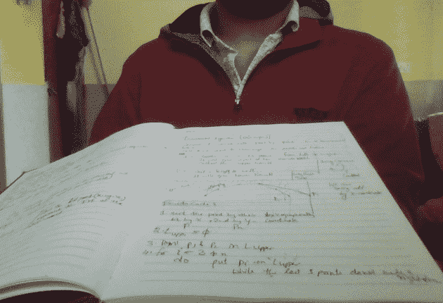
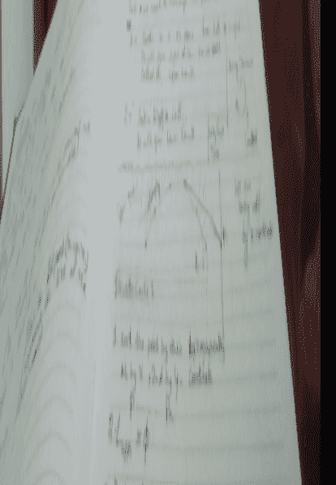

# 透视变换——Python OpenCV

> 原文:[https://www . geesforgeks . org/perspective-transformation-python-opencv/](https://www.geeksforgeeks.org/perspective-transformation-python-opencv/)

在**视角变换，**中，我们可以改变给定图像或视频的视角，以便更好地洞察所需信息。在透视变换中，我们需要通过改变透视来提供图像上想要从中收集信息的点。我们还需要提供我们想要显示图像的点。然后，我们从两个给定的点集合中获得透视变换，并用原始图像包裹它。
我们先用**cv2 . getperspective transform**再用**cv2 . warpper specify**。

> **cv2.getPerspectiveTransform 方法–**
> **语法**:cv2 . getperspective transform(src，dst)
> **参数** :
> - > **src** :源图像中四边形顶点的坐标。
> - > **dst** :目的图像中对应四边形顶点的坐标。
> **cv2.wrapPerspective 方法–**
> **语法:**cv2 . warpperspective(src、dst、dsize)
> **参数** :
> - > **src** :源图像
> - > **dst** :输出图像与 src 大小相同、类型相同的图像。
> - > **dsize** :输出图像的大小

下面是解释透视变换的 Python 代码–

## 蟒蛇 3

```py
# import necessary libraries

import cv2
import numpy as np

# Turn on Laptop's webcam
cap = cv2.VideoCapture(0)

while True:

    ret, frame = cap.read()

    # Locate points of the documents or object which you want to transform
    pts1 = np.float32([[0, 260], [640, 260], [0, 400], [640, 400]])
    pts2 = np.float32([[0, 0], [400, 0], [0, 640], [400, 640]])

    # Apply Perspective Transform Algorithm
    matrix = cv2.getPerspectiveTransform(pts1, pts2)
    result = cv2.warpPerspective(frame, matrix, (500, 600))
    # Wrap the transformed image

    cv2.imshow('frame', frame) # Initial Capture
    cv2.imshow('frame1', result) # Transformed Capture

    if cv2.waitKey(24) == 27:
        break

cap.release()
cv2.destroyAllWindows()
```

**输入图像:**



**输出:**

