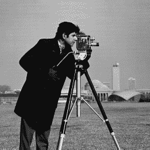
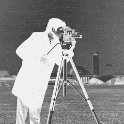

# 使用 Python-OpenCV 的图像处理中的点处理

> 原文:[https://www . geeksforgeeks . org/point-processing-in-image-processing-use-python-opencv/](https://www.geeksforgeeks.org/point-processing-in-image-processing-using-python-opencv/)

[OpenCV](https://www.geeksforgeeks.org/opencv-python-tutorial/) 是用于计算机视觉、机器学习和图像处理的巨大开源库，现在它在实时操作中发挥着重要作用，这在当今的系统中非常重要。通过使用它，人们可以处理图像和视频来识别物体、人脸，甚至是人类的笔迹。

## 空间域中点处理

对像素值进行的所有处理。点处理操作采用以下形式–

```py
s = T ( r )
```

这里，T 指的是灰度变换函数或点处理操作，s 指的是处理后的图像像素值，r 指的是原始图像像素值。

**影像底片:**

```py
s = (L-1) – r, where L= number of grey levels
```

**阈值化:**

```py
s = L-1 for r > threshold
s = 0 for r < threshold
```

**背景灰度切片:**

```py
s = L-1 for a < r < b,
here a and b define some specific range of grey level
s = r otherwise.
```

下面是实现。

**原始输入图像:**



```py
import cv2
import numpy as np

# Image negative
img = cv2.imread('food.jpeg',0) 

# To ascertain total numbers of 
# rows and columns of the image,
# size of the image
m,n = img.shape

# To find the maximum grey level
# value in the image
L = img.max()

# Maximum grey level value  minus 
# the original image gives the
# negative image
img_neg = L-img

# convert the np array img_neg to 
# a png image
cv2.imwrite('Cameraman_Negative.png', img_neg)

# Thresholding without background 
# Let threshold =T
# Let pixel value in the original be denoted by r
# Let pixel value in the new image be denoted by s
# If r<T, s= 0
# If r>T, s=255

T = 150

# create a array of zeros
img_thresh = np.zeros((m,n), dtype = int) 

for i in range(m):

    for j in range(n):

        if img[i,j] <  T: 
            img_thresh[i,j]= 0
        else:
            img_thresh[i,j] = 255

# Convert array to png image
cv2.imwrite('Cameraman_Thresh.png', img_thresh)

# the lower threshold value
T1 = 100

# the upper threshold value
T2 = 180 

# create a array of zeros
img_thresh_back = np.zeros((m,n), dtype = int)

for i in range(m):

    for j in range(n):

        if T1 < img[i,j] < T2: 
            img_thresh_back[i,j]= 255
        else:
            img_thresh_back[i,j] = img[i,j]

# Convert array to  png image
cv2.imwrite('Cameraman_Thresh_Back.png', img_thresh_back)
```

**输出:图像负片**


**输出:带阈值的图像:**



**输出:带背景灰度切片的图像**

