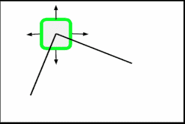
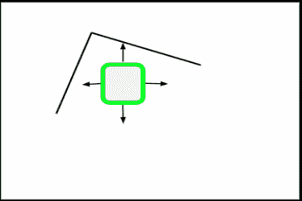
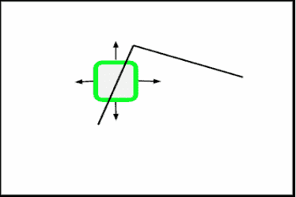
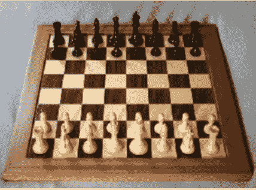
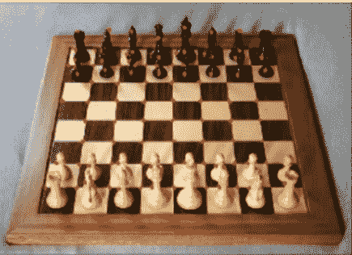

# Python |使用 OpenCV 的 Shi-Tomasi 角点检测方法进行角点检测

> 原文:[https://www . geesforgeks . org/python-corner-detection-with-Shi-tomasi-corner-detection-method-use-opencv/](https://www.geeksforgeeks.org/python-corner-detection-with-shi-tomasi-corner-detection-method-using-opencv/)

**什么是角落？**
一个角可以解释为两条边的交汇点(其中一条边是图像亮度的突然变化)。

### 施-托马西角检测–

史-托马西角点检测是由史和托马西在他们的论文《跟踪的好特征》中发表的。这里的基本直觉是，可以通过寻找所有方向的显著变化来检测拐角。

我们在图像上考虑一个小窗口，然后扫描整个图像，寻找角落。

向任何方向移动这个小窗口都会导致外观的巨大变化，如果那个特定的窗口恰好位于某个角落的话。


平坦区域在任何方向上都没有变化。


如果有边缘，那么沿着边缘方向不会有大的变化。


### 数学概述–

对于位于(X，Y)且像素强度为 I(X，Y)的窗口(W)，Shi-Tomasi 角点检测公式为–

```
f(X, Y) = Σ (I(Xk, Yk) - I(Xk + ΔX, Yk + ΔY))2  where (Xk, Yk) ϵ W
```

**根据公式:**
如果我们用一个窗口扫描图像，就像用一个内核扫描一样，我们注意到有一个区域，无论我们实际扫描的方向如何，都有一个重大变化，那么我们有一个很好的直觉，那里可能有一个角落。

计算 f(X，Y)会真的很慢。因此，我们使用泰勒展开来简化评分函数

```
R = min(λ1, λ2)
where λ1, λ2 are eigenvalues of resultant matrix
```

**使用`goodFeaturesToTrack()`功能–**

> **语法:**cv2 . goodyfeaturestotrack(gray _ img，maxc，Q，minD)
> 
> **参数:**
> **gray _ img–**积分值的灰度图像
> **maxc–**我们想要的最大转角数(给出负值得到所有转角)
> **Q–**质量等级参数(优选值= 0.01)
> **maxD–**最大距离(优选值=10)

Below is the Python implementation of Shi-Tomasi Corner Detection:

```
# Python program to illustrate 
# corner detection with 
# Shi-Tomasi Detection Method

# organizing imports 
import cv2
import numpy as np
import matplotlib.pyplot as plt
%matplotlib inline

# path to input image specified and  
# image is loaded with imread command
img = cv2.imread('chess.png')

# convert image to grayscale
gray_img = cv2.cvtColor(img, cv2.COLOR_BGR2GRAY)

# Shi-Tomasi corner detection function
# We are detecting only 100 best corners here
# You can change the number to get desired result.
corners = cv2.goodFeaturesToTrack(gray_img, 100, 0.01, 10)

# convert corners values to integer
# So that we will be able to draw circles on them
corners = np.int0(corners)

# draw red color circles on all corners
for i in corners:
    x, y = i.ravel()
    cv2.circle(img, (x, y), 3, (255, 0, 0), -1)

# resulting image
plt.imshow(img)

# De-allocate any associated memory usage  
if cv2.waitKey(0) & 0xff == 27: 
    cv2.destroyAllWindows()
```

**输入:**


**输出:**
