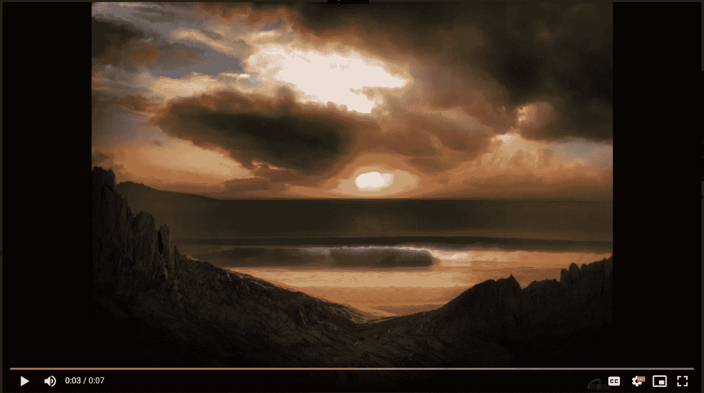

# Python |使用 OpenCV 使用多个图像创建视频

> 原文:[https://www . geesforgeks . org/python-create-video-use-multi-images-use-opencv/](https://www.geeksforgeeks.org/python-create-video-using-multiple-images-using-opencv/)

众所周知，OpenCV 是一个广泛使用的图像处理库。它提供了广泛意义上的图像处理。让我们看看如何使用 OpenCV 使用多个图像创建视频。

> **安装以下库:**
> 
> GDP〔t0〕cv 2

此外，在运行代码之前检查路径，否则您将充满错误。

**它是如何工作的？**
使用 PIL 库，我们正在打开图像，并将它们调整到它们的*平均高度*和*平均宽度*，因为使用 cv2 库创建的视频需要相同高度和宽度的输入图像。
调整大小后的图像包含在一个数组中，视频帧设置为*平均高度*和*平均宽度*。然后通过循环，我们将每个图像附加到该帧。

下面是实现:

```
# importing libraries
import os
import cv2 
from PIL import Image 

# Checking the current directory path
print(os.getcwd()) 

# Folder which contains all the images
# from which video is to be generated
os.chdir("C:\\Python\\Geekfolder2")  
path = "C:\\Python\\Geekfolder2"

mean_height = 0
mean_width = 0

num_of_images = len(os.listdir('.'))
# print(num_of_images)

for file in os.listdir('.'):
    im = Image.open(os.path.join(path, file))
    width, height = im.size
    mean_width += width
    mean_height += height
    # im.show()   # uncomment this for displaying the image

# Finding the mean height and width of all images.
# This is required because the video frame needs
# to be set with same width and height. Otherwise
# images not equal to that width height will not get 
# embedded into the video
mean_width = int(mean_width / num_of_images)
mean_height = int(mean_height / num_of_images)

# print(mean_height)
# print(mean_width)

# Resizing of the images to give
# them same width and height 
for file in os.listdir('.'):
    if file.endswith(".jpg") or file.endswith(".jpeg") or file.endswith("png"):
        # opening image using PIL Image
        im = Image.open(os.path.join(path, file)) 

        # im.size includes the height and width of image
        width, height = im.size   
        print(width, height)

        # resizing 
        imResize = im.resize((mean_width, mean_height), Image.ANTIALIAS) 
        imResize.save( file, 'JPEG', quality = 95) # setting quality
        # printing each resized image name
        print(im.filename.split('\\')[-1], " is resized") 

# Video Generating function
def generate_video():
    image_folder = '.' # make sure to use your folder
    video_name = 'mygeneratedvideo.avi'
    os.chdir("C:\\Python\\Geekfolder2")

    images = [img for img in os.listdir(image_folder)
              if img.endswith(".jpg") or
                 img.endswith(".jpeg") or
                 img.endswith("png")]

    # Array images should only consider
    # the image files ignoring others if any
    print(images) 

    frame = cv2.imread(os.path.join(image_folder, images[0]))

    # setting the frame width, height width
    # the width, height of first image
    height, width, layers = frame.shape  

    video = cv2.VideoWriter(video_name, 0, 1, (width, height)) 

    # Appending the images to the video one by one
    for image in images: 
        video.write(cv2.imread(os.path.join(image_folder, image))) 

    # Deallocating memories taken for window creation
    cv2.destroyAllWindows() 
    video.release()  # releasing the video generated

# Calling the generate_video function
generate_video()
```

**输出:**


从[这里](https://drive.google.com/drive/folders/14Z3iASRYhob9cDohpVU-pcN9LgZ2Imqp?usp=sharing)获取所用输入图像和输出视频的链接。

**更好的选择:**
如果我们想要更多的效果、声音和视频，那么使用提供这种功能的 `**ffmpeg python library**`会很好。