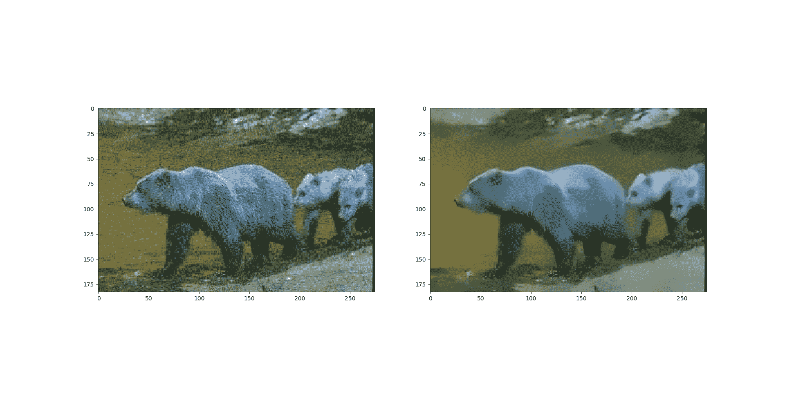

# Python |使用 opencv 对彩色图像去噪

> 原文:[https://www . geesforgeks . org/python-彩色图像去噪-使用-opencv/](https://www.geeksforgeeks.org/python-denoising-of-colored-images-using-opencv/)

**图像去噪**是指从有噪声的图像中重建信号的过程。去噪是为了去除图像中不需要的噪声，以更好的形式进行分析。它指的是主要的预处理步骤之一。opencv 中有四个函数用于不同图像的去噪。

> **语法:**cv2 . fastnlminandnoisingcolored(P1，P2，浮点 P3，浮点 P4，int P5，int P6)
> 
> **参数:**
> **P1–**源图像阵列
> **P2–**目标图像阵列
> **P3–**用于计算权重的模板面片的像素大小。
> **P4–**窗口的像素大小，用于计算给定像素的加权平均值。
> **P5–**调节亮度分量滤波强度的参数。
> **P6–**同上，但颜色成分//未用于灰度图像。

**下面是实现:**

```py
# importing libraries
import numpy as np
import cv2
from matplotlib import pyplot as plt

# Reading image from folder where it is stored
img = cv2.imread('bear.png')

# denoising of image saving it into dst image
dst = cv2.fastNlMeansDenoisingColored(img, None, 10, 10, 7, 15)

# Plotting of source and destination image
plt.subplot(121), plt.imshow(img)
plt.subplot(122), plt.imshow(dst)

plt.show()
```

**输出:**
