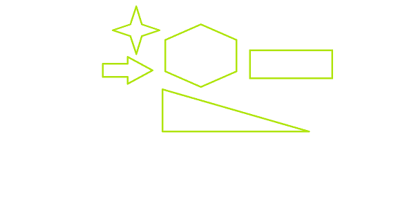
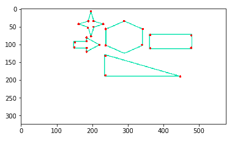

# Python |使用 OpenCV 检测图像的角点

> 原文:[https://www . geesforgeks . org/python-detect-一角图像-使用-opencv/](https://www.geeksforgeeks.org/python-detect-corner-of-an-image-using-opencv/)

**OpenCV** (开源计算机视觉)是一个计算机视觉库，包含对图像或视频进行操作的各种功能。OpenCV 库可以用来对视频进行多种操作。

让我们看看如何检测图像中的角点。

`cv2.goodFeaturesToTrack()` 方法通过 Shi-Tomasi 方法找到图像中 N 个最强的角点。请注意，图像应该是灰度图像。指定要查找的角的数量和质量等级(0-1 之间的值)。它表示每个人都被拒绝的角落的最低质量。然后提供检测到的角点之间的最小欧几里德距离。

> **语法:** **`cv2.goodFeaturesToTrack`** (图像、最大角、质量等级、最小距离[、角[、遮罩[、块大小[、useHarrisDector[，k]]]])

**角点检测前的图像:**


```py
# import the required library
import numpy as np
import cv2
from matplotlib import pyplot as plt

# read the image
img = cv2.imread('corner1.png')

# convert image to gray scale image
gray = cv2.cvtColor(img, cv2.COLOR_BGR2GRAY)

# detect corners with the goodFeaturesToTrack function.
corners = cv2.goodFeaturesToTrack(gray, 27, 0.01, 10)
corners = np.int0(corners)

# we iterate through each corner, 
# making a circle at each point that we think is a corner.
for i in corners:
    x, y = i.ravel()
    cv2.circle(img, (x, y), 3, 255, -1)

plt.imshow(img), plt.show()
```

**角点检测后的图像–**
