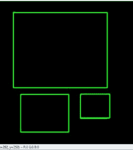
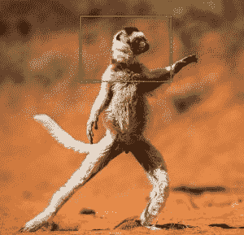
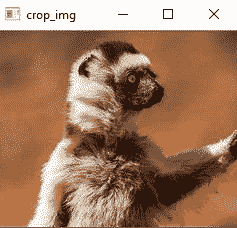

# 使用 Python 的 OpenCV

绘制一个矩形并提取对象

> 原文:[https://www . geesforgeks . org/python-draw-矩形-shape-and-extract-objects-use-opencv/](https://www.geeksforgeeks.org/python-draw-rectangular-shape-and-extract-objects-using-opencv/)

**OpenCV** 是一个开源的计算机视觉和机器学习软件库。在它的帮助下，可以完成各种图像处理操作，如操纵图像和应用大量滤镜。它广泛应用于目标检测、人脸检测和其他图像处理任务。

让我们看看如何在图像上绘制矩形形状，并使用 OpenCV 提取对象。

```
# Python program to extract rectangular
# Shape using OpenCV in Python3
import cv2
import numpy as np

drawing = False     # true if mouse is pressed
mode = True         # if True, draw rectangle.
ix, iy = -1, -1

# mouse callback function
def draw_circle(event, x, y, flags, param):
    global ix, iy, drawing, mode

    if event == cv2.EVENT_LBUTTONDOWN:
        drawing = True
        ix, iy = x, y

    elif event == cv2.EVENT_MOUSEMOVE:
        if drawing == True:
            if mode == True:
                cv2.rectangle(img, (ix, iy), (x, y), (0, 255, 0), 3)
                a = x
                b = y
                if a != x | b != y:
                    cv2.rectangle(img, (ix, iy), (x, y), (0, 0, 0), -1)
            else:
                cv2.circle(img, (x, y), 5, (0, 0, 255), -1)

    elif event == cv2.EVENT_LBUTTONUP:
        drawing = False
        if mode == True:
            cv2.rectangle(img, (ix, iy), (x, y), (0, 255, 0), 2)

        else:
            cv2.circle(img, (x, y), 5, (0, 0, 255), -1)

img = np.zeros((512, 512, 3), np.uint8)
cv2.namedWindow('image')
cv2.setMouseCallback('image', draw_circle)

while(1):
    cv2.imshow('image', img)
    k = cv2.waitKey(1) & 0xFF
    if k == ord('m'):
        mode = not mode
    elif k == 27:
        break

cv2.destroyAllWindows() 
```

**输出:**

<center></center>

上面这段代码将只适用于黑色背景图像。但是矩形可以画到任何图像上。我们可以编写一个程序，允许我们在图像中选择所需的部分，并提取所选的部分。该任务包括以下内容–

*   在任何图像上绘制形状
*   重新选择提取部分，以防选择错误
*   从图像中提取特定对象

```
# Write Python code here
# import the necessary packages
import cv2
import argparse

# now let's initialize the list of reference point
ref_point = []
crop = False

def shape_selection(event, x, y, flags, param):
    # grab references to the global variables
    global ref_point, crop

    # if the left mouse button was clicked, record the starting
    # (x, y) coordinates and indicate that cropping is being performed
    if event == cv2.EVENT_LBUTTONDOWN:
        ref_point = [(x, y)]

    # check to see if the left mouse button was released
    elif event == cv2.EVENT_LBUTTONUP:
        # record the ending (x, y) coordinates and indicate that
        # the cropping operation is finished
        ref_point.append((x, y))

        # draw a rectangle around the region of interest
        cv2.rectangle(image, ref_point[0], ref_point[1], (0, 255, 0), 2)
        cv2.imshow("image", image)

# construct the argument parser and parse the arguments
ap = argparse.ArgumentParser()
ap.add_argument("-i", "--image", required = True, help ="Path to the image")
args = vars(ap.parse_args())

# load the image, clone it, and setup the mouse callback function
image = cv2.imread(args["image"])
clone = image.copy()
cv2.namedWindow("image")
cv2.setMouseCallback("image", shape_selection)

# keep looping until the 'q' key is pressed
while True:
    # display the image and wait for a keypress
    cv2.imshow("image", image)
    key = cv2.waitKey(1) & 0xFF

    # press 'r' to reset the window
    if key == ord("r"):
        image = clone.copy()

    # if the 'c' key is pressed, break from the loop
    elif key == ord("c"):
        break

if len(ref_point) == 2:
    crop_img = clone[ref_point[0][1]:ref_point[1][1], ref_point[0][0]:
                                                           ref_point[1][0]]
    cv2.imshow("crop_img", crop_img)
    cv2.waitKey(0)

# close all open windows
cv2.destroyAllWindows() 
```

**运行**:将文件保存为***capture _ events . py***并选择位于同一目录的演示图片进行测试。现在，执行以下命令–

```
python capture_events.py --image demo.jpg
```

**输出**:首先从图像中选择想要的部分。此外，我们可以通过按下程序中的“r”来删除错误的选择，以进行新的正确选择。

<center>
**Fig: Selected Portion**</center>

现在像上面一样选择一个合适的选项后，只需按“c”就可以按照程序提取。
**图:切割部分**

<center></center>