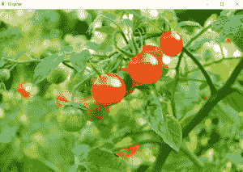
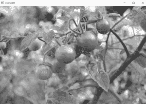
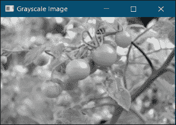
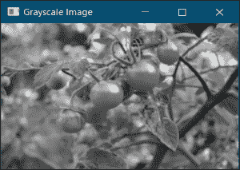

# Python |使用 OpenCV 对图像进行灰度缩放

> 原文:[https://www . geeksforgeeks . org/python-gray scaling-of-images-use-opencv/](https://www.geeksforgeeks.org/python-grayscaling-of-images-using-opencv/)

**灰度缩放**是将图像从其他颜色空间(如 RGB、CMYK、HSV 等)转换的过程。灰色的阴影。它在全黑和全白之间变化。

### 灰度的重要性

*   **降维:**例如，在 RGB 图像中，有三个颜色通道并具有三维，而灰度图像是一维的。
*   **降低模型复杂度:**考虑在 10x10x3 像素的 RGB 图像上训练神经文章。输入层将有 300 个输入节点。另一方面，同样的神经网络对于灰度图像只需要 100 个输入节点。
*   **要让其他算法工作:**许多算法被定制为只在灰度图像上工作，例如在 OpenCV 库中预先实现的 Canny 边缘检测功能只在灰度图像上工作。

让我们学习将彩色图像转换为灰度图像的不同图像处理方法。

### 方法 1:使用 cv2.cvtColor()函数

## 蟒蛇 3

```
# import opencv
import cv2

# Load the input image
image = cv2.imread('C:\\Documents\\full_path\\tomatoes.jpg')
cv2.imshow('Original', image)
cv2.waitKey(0)

# Use the cvtColor() function to grayscale the image
gray_image = cv2.cvtColor(image, cv2.COLOR_BGR2GRAY)

cv2.imshow('Grayscale', gray_image)
cv2.waitKey(0) 

# Window shown waits for any key pressing event
cv2.destroyAllWindows()
```

**输入图像:**



**输出图像:**



### 方法 2:使用标志= 0 的 cv2.imread()函数

## 蟒蛇 3

```
# Import opencv
import cv2

# Use the second argument or (flag value) zero
# that specifies the image is to be read in grayscale mode
img = cv2.imread('C:\\Documents\\full_path\\tomatoes.jpg', 0)

cv2.imshow('Grayscale Image', img)
cv2.waitKey(0)

# Window shown waits for any key pressing event
cv2.destroyAllWindows()
```

**输出图像:**



### 方法 3:使用像素操作(平均法)

## 蟒蛇 3

```
# Import opencv
import cv2

# Load the input image
img = cv2.imread('C:\\Documents\\full_path\\tomatoes.jpg')

# Obtain the dimensions of the image array
# using the shape method
(row, col) = img.shape[0:2]

# Take the average of pixel values of the BGR Channels
# to convert the colored image to grayscale image
for i in range(row):
    for j in range(col):
        # Find the average of the BGR pixel values
        img[i, j] = sum(img[i, j]) * 0.33

cv2.imshow('Grayscale Image', img)
cv2.waitKey(0)

# Window shown waits for any key pressing event
cv2.destroyAllWindows()
```

**输出图像:**



希望你已经理解了上面讨论的用 Python 将彩色图像转换成灰度图像的图像处理技术！