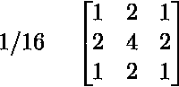
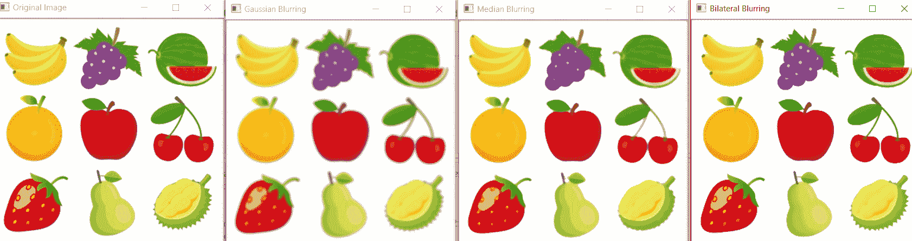

# Python |使用 OpenCV 的图像模糊

> 原文:[https://www . geesforgeks . org/python-image-furning-using-opencv/](https://www.geeksforgeeks.org/python-image-blurring-using-opencv/)

**图像模糊**是指使图像变得不清晰或不清晰。这是在各种低通滤波器内核的帮助下完成的。

**模糊优势:**

*   它有助于消除噪音。由于噪声被认为是高通信号，所以通过应用低通滤波器核来限制噪声。
*   它有助于平滑图像。
*   低强度边缘被移除。
*   必要时，它有助于隐藏细节。例如，在许多情况下，警察故意想隐藏受害者的脸，在这种情况下，需要模糊。

**重要的模糊类型:**

*   **高斯模糊:**高斯模糊是通过高斯函数模糊图像的结果。这是图形软件中广泛使用的效果，通常用于减少图像噪声和细节。它还被用作应用我们的机器学习或深度学习模型之前的预处理阶段。
    例如高斯核(3×3)
    
*   **中值模糊:**中值滤波器是一种非线性数字滤波技术，通常用于去除图像或信号中的噪声。中值滤波在数字图像处理中应用非常广泛，因为在某些条件下，它在去除噪声的同时保留了边缘。它是去除椒盐噪声的最佳算法之一。
*   **双边模糊:**双边滤波器是一种用于图像的非线性、边缘保持和降噪平滑滤波器。它用附近像素的亮度值的加权平均值替换每个像素的亮度。这个权重可以基于高斯分布。因此，在丢弃弱边缘的同时，保留了尖锐的边缘。

**下面是 Python 代码:**

```
# importing libraries
import cv2
import numpy as np

image = cv2.imread('C://Geeksforgeeks//image_processing//fruits.jpg')

cv2.imshow('Original Image', image)
cv2.waitKey(0)

# Gaussian Blur
Gaussian = cv2.GaussianBlur(image, (7, 7), 0)
cv2.imshow('Gaussian Blurring', Gaussian)
cv2.waitKey(0)

# Median Blur
median = cv2.medianBlur(image, 5)
cv2.imshow('Median Blurring', median)
cv2.waitKey(0)

# Bilateral Blur
bilateral = cv2.bilateralFilter(image, 9, 75, 75)
cv2.imshow('Bilateral Blurring', bilateral)
cv2.waitKey(0)
cv2.destroyAllWindows()
```

**输出:**
