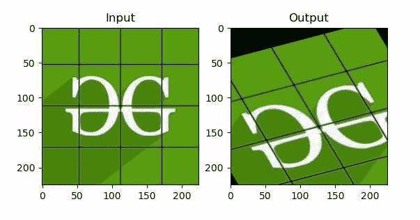
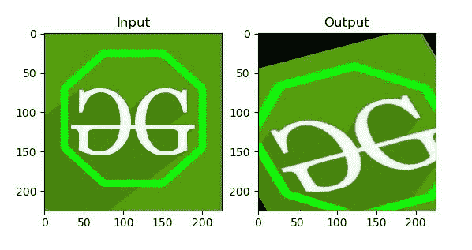

# Python OpenCV–仿射变换

> 原文:[https://www . geesforgeks . org/python-opencv-仿射-变换/](https://www.geeksforgeeks.org/python-opencv-affine-transformation/)

**OpenCV** 是用于计算机视觉、机器学习和图像处理的巨大开源库，现在它在实时操作中发挥着重要作用，这在当今的系统中非常重要。通过使用它，人们可以处理图像和视频来识别物体、人脸，甚至是人类的笔迹。当它与各种库(如 Numpuy)集成时，Python 能够处理 OpenCV 数组结构进行分析。

**注意:**更多信息请参考 [OpenCV Python 教程](http://geeksforgeeks.org/opencv-python-tutorial/)

## 仿射变换

在仿射变换中，原始图像中的所有平行线在输出图像中仍然是平行的。为了找到变换矩阵，我们需要输入图像中的三个点以及它们在输出图像中的对应位置。然后**cv2 . Getaffinettransform**会创建一个 2×3 的矩阵，传递给 **cv2.warpAffine** 。

**cv2 . Getaffinettransform 方法:**

> **语法:**cv 2 . get perspectivetransformation(src，dst)
> 
> **参数:**
> **src:** 源图像中四边形顶点的坐标。
> **dst:** 目标图像中对应四边形顶点的坐标。

**cv2.warpAffine 方法:**

> **语法:** cv2.warpAffine(src、m、dsize、dst、flags、borderMode、bordervalue)
> 
> **参数:**
> **src:** 输入图像。
> **dst:** 输出与 src 大小相同、类型相同的图像。
> **M:** 变换矩阵。
> **dsize:** 输出图像的大小。
> **标志:**插值方法的组合(参见 resize())和可选标志
> WARP_INVERSE_MAP，表示 M 是逆变换(dst- > src)。
> **borderMode:** 像素外推方法；当 borderMode=BORDER_TRANSPARENT 时，意味着目标图像中与源图像中的“异常值”相对应的像素不会被函数修改。
> **边界值:**在边界不变的情况下使用的值；默认情况下，它是 0。

**例 1:**

```
import cv2
import numpy as np
from matplotlib import pyplot as plt

img = cv2.imread('food.jpeg')
rows, cols, ch = img.shape

pts1 = np.float32([[50, 50],
                   [200, 50], 
                   [50, 200]])

pts2 = np.float32([[10, 100],
                   [200, 50], 
                   [100, 250]])

M = cv2.getAffineTransform(pts1, pts2)
dst = cv2.warpAffine(img, M, (cols, rows))

plt.subplot(121)
plt.imshow(img)
plt.title('Input')

plt.subplot(122)
plt.imshow(dst)
plt.title('Output')

plt.show()

# Displaying the image
while(1):

    cv2.imshow('image', img)
    if cv2.waitKey(20) & 0xFF == 27:
        break

cv2.destroyAllWindows()
```

**输出:**


**例 2:**

```
import cv2
import numpy as np
from matplotlib import pyplot as plt

img = cv2.imread('food.jpeg')
rows, cols, ch = img.shape

pts1 = np.float32([[50, 50], 
                   [200, 50],
                   [50, 200]])

pts2 = np.float32([[10, 100],
                   [200, 50], 
                   [100, 250]])

M = cv2.getAffineTransform(pts1, pts2)
dst = cv2.warpAffine(img, M, (cols, rows))

plt.subplot(121)
plt.imshow(img)
plt.title('Input')

plt.subplot(122)
plt.imshow(dst)
plt.title('Output')
plt.show()

# Displaying the image
while(1):

    cv2.imshow('image', img)
    if cv2.waitKey(20) & 0xFF == 27:
        break

cv2.destroyAllWindows()
```

**输出:**
