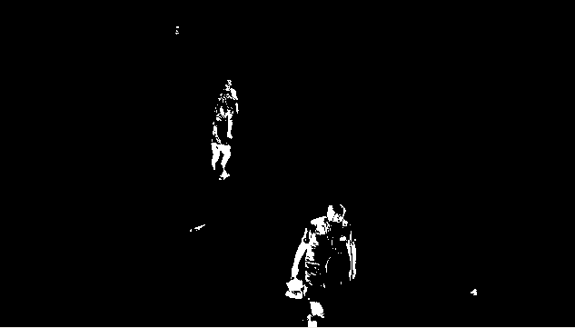
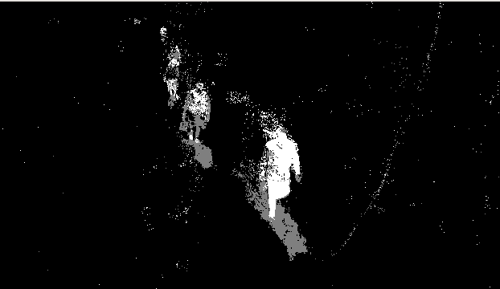

# Python OpenCV–背景减法

> 原文:[https://www . geesforgeks . org/python-opencv-background-减法/](https://www.geeksforgeeks.org/python-opencv-background-subtraction/)

背景减除是图像处理的主要任务之一。它用于各种图像处理应用，如图像分割、目标检测等。OpenCV 为我们提供了 3 种背景减除算法:-

*   背景减法公式
*   背景减法公式 2
*   背景减法器组

通常，我们可以使用矩阵减法来执行背景减法，即只从视频中减去静态帧。但是这有很多缺点。这是一种效率非常低的背景减法算法，因为它不会自我更新。这个问题是由 OpenCV 提供的背景减除算法来处理的。

## 使用 background 减法公式

要使用 background 减法我们可以使用

```py
cv2.bgsegm.createBackgroundSubtractorMOG()
```

然后我们可以在视频的每一帧上使用“应用”方法来应用它。考虑下面的例子来更好地理解这个主题。

**示例:**

```py
import numpy as np
import cv2

cap = cv2.VideoCapture('sample.mp4')

# initializing subtractor 
fgbg = cv2.bgsegm.createBackgroundSubtractorMOG() 

while(1):
    ret, frame = cap.read()       

    # applying on each frame
    fgmask = fgbg.apply(frame)  

    cv2.imshow('frame', fgmask)
    k = cv2.waitKey(30) & 0xff
    if k == 27:
        break

cap.release()
cv2.destroyAllWindows()
```

**输出:**



## 使用背景减法公式 2

在前面的减法器工作得相当好，但在现实世界的情况下，也存在阴影。在 background 减法器 OG2 中，我们还可以检测阴影，在下面代码的输出中，可以清楚地看到。要应用 background 减法公式 2，请使用

```py
cv2.createBackgroundSubtractorMOG2()
```

**示例:**

```py
import numpy as np
import cv2

cap = cv2.VideoCapture('sample.mp4')

# initializing subtractor 
fgbg = cv2.createBackgroundSubtractorMOG2()

while(1):
    ret, frame = cap.read()

    # applying on each frame
    fgmask = fgbg.apply(frame)

    cv2.imshow('frame', fgmask)  
    k = cv2.waitKey(30) & 0xff
    if k == 27:
        break

cap.release()
cv2.destroyAllWindows()
```

**输出:**



## 使用背景减法器

该算法结合了统计背景图像估计和逐像素贝叶斯分割。它采用概率前景分割算法，使用贝叶斯推理识别可能的前景对象。要使用 background 减法器组，请使用

```py
cv2.bgsegm.createBackgroundSubtractorGMG()
```

**注意:**在前几帧我们会得到一个黑色的窗口。

```py
import numpy as np
import cv2

cap = cv2.VideoCapture('sample.mp4')

kernel = cv2.getStructuringElement(cv2.MORPH_ELLIPSE, (3, 3))

# initializing subtractor 
fgbg = cv2.bgsegm.createBackgroundSubtractorGMG()

while(1):
    ret, frame = cap.read()

    # applying on each frame
    fgmask = fgbg.apply(frame)

    fgmask = cv2.morphologyEx(fgmask, cv2.MORPH_OPEN, kernel)     

    cv2.imshow('frame', fgmask)
    k = cv2.waitKey(30) & 0xff
    if k == 27:
        break

cap.release()
cv2.destroyAllWindows()
```

**输出:**

