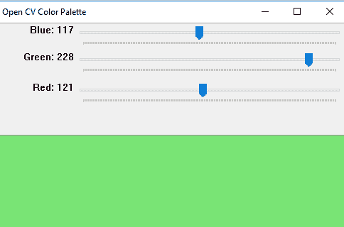

# Python | OpenCV BGR 带跟踪条的调色板

> 原文:[https://www . geesforgeks . org/python-opencv-bgr-color-palette-with-track bar/](https://www.geeksforgeeks.org/python-opencv-bgr-color-palette-with-trackbars/)

**OpenCV** 是一个主要针对实时计算机视觉的编程函数库。
在本文中，让我们创建一个窗口，其中将包含带有跟踪条的 RGB 调色板。通过移动跟踪条，RGB 颜色的值将从 0 变为 255。所以使用相同的方法，我们可以找到具有 RGB 值的颜色。

```py
Libraries needed:
OpenCV
Numpy
```

**方法:**
创建一个分辨率为 512 x 512 的三色通道的黑色窗口。然后使用 OpenCV 库的预定义函数创建三个“B”“G”“R”跟踪条。将通道值设置为 0 到 255。将黑色窗口与这些彩色跟踪条合并。

```py
# Python program to create RGB color  
# palette with trackbars 

# importing libraries
import cv2
import numpy as np

# empty function called when
# any trackbar moves
def emptyFunction():
    pass

def main():

    # blackwindow having 3 color chanels
    image = np.zeros((512, 512, 3), np.uint8) 
    windowName ="Open CV Color Palette"

    # window name
    cv2.namedWindow(windowName) 

    # there trackbars which have the name
    # of trackbars min and max value 
    cv2.createTrackbar('Blue', windowName, 0, 255, emptyFunction)
    cv2.createTrackbar('Green', windowName, 0, 255, emptyFunction)
    cv2.createTrackbar('Red', windowName, 0, 255, emptyFunction)

    # Used to open the window
    # till press the ESC key
    while(True):
        cv2.imshow(windowName, image)

        if cv2.waitKey(1) == 27:
            break

        # values of blue, green, red
        blue = cv2.getTrackbarPos('Blue', windowName)
        green = cv2.getTrackbarPos('Green', windowName)
        red = cv2.getTrackbarPos('Red', windowName)

        # merge all three color chanels and
        # make the image composites image from rgb   
        image[:] = [blue, green, red]
        print(blue, green, red)

    cv2.destroyAllWindows()

# Calling main()         
if __name__=="__main__":
    main()
```

**输出:**


**注意:**以上程序不会在联机 IDE 上运行。