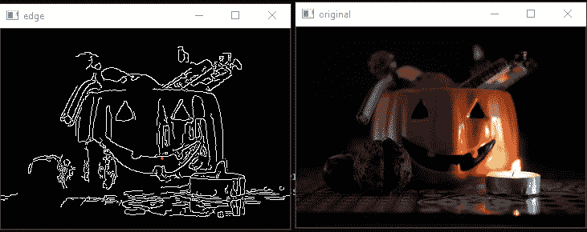
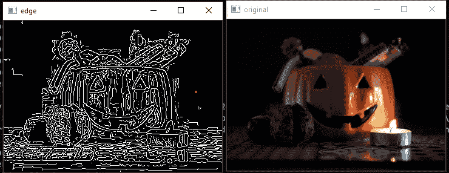
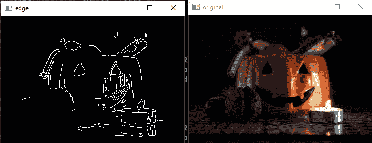
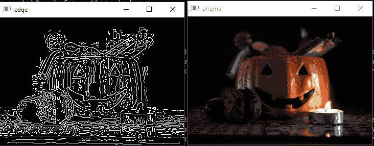

# Python OpenCV–Canny()函数

> 原文:[https://www.geeksforgeeks.org/python-opencv-canny-function/](https://www.geeksforgeeks.org/python-opencv-canny-function/)

在本文中，我们将在 OpenCV 中看到 **Canny Edge** 滤镜。OpenCV 中的 Canny()函数用于检测图像的边缘。

> **语法:** cv2。Canny(图像，下，上，孔径大小，L2Gradient)
> 
> **其中:**
> 
> *   图像:将应用 Canny 滤波器的输入图像
> *   T_lower:滞后阈值中的下阈值
> *   T_upper:滞后阈值中的上限阈值
> *   aperture_size:索贝尔滤镜的光圈大小。
> *   L2Gradient:布尔参数，用于计算边缘梯度时更精确。

## Canny 边缘检测是一种由 4 个主要步骤组成的算法:

*   使用高斯平滑降低噪声。
*   使用索贝尔滤波器计算图像梯度。
*   应用非最大值抑制或 NMS 只是吉普当地的最大值
*   最后，应用滞后阈值，该阈值是 Canny()函数中使用两个阈值 T_upper 和 T_lower。

**输入图像**:


### **基本示例** Canny()函数

## 蟒蛇 3

```py
import cv2

img = cv2.imread("test.jpeg")  # Read image

# Setting parameter values
t_lower = 50  # Lower Threshold
t_upper = 150  # Upper threshold

# Applying the Canny Edge filter
edge = cv2.Canny(img, t_lower, t_upper)

cv2.imshow('original', img)
cv2.imshow('edge', edge)
cv2.waitKey(0)
cv2.destroyAllWindows()
```

**输出**:



## Canny()函数**带 Aperture_size**

这是一个可选参数，用于指定在 Canny 算法中用于计算梯度的 Sobel 滤波器的顺序。默认值为 3，其值应为 3 到 7 之间的奇数。当您想要检测更详细的特征时，可以增加光圈大小。

## 蟒蛇 3

```py
import cv2

img = cv2.imread("test.jpeg")  # Read image

# Setting All parameters
t_lower = 100  # Lower Threshold
t_upper = 200  # Upper threshold
aperture_size = 5  # Aperture size

# Applying the Canny Edge filter
# with Custom Aperture Size
edge = cv2.Canny(img, t_lower, t_upper, 
                 apertureSize=aperture_size)
cv2.imshow('original', img)
cv2.imshow('edge', edge)
cv2.waitKey(0)
cv2.destroyAllWindows()
```

**输出:**



## Canny()函数**带 L2Gradient**

这是一个布尔参数，指定是要计算通常的梯度方程还是 L2Gradient 算法。同样，这是一个可选参数。L2gradient 什么都不是我的 sqrt(gradient _ x _ square+gradient _ y _ square)，而 L1gradient 只是 abs(gradient_x) + abs(gradient_y)。

## 蟒蛇 3

```py
import cv2

img = cv2.imread("test.jpeg") # Read image

t_lower = 100 # Lower Threshold
t_upper = 200 # Upper threshold
aperture_size = 5 # Aperture size
L2Gradient = True # Boolean

# Applying the Canny Edge filter with L2Gradient = True
edge = cv2.Canny(img, t_lower, t_upper, L2gradient = L2Gradient )

cv2.imshow('original', img)
cv2.imshow('edge', edge)
cv2.waitKey(0)
cv2.destroyAllWindows()
```

**输出:**



## Canny()函数**同时具有孔径大小和 L2 梯度**

这里我们将在函数中使用这两个属性。

## 蟒蛇 3

```py
import cv2 

img = cv2.imread("test.jpeg") # Read image

# Defining all the parameters
t_lower = 100 # Lower Threshold
t_upper = 200 # Upper threshold
aperture_size = 5 # Aperture size
L2Gradient = True # Boolean

# Applying the Canny Edge filter 
# with Aperture Size and L2Gradient
edge = cv2.Canny(img, t_lower, t_upper,
                 apertureSize = aperture_size, 
                 L2gradient = L2Gradient ) 

cv2.imshow('original', img)
cv2.imshow('edge', edge)
cv2.waitKey(0)
cv2.destroyAllWindows()
```

**输出:**

