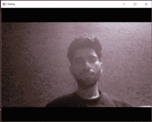

# Python OpenCV:从摄像头

捕捉视频

> 原文:[https://www . geesforgeks . org/python-opencv-capture-video-from-camera/](https://www.geeksforgeeks.org/python-opencv-capture-video-from-camera/)

Python 为图像和视频处理提供了各种库。其中之一就是 OpenCV。OpenCV 是一个庞大的库，有助于为图像和视频操作提供各种功能。借助 OpenCV，我们可以从相机中捕捉视频。它允许您创建一个视频捕获对象，该对象有助于通过网络摄像头捕获视频，然后您可以对该视频执行所需的操作。

**拍摄视频的步骤:**

*   使用`cv2.VideoCapture(`)获取摄像机的视频拍摄对象。
*   设置一个无限 while 循环，并使用`read()`方法使用上面创建的对象读取帧。
*   使用`cv2.imshow()`方法显示视频中的帧。
*   当用户单击特定的键时中断循环。

下面是实现。

```py
# import the opencv library
import cv2

# define a video capture object
vid = cv2.VideoCapture(0)

while(True):

    # Capture the video frame
    # by frame
    ret, frame = vid.read()

    # Display the resulting frame
    cv2.imshow('frame', frame)

    # the 'q' button is set as the
    # quitting button you may use any
    # desired button of your choice
    if cv2.waitKey(1) & 0xFF == ord('q'):
        break

# After the loop release the cap object
vid.release()
# Destroy all the windows
cv2.destroyAllWindows()
```

**输出:**

