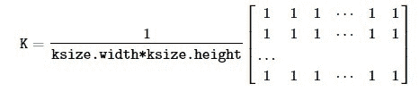
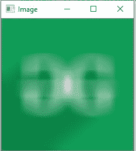

# Python OpenCV | cv2.blur()方法

> 原文:[https://www . geesforgeks . org/python-opencv-cv2-blur-method/](https://www.geeksforgeeks.org/python-opencv-cv2-blur-method/)

**OpenCV-Python** 是一个 Python 绑定库，旨在解决计算机视觉问题。`cv2.blur()`方法用于使用归一化箱式滤波器模糊图像。该函数使用内核平滑图像，内核表示为:


> **语法:** cv2.blur(src，ksize[，dst[，anchor[，border type]])
> **参数:**
> **src:** 是要模糊的图像。
> **ksize:** 表示模糊内核大小的元组。
> **dst:** 是与 src 大小和类型相同的输出图像。
> **锚点:**是表示锚点的整型变量，默认值为 Point(-1，-1)，表示锚点在内核中心。
> **边框类型:**描绘需要添加什么样的边框。它由类似 **cv2 的标志定义。**， **cv2。BORDER_REFLECT** 等
> **返回值:**返回一个图像。

**图像用于以下所有示例:**

**示例#1:**

```py
# Python program to explain cv2.blur() method 

# importing cv2 
import cv2 

# path 
path = r'C:\Users\Rajnish\Desktop\geeksforgeeks\geeks.png'

# Reading an image in default mode 
image = cv2.imread(path) 

# Window name in which image is displayed 
window_name = 'Image'

# ksize
ksize = (10, 10)

# Using cv2.blur() method 
image = cv2.blur(image, ksize) 

# Displaying the image 
cv2.imshow(window_name, image) 
```

**输出:**


**例 2:**

```py
# Python program to explain cv2.blur() method 

# importing cv2 
import cv2 

# path 
path = r'C:\Users\Rajnish\Desktop\geeksforgeeks\geeks.png'

# Reading an image in default mode 
image = cv2.imread(path) 

# Window name in which image is displayed 
window_name = 'Image'

# ksize
ksize = (30, 30)

# Using cv2.blur() method 
image = cv2.blur(image, ksize, cv2.BORDER_DEFAULT) 

# Displaying the image 
cv2.imshow(window_name, image) 
```

**输出:**
