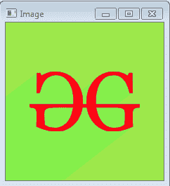

# Python OpenCV | cv2.cvtColor()方法

> 原文:[https://www . geesforgeks . org/python-opencv-cv2-CVT color-method/](https://www.geeksforgeeks.org/python-opencv-cv2-cvtcolor-method/)

**OpenCV-Python** 是一个 Python 绑定库，旨在解决计算机视觉问题。`cv2.cvtColor()`方法用于将图像从一个颜色空间转换到另一个颜色空间。OpenCV 中有 150 多种颜色空间转换方法。我们将使用下面的一些色彩空间转换代码。

> **语法:** cv2.cvtColor(src、code[、dst[、dstCn]]
> 
> **参数:**
> **src:** 就是要改变颜色空间的图像。
> **代码:**是色彩空间转换代码。
> **dst:** 是与 src 图像大小和深度相同的输出图像。这是一个可选参数。
> **dstCn:** 是目的图像中的通道数。如果参数为 0，则通道数自动从 src 和代码中导出。这是一个可选参数。
> 
> **返回值:**返回图像。

**图像用于以下所有示例:**


**示例#1:**

```
# Python program to explain cv2.cvtColor() method 

# importing cv2 
import cv2 

# path 
path = r'C:\Users\Administrator\Desktop\geeks.png'

# Reading an image in default mode
src = cv2.imread(path)

# Window name in which image is displayed
window_name = 'Image'

# Using cv2.cvtColor() method
# Using cv2.COLOR_BGR2GRAY color space
# conversion code
image = cv2.cvtColor(src, cv2.COLOR_BGR2GRAY )

# Displaying the image 
cv2.imshow(window_name, image)
```

**输出:**


**示例#2:**
使用 HSV 颜色空间。HSV 颜色空间主要用于目标跟踪。

```
# Python program to explain cv2.cvtColor() method 

# importing cv2 
import cv2 

# path 
path = r'C:\Users\Administrator\Desktop\geeks.png'

# Reading an image in default mode
src = cv2.imread(path)

# Window name in which image is displayed
window_name = 'Image'

# Using cv2.cvtColor() method
# Using cv2.COLOR_BGR2HSV color space
# conversion code
image = cv2.cvtColor(src, cv2.COLOR_BGR2HSV )

# Displaying the image 
cv2.imshow(window_name, image)
```

**输出:**
