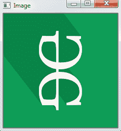
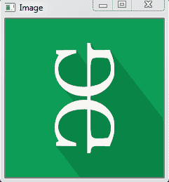

# Python OpenCV–cv2 . rotate()方法

> 原文:[https://www . geesforgeks . org/python-opencv-cv2-rotate-method/](https://www.geeksforgeeks.org/python-opencv-cv2-rotate-method/)

**OpenCV-Python** 是一个 Python 绑定库，旨在解决计算机视觉问题。`cv2.rotate()`方法用于以 90 度的倍数旋转 2D 阵列。函数 cv::rotate 以三种不同的方式旋转数组。

> **语法:** cv2.cv.rotate( src，rotateCode[，dst])
> 
> **参数:**
> **src:** 就是要改变颜色空间的图像。
> **旋转代码:**是一个枚举，指定如何旋转数组。
> **dst:** 是与 src 图像大小和深度相同的输出图像。这是一个可选参数。
> 
> **返回值:**返回图像。

**图像用于以下所有示例:**


**示例#1:** 顺时针旋转 90 度

```
# Python program to explain cv2.rotate() method

# importing cv2
import cv2

# path
path = r'C:\Users\user\Desktop\geeks14.png'

# Reading an image in default mode
src = cv2.imread(path)

# Window name in which image is displayed
window_name = 'Image'

# Using cv2.rotate() method
# Using cv2.ROTATE_90_CLOCKWISE rotate
# by 90 degrees clockwise
image = cv2.rotate(src, cv2.cv2.ROTATE_90_CLOCKWISE)

# Displaying the image
cv2.imshow(window_name, image)
cv2.waitKey(0)
```

**输出:**


**例 2:** 顺时针旋转 180 度

```
# Python program to explain cv2.rotate() method

# importing cv2
import cv2

# path
path = r'C:\Users\user\Desktop\geeks14.png'

# Reading an image in default mode
src = cv2.imread(path)

# Window name in which image is displayed
window_name = 'Image'

# Using cv2.rotate() method
# Using cv2.ROTATE_180 rotate by 
# 180 degrees clockwise
image = cv2.rotate(src, cv2.ROTATE_180)

# Displaying the image
cv2.imshow(window_name, image)
cv2.waitKey(0)
```

**输出:**


**例 3:** 顺时针旋转 270 度

```
# Python program to explain cv2.rotate() method

# importing cv2
import cv2

# path
path = r'C:\Users\user\Desktop\geeks14.png'

# Reading an image in default mode
src = cv2.imread(path)

# Window name in which image is displayed
window_name = 'Image'

# Using cv2.rotate() method
# Using cv2.ROTATE_90_COUNTERCLOCKWISE 
# rotate by 270 degrees clockwise
image = cv2.rotate(src, cv2.ROTATE_90_COUNTERCLOCKWISE)

# Displaying the image
cv2.imshow(window_name, image)
cv2.waitKey(0)
```

**输出:**
