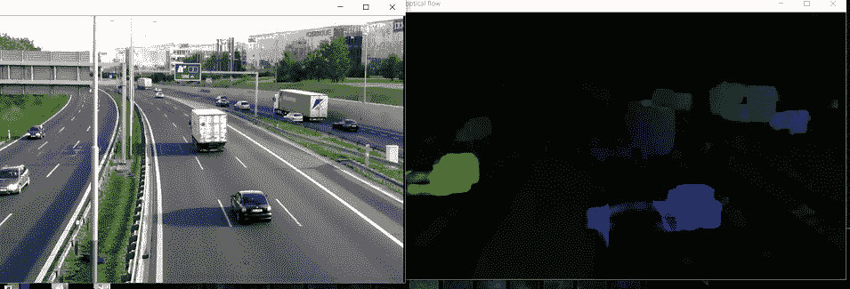

# Python OpenCV–密集光流

> 原文:[https://www . geesforgeks . org/python-opencv-dense-optical-flow/](https://www.geeksforgeeks.org/python-opencv-dense-optical-flow/)

**先决条件:**[Python OpenCV](https://www.geeksforgeeks.org/opencv-python-tutorial/)[灰度缩放](https://www.geeksforgeeks.org/python-grayscaling-of-images-using-opencv/)

**光流**是序列中连续帧之间物体的运动，由摄像机和物体之间的相对运动引起。它可以有两种类型——稀疏光流和密集光流。

## 密集光流

密集光流为帧的每个像素计算光流矢量，这可能是其速度较慢的原因，但会导致更准确的结果。它可以用于检测视频中的运动，视频分割，从运动中学习结构。密集光流可以有多种实现方式。下面的例子将遵循 Farneback 方法和 OpenCV。

## 弗兰贝克方法

第一步，该方法借助多项式展开变换，用二次多项式逼近图像帧的窗口。接下来，通过观察多项式在运动状态下如何变换。即估计位移场。经过一系列改进后，计算出密集的光流。

对于 OpenCV 的实现，计算光流问题的二维通道流矢量阵列的光流大小和方向。由色调表示的流动角度(方向)是可视化的，由 HSV 颜色表示的值表示的流动距离(幅度)是可视化的。HSV 的强度始终设置为最大值 255，以获得最佳可见度。
定义的方法为 caclopticalFlowFarneback()。

下面是实现。

```
import cv2 as cv
import numpy as np

# The video feed is read in as
# a VideoCapture object
cap = cv.VideoCapture("videoplayback.mp4")

# ret = a boolean return value from
# getting the frame, first_frame = the
# first frame in the entire video sequence
ret, first_frame = cap.read()

# Converts frame to grayscale because we
# only need the luminance channel for
# detecting edges - less computationally 
# expensive
prev_gray = cv.cvtColor(first_frame, cv.COLOR_BGR2GRAY)

# Creates an image filled with zero
# intensities with the same dimensions 
# as the frame
mask = np.zeros_like(first_frame)

# Sets image saturation to maximum
mask[..., 1] = 255

while(cap.isOpened()):

    # ret = a boolean return value from getting
    # the frame, frame = the current frame being
    # projected in the video
    ret, frame = cap.read()

    # Opens a new window and displays the input
    # frame
    cv.imshow("input", frame)

    # Converts each frame to grayscale - we previously 
    # only converted the first frame to grayscale
    gray = cv.cvtColor(frame, cv.COLOR_BGR2GRAY)

    # Calculates dense optical flow by Farneback method
    flow = cv.calcOpticalFlowFarneback(prev_gray, gray, 
                                       None,
                                       0.5, 3, 15, 3, 5, 1.2, 0)

    # Computes the magnitude and angle of the 2D vectors
    magnitude, angle = cv.cartToPolar(flow[..., 0], flow[..., 1])

    # Sets image hue according to the optical flow 
    # direction
    mask[..., 0] = angle * 180 / np.pi / 2

    # Sets image value according to the optical flow
    # magnitude (normalized)
    mask[..., 2] = cv.normalize(magnitude, None, 0, 255, cv.NORM_MINMAX)

    # Converts HSV to RGB (BGR) color representation
    rgb = cv.cvtColor(mask, cv.COLOR_HSV2BGR)

    # Opens a new window and displays the output frame
    cv.imshow("dense optical flow", rgb)

    # Updates previous frame
    prev_gray = gray

    # Frames are read by intervals of 1 millisecond. The
    # programs breaks out of the while loop when the
    # user presses the 'q' key
    if cv.waitKey(1) & 0xFF == ord('q'):
        break

# The following frees up resources and
# closes all windows
cap.release()
cv.destroyAllWindows()
```

**输出**
