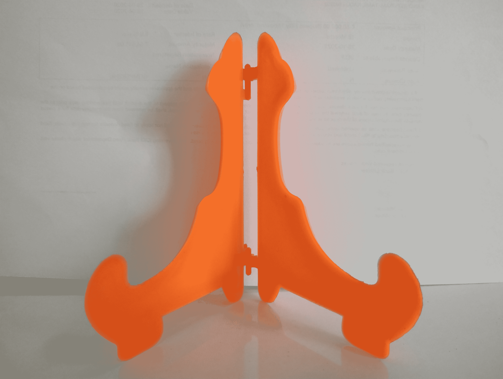
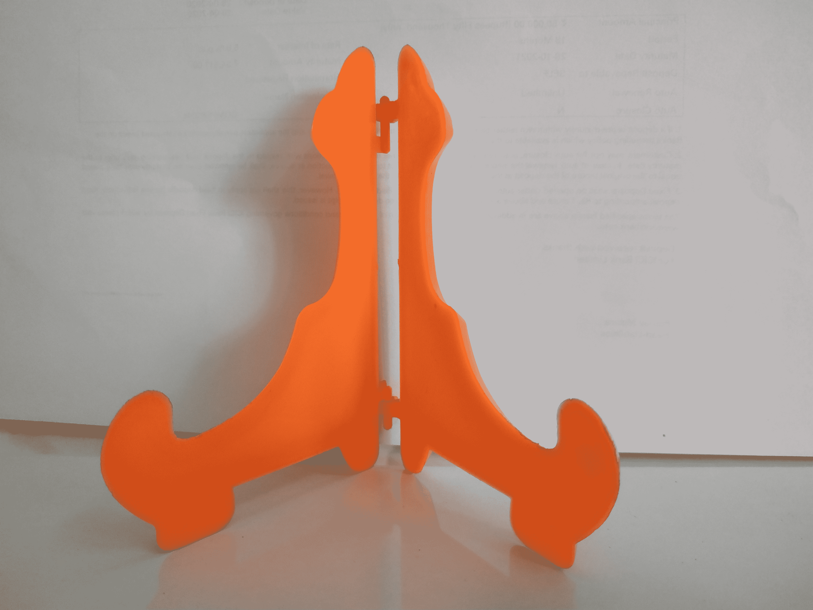
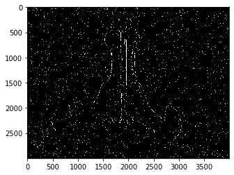

# Python Opencv–立体图像的深度图

> 原文:[https://www . geesforgeks . org/python-opencv-depth-map-from-stereo-images/](https://www.geeksforgeeks.org/python-opencv-depth-map-from-stereo-images/)

[**OpenCV**](https://www.geeksforgeeks.org/introduction-to-opencv/) 是用于计算机视觉、机器学习和图像处理的巨大开源库，现在它在实时操作中发挥着重要作用，这在当今的系统中非常重要。
**注:**更多信息请参考[OpenCV 简介](https://www.geeksforgeeks.org/introduction-to-opencv//)

**深度图:**深度图是每个像素都有深度信息(而不是 RGB)的图片，通常表示为灰度图片。深度信息是指从一个视点到场景物体表面的距离。像素值深度图的一个例子可以在这里找到:[使用直方图的像素值深度图](https://www.geeksforgeeks.org/opencv-python-program-analyze-image-using-histogram/)

**立体影像:**两幅稍有偏移的影像。例如，从中心拍一张物体的照片。将您的相机向右移动 6 厘米，同时将对象保持在图像的中心。在两张图片中寻找相同的东西，并根据位置的差异推断深度。这叫做立体匹配。为了获得最佳效果，请避免扭曲。

**接近**T2】

*   收集或拍摄立体图像。
*   导入 OpenCV 和 matplotlib 库。
*   阅读左右图像。
*   用立体计算视差。

**示例:**
**示例图像:**



左边的



对吧

## 蟒蛇 3

```py
# import OpenCV and pyplot
import cv2 as cv
from matplotlib import pyplot as plt

# read left and right images
imgR = cv.imread('right.png', 0)
imgL = cv.imread('left.png', 0)

# creates StereoBm object
stereo = cv.StereoBM_create(numDisparities = 16,
                            blockSize = 15)

# computes disparity
disparity = stereo.compute(imgL, imgR)

# displays image as grayscale and plotted
plt.imshow(disparity, 'gray')
plt.show()
```

**输出:**



视差图输出